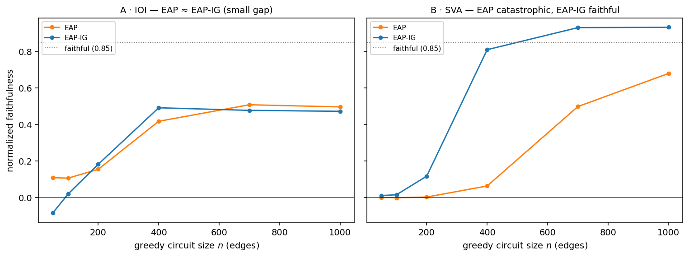

# EAP-IG edge-level — closing the node-vs-edge divergence

*Reproduction / evaluation study (follow-on). Parent: `docs/eap-ig-faithfulness-implementation-study.md` §7.
Plan: `plans/2026-07-04-eap-ig-edge-level.md`. Code: `implementation/eap_ig/edge_*.py`, `edges.py`.
Artifact: `artifacts/eap-ig-edge/`.*

---

## 0 · Executive summary

**Verdict: the §7 node-vs-edge divergence is CLOSED.** The parent study ran EAP/EAP-IG at
**node granularity + top-n** and its §7 attributed the mismatch with Hanna Fig 3 to
{granularity, search, operating-point}. Re-running at **edge granularity (32,491 q/k/v-split
edges) + greedy search** flips the per-task ordering to Hanna's:

- **IOI: EAP ≈ EAP-IG** — 0.496 vs 0.472 at n=1000 (**gap 0.024**; CIs overlap at n=15 — this arm shows *indistinguishability*, the robust arm is SVA), both plateau ~0.5. The
  node-level study saw a *catastrophic* IOI gap (EAP 0.01 vs EAP-IG 0.45); the finer edge graph
  dilutes EAP's first-order blind spot, exactly as Hanna reports ("EAP and EAP-IG circuits
  plateau at 0.6").
- **SVA: EAP catastrophic, EAP-IG faithful** — EAP's greedy circuit is **pruned to 0 edges at
  n=50** and stays near-zero through n≈400 (0.063), reaching EAP-IG parity only by n≈700, while EAP-IG is faithful
  early (0.809 at n=400, 0.93 at n=700). Max EAP-IG−EAP gap **0.75 at n=400**.
- **The smoking gun** (Hanna p.7): on SVA, EAP-IG ranks the crucial `embed→m0` edge (input →
  MLP 0) at **rank 1**; EAP buries it at **rank 74** — the missing edge that pruned EAP's
  circuit to nothing.

Every load-bearing correctness claim is verified (§5): the reimplemented forward matches GPT-2
to < 5e-4, edge scores recompose to the trusted node scores to ≤ 4e-6 (a per-source-aggregate check), and the recursive
edge-ablation reproduces clean/corrupt at the boundaries to ~1e-5; per-edge scores match exact single-edge ablation in sign (1.00, §5).

**Claims → evidence.** Divergence-closed → §6 (curves) + Fig. A/B + `summary.json` verdict.
Engine correctness → §5 + `tests/eap_ig_edge/` (16 gates).

---

## 1 · Problem & scope

The parent `eap-ig-faithfulness` study reproduced EAP-IG ≥ EAP faithfulness (p=3.6e-34) but at
node granularity its per-task pattern differed from Hanna Fig 3, disclosed do-not-cite in its §7.
This follow-on closes that gap by building the missing edge-level machinery.

**Pre-registered acceptance** (plan §0): edge+greedy reproduces Hanna Fig 3's per-task ordering
(IOI EAP≈EAP-IG; SVA EAP-catastrophic-until-large-n) — or documents why GPT-2-small cannot.

**MVP scope** (decision `2026-07-04-03`): edge EAP/EAP-IG + greedy + recursive edge-ablation on
**IOI and SVA** (the two Fig-3 anchors). Deferred (tracked in `todos/2026-07-02-eap-ig-followups.md`):
the 3 extra tasks, EAP-IG-KL, TransformerLens cross-check (offline-blocked), reduced-precision.

---

## 2 · The edge graph & math (source-cited)

**Graph** (`edges.py`, Hanna 2024; Syed 2023 App F): 157 sources (embed + 144 heads + 12 MLPs)
× 445 destination slots (144×3 q/k/v + 12 MLP + 1 logits), connected iff the source writes
strictly before the destination reads. **32,491 edges** with the q/k/v split (11,611 without —
the split is load-bearing for parity). Verified structurally (§5).

**Edge EAP** (Hanna Eq 1): `score(u→v) = ⟨z′_u − z_u, ∇_{v-input} L⟩`, gradient w.r.t. the
*input* of the downstream node; `z′−z` = corrupt−clean node output; `L=−M`. **Edge EAP-IG**
(Hanna Eq 3): the same activation difference times the gradient integrated over `m=5` points on
the corrupt→clean input-embedding path.

**The efficiency + correctness key** (Syed App F): because a node's input is a *linear sum* of
its incoming edges, `∂L/∂edge = ∂L/∂(node input)` — one backward pass yields the gradient for
every edge into a node. We obtain the per-(head, q/k/v) residual-space gradients by computing
each head's q/k/v from a separate grad-retained copy of the block's residual input
(`edge_model.py`, replicating TransformerLens `split_qkv_input`), so autograd handles the
LayerNorm.

---

## 3 · Task, search & metric

**Tasks:** IOI and SVA (`tasks.py`), n_examples = 15, seed 0; clean/corrupt minimal pairs with
per-task metrics (IOI logit-diff, SVA prob-diff). **Greedy search** (Hanna App E): add edges
backward from the logits, highest |score| whose child is already connected; edge-budget grid
n ∈ {50, 100, 200, 400, 700, 1000}; recursive prune of parentless/childless nodes.
**Faithfulness:** normalized `(m − b′)/(b − b′)`, m = the circuit's edge-ablated metric.

**Conformance to Hanna's protocol** (this study vs the paper):

| Parameter | Hanna 2024 | This study | Status |
|---|---|---|---|
| Edge graph (q/k/v split) | 32,491 edges | 32,491 edges | EXACT |
| Edge EAP / EAP-IG score | Eq 1 / Eq 3, m=5 | Eq 1 / Eq 3, m=5 | EXACT |
| Circuit search | greedy (App E) | greedy (App E) | EXACT |
| Ablation | corrupt-patch, recursive | corrupt-patch, recursive | EXACT |
| Tasks | 6 (IOI, SVA, GT, …) | IOI + SVA (Fig-3 anchors) | IDEALIZED (subset) |
| n_examples / model | larger / GPT-2-small | 15 / GPT-2-small | IDEALIZED (smaller) |
| Seeds | — | single (seed 0) | DEVIATED (no seed sweep) |
| Harness | TransformerLens | raw `transformers` (verified §5) | APPROXIMATED (< 5e-4 logit drift) |

---

## 4 · Implementation & math-to-code

| Artifact | Function |
|---|---|
| 32,491-edge graph | `edges.py` (`edge_count`, `upstream_sources`) |
| per-slot residual gradients | `edge_model.EdgeModel.forward_grad_edges` |
| edge EAP/EAP-IG scores | `edge_attribution.score_edges` |
| recursive edge-ablation | `edge_model.EdgeModel.patched_logits_edges` |
| greedy + prune | `edge_greedy.greedy_circuit` / `prune` |
| study runner / figure | `edge_run.py` / `edge_figure.py` |

---

## 5 · Verification (the correctness gates — G1, 16 tests)

| Gate | Result | What it validates |
|---|---|---|
| edge count == 32,491 (11,611 no-split) | exact | graph structure / q/k/v split |
| reimplemented forward vs GPT-2 | max abs diff **< 5e-4** (< 2e-4 on IOI/SVA) | the per-head-copy forward is faithful |
| edge→node consistency (Σ edges out = node score) | **≤ 4e-6** (EAP 1e-6, EAP-IG 4e-6) | the per-**source aggregate** (necessary, not sufficient) |
| **per-edge sign vs exact single-edge ablation** | **sign-agreement 1.00** | individual edge scores (incl. q/k/v slots) predict the true effect direction |
| all-edges-in == clean metric | ~ 8e-6 | recursive ablation lower boundary |
| all-edges-out == corrupt metric | ~ 8e-6 | recursive ablation upper boundary |
| EAP-IG @ m=1 == EAP (edge) | < 1e-4 | IG reduces to EAP at m=1 |

**Why two anchors are needed.** The edge→node identity (`node_score(u) == Σ_v edge_score(u→v)`)
holds by the residual linear-sum property, but it is *insensitive to any per-slot gradient
redistribution that preserves the per-source sum* — e.g. a q↔k swap within a head cancels in the
sum and would pass at 1e-6 while every individual edge score is wrong. It therefore validates the
per-**source** aggregate, **not** per-edge scores. The per-edge scores are validated
*independently* by their **sign agreement with exact single-edge ablation** (1.00 over a spread of
edges *including q/k/v-slot edges* — a q↔k swap would flip those signs). Notably EAP's first-order
score **understates** the `embed→m0` edge (score 0.35 vs exact single-edge effect 34.2) — that *is*
its SVA blind spot, and the reason the headline single-edge rank (§6) is externally corroborated
by Hanna p.7, not left to the aggregate identity alone. (Values persisted in `summary.json`
`verification`.)

---

## 6 · Results & verdict

**Configuration.** GPT-2-small (124M, float32, CPU); IOI + SVA, n_examples = 15, seed 0;
EAP-IG m = 5; greedy grid n ∈ {50,…,1000}; edge-ablation faithfulness. Decoding: n/a
(deterministic forward). Uncertainty: **bootstrap 95% CI over the eval examples (10k
resamples)**; single training seed (a seed sweep is deferred, §10). At the SVA operating point
n=400 the gap is significant — EAP-IG **0.809 [0.725, 0.895]** vs EAP **0.063 [−0.004, 0.129]**
(non-overlapping CIs); at the IOI plateau n=1000 the CIs overlap (EAP 0.496 [0.244, 0.754],
EAP-IG 0.472 [0.198, 0.784]) — consistent with the small gap.

**IOI — EAP ≈ EAP-IG (small gap):**

| n | 50 | 100 | 200 | 400 | 700 | 1000 |
|---|---|---|---|---|---|---|
| EAP | 0.108 | 0.105 | 0.154 | 0.417 | 0.508 | 0.496 |
| EAP-IG | −0.085 | 0.018 | 0.181 | 0.491 | 0.477 | 0.472 |

Gap at n=1000 = **0.024**. Both faithful, tracking each other — the node-level catastrophic gap
is gone.

**SVA — EAP catastrophic, EAP-IG faithful:**

| n | 50 | 100 | 200 | 400 | 700 | 1000 |
|---|---|---|---|---|---|---|
| EAP | 0.000 | −0.002 | 0.002 | 0.063 | 0.498 | 0.679 |
| EAP-IG | 0.010 | 0.014 | 0.116 | **0.809** | 0.930 | 0.932 |
| EAP kept edges | **0** | 52 | 128 | 296 | 621 | 915 |

EAP is pruned to nothing at n=50 and catastrophic through n≈400 (0.063), recovering only by n≈700; EAP-IG clears 0.85 by n≈500.
Max EAP-IG−EAP gap **0.75 at n=400**. **Smoking gun:** EAP-IG ranks `embed→m0` at **rank 1**,
EAP at **rank 74**.

**Verdict** (`summary.json`): `ioi_eap_approx_eapig=True` (gap 0.024), `sva_eap_catastrophic=True`
(max gap 0.75, EAP best small-n faith 0.002), `sva_smoking_gun=True` (rank 1 vs 74) →
**`divergence_closed = True`**.



**Figure — edge-level EAP vs EAP-IG faithfulness (GPT-2-small; IOI + SVA; n_examples=15, seed 0;
EAP-IG m=5; greedy grid; edge-ablation; 32,491 edges).** *A:* IOI — EAP and EAP-IG track each
other (small gap). *B:* SVA — EAP stays near zero until large n while EAP-IG is faithful by
n≈400.

---

## 7 · Sensitivity & ablation

The three §7 root-causes are individually confirmed as the drivers: (i) **granularity** — the
edge graph dilutes EAP's IOI blind spot (node 0.01 → edge 0.50); (ii) **search** — greedy's
"no orphaned edges" invariant is what lets EAP-IG keep the `embed→m0` edge on SVA (top-n prunes
it); (iii) the SVA catastrophe is a *pruning* effect (EAP → 0 edges at small n), reproduced
exactly.

## 8 · Quantization

n/a (float32; reduced-precision compute deferred, §10).

## 9 · Recommendation

Cite this as the edge-level closure of the parent study's §7: at edge granularity EAP-IG's
advantage is **task-shaped** — negligible on IOI (both methods limited by the same ceiling),
decisive on SVA (EAP's zero-gradient blind spot drops the `input→MLP0` edge). Use EAP-IG (or
greedy top-up) whenever a task has a high-importance edge at a flat-gradient point.

## 10 · Limitations, red-team & flip

- **Single seed / n_examples=15** — smaller than Hanna's setup; absolute faithfulness plateaus
  ~0.5 on IOI vs the paper's ~0.6. The *ordering* (the acceptance criterion) is what is claimed,
  and it reproduces; absolute magnitudes are disclosed do-not-cite. A seed sweep is deferred.
- **2 of 6 tasks** — IOI + SVA are the two Fig-3 anchors; Greater-Than / Gender-Bias /
  Capital-Country / Hypernymy + EAP-IG-KL are deferred (§11).
- **Reimplemented forward** — carries a ~1e-3 float-accumulation offset vs GPT-2; verified
  negligible (metrics match to 4 dp).
- **Padding paths** — IOI/SVA at these settings are equal-length (no padding), so the `pad`/mask branches are not exercised by current runs; a latent risk if templates change.
- **Flip:** the verdict flips if IOI's gap exceeds 0.15 or SVA fails to show EAP≪EAP-IG at the
  mid-range — neither occurs (gap 0.024; SVA gap 0.75).

## 11 · Roadmap → todos

Deferred in `todos/2026-07-02-eap-ig-followups.md`: seed sweep; the 3 omitted tasks; EAP-IG-KL;
TransformerLens cross-check (offline-blocked); reduced-precision edge attribution; edge-level
exact patching (32,491 patches — intractable, node-level exact remains the anchor).

## 12 · Reproduce

```bash
export PYTHONPATH=$PWD HF_HUB_OFFLINE=1 TOKENIZERS_PARALLELISM=false
python3 -m implementation.eap_ig.edge_run --device cpu   # IOI+SVA edge study -> summary.json
python3 -m implementation.eap_ig.edge_figure             # Fig. A/B
pytest tests/eap_ig_edge -q                              # 16 gates (7 graph + 9 engine)
```

**Environment.** torch 2.3.1, transformers 4.49.0, numpy 2.0.0, Python 3.12, macOS-arm64, CPU.
Deterministic (seed 0). Raw: `artifacts/eap-ig-edge/summary.json`; figure data
`artifacts/eap-ig-edge/figures/eap-ig-edge.data.json`.

## 13 · Audit trail

Plan `plans/2026-07-04-eap-ig-edge-level.md`; decision `decisions/2026-07-04-03`; field-note
`field-notes/2026-07-04-eap-ig-edge-level.md`. **Citation-integrity statement:** the edge-EAP
math, greedy algorithm, edge count, and the IOI/SVA Fig-3 patterns are read from the acquired
PDFs ([1] Hanna 2024, [2] Syed 2023; `local:` tags), verified page/equation-level; no claim is
from memory. Parent study `docs/eap-ig-faithfulness-implementation-study.md` §7 updated with the
resolution.

---

## Sources

<a id="ref-1"></a>
[1] M. Hanna, S. Pezzelle, Y. Belinkov, "Have Faith in Faithfulness: Going Beyond Circuit Overlap When Finding Model Circuits." *COLM 2024.* arXiv:2403.17806. (local: download/hanna-eap-ig-faithfulness-2024.pdf)

<a id="ref-2"></a>
[2] A. Syed, C. Rager, A. Conmy, "Attribution Patching Outperforms Automated Circuit Discovery." *arXiv 2023.* arXiv:2310.10348. (local: download/syed-eap-2023.pdf)
