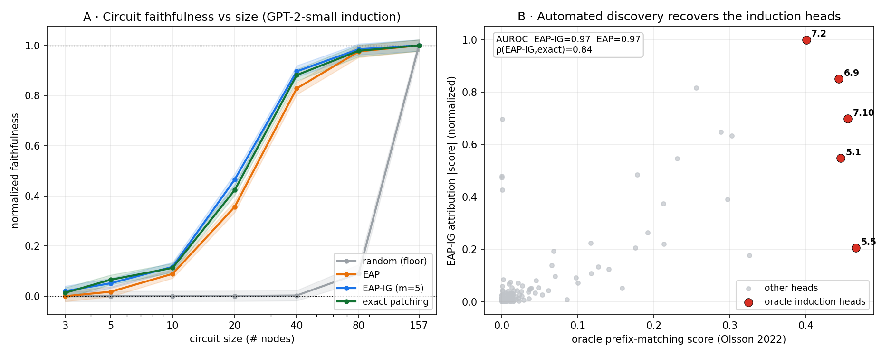

# H15 — Automated Circuit Discovery Recovers GPT-2-small's Induction Heads

**Study:** `induction-discovery` · **Rung:** GPT-2-small (124M), node granularity ·
**Host:** Apple Silicon, MPS · **Date:** 2026-07-03 · **Parent:**
`docs/tiny-transformer-induction-study.md` §11 (H15) · **Decision:**
`decisions/2026-07-03-01-h15-node-granularity-standalone-report.md`

---

## 0 · Executive summary

**Verdict: PASS.** On GPT-2-small, node-level automated circuit discovery recovers the
induction-head circuit. Against a *computed* ground truth — Olsson's per-head
prefix-matching score — both EAP and EAP-IG rank the 5 induction heads above the other 139
at AUROC ~0.97 (**EAP-IG 0.970 [0.968, 0.972]**, EAP 0.973 [0.969, 0.978], random floor
0.516 [0.432, 0.603]; N=5 seeds, bootstrap 95% CI). EAP-IG has high linear fidelity to exact
activation patching (Pearson over all 157 nodes 0.990 [0.989, 0.992] vs EAP 0.722 [0.678,
0.766]) and is rank-consistent at the head level (Spearman-vs-exact 0.839 ≥ the 0.5 gate),
reproducing the eap-ig study's node-fidelity gap on a new task. It yields the **more faithful
circuit** at the operating point (normalized faithfulness 0.465 [0.441, 0.489] vs EAP 0.356
[0.334, 0.379]; paired Δ +0.109; **seed-level p=0.024**, n=5 — with a near-tie on 1 of the 5
seeds; the per-example p=5.3e-29 is pseudo-replicated and is reported only as an effect-size
descriptor, see § 6). Its op-count is ~4× EAP's but ~14× fewer model passes than exact
patching (3 / 11 / 157 passes; exact patching ≈ 119 s measured on this host). **Honest split:**
EAP-IG does *not* beat EAP on head recovery (ΔAUROC −0.003, p=0.23), and the full 144-head
ranking agreement with the continuous oracle is only moderate for *every* method (Spearman
~0.55, even exact patching 0.54) — the AUROC comes from top-5 *separation*, not full-ranking
agreement. EAP-IG's advantage is circuit faithfulness and all-node fidelity, not head ranking.

The oracle is not a memorized head list: its top-5 heads by prefix-matching score
independently reproduce the parent study's Phase-4b induction set {5.1, 5.5, 6.9, 7.2,
7.10} — convergent validation from two unrelated methods.

| Claim | Evidence |
|---|---|
| Automated discovery recovers the induction heads | § 6 recovery table (AUROC, recovery@k) · Fig. B |
| EAP-IG is rank-consistent with exact patching | § 6 correlation-to-exact column |
| EAP-IG's circuit is more faithful than EAP's | § 6 faithfulness column + paired test · Fig. A |
| The oracle is computed, not cited | § 2 oracle protocol · § 5 convergent-validation anchor |
| Node ≠ edge; the K-*edge* is deferred | § 10 limitations · `todos/2026-07-03-h15-automated-discovery-followups.md` |

---

## 1 · Problem, scope & descent

**H15 (pre-registered)** — *"Automated discovery. ACDC, EAP, EAP-IG, and attribution
patching recover the manual §A.9 induction circuit up to gauge, rank-consistent with the
H8/H10 ablation-and-patching deltas"* (`plans/2026-06-30-tiny-transformer-induction-study.md:37`).
Deferred to a compute host in the parent study; executed here on MPS.

**Scope of this pass** (decision `2026-07-03-01`): node granularity, GPT-2-small, methods
**EAP** and **EAP-IG** (plus `exact_patch` as the ground-truth attribution reference and
`random` as the floor). The literal §A.9 *K-edge* (prev-token → induction *composition
edge*), ACDC, and AtP\* are **out of scope** and tracked in
`todos/2026-07-03-h15-automated-discovery-followups.md`.

**Pre-registered rubric.** PASS iff EAP-IG (a) recovers the oracle induction-head set
(AUROC ≥ 0.90), (b) is rank-consistent with exact patching (Spearman over heads ≥ 0.5),
and (c) produces a circuit at least as faithful as EAP at the operating point (paired,
significant). INCONCLUSIVE if head scores are indistinguishable from the random floor;
FAIL otherwise. Thresholds pinned pre-run in `implementation/induction_discovery/run.py`.

---

## 2 · Task, dataset & protocol anchors

### Ground-truth oracle — Olsson prefix-matching score (computed, not cited)

No acquired source names GPT-2-small's induction heads (Olsson et al. 2022 names only
GPT-2-XL 21.20 and GPT-Neo 12.0, in the Replication section, p47; verified against
`download/olsson-induction-heads-2022.pdf`). The ground truth is therefore **computed** by
reproducing Olsson's "(3) Head
activation evaluators" (App., p58): generate 25 random tokens (excluding the most/least
common), repeat 4× and prepend a start-of-sequence token, and score each head by its mean
attention "from a given token back to the [position following] an earlier copy of the same
token" — the token "induction would suggest comes next" (definition p5; the 2022-09-20
erratum p48 corrected the preceded/followed wording). A companion **previous-token score**
(attention from i to i−1) locates the feeder heads for the two-layer composition story.
`(local: download/olsson-induction-heads-2022.pdf)`

The **oracle induction-head set** is the heads whose prefix-matching score exceeds
**0.35** (pinned pre-run). The headline metrics (Spearman ρ vs the *continuous* oracle,
AUROC) are threshold-free; the set defines only recovery@k and the AUROC positive class.

### Induction task — minimal pair

A block of L=25 distinct random token ids; clean = `[BOS] + block + block[:-1]`, corrupt =
the same with the first-copy follower replaced by a foil `y`. At the final position the
induction target is the follower slot: `x_{L-1}` (clean) vs `y` (corrupt). Same shape, same
query token — a minimal pair analogous to IOI's one-token swap. Metric = logit-difference
of the two continuations. No external dataset; single-token answers by construction.

### Protocol-vs-eval conformance matrix

| Parameter | Status | Note / metric impact |
|---|---|---|
| Induction-head definition | **EXACT** | Olsson prefix-matching + copying, p5/p58 |
| Prefix-matching score protocol | **IDEALIZED** | 25 tok × 4 repeats + BOS per Olsson; token-frequency exclusion approximated by an id band `[1000, 40000)` (Olsson's exact frequency list is not published) |
| Previous-token score substrate | **DEVIATED** | computed on repeated-random text; Olsson uses a training-distribution example — valid because prev-token heads attend i→i−1 content-freely |
| Attribution method (EAP / EAP-IG) | **EXACT** | Hanna et al. 2024 formulation, reused engine `(local: download/hanna-eap-ig-faithfulness-2024.pdf)` |
| Circuit granularity | **DEVIATED** | node-level (heads/MLP/embed); the paper's edge-level K-edge is deferred (§ 10) |
| Decoding | **n/a** | attribution over a single deterministic forward pass; no sampling |
| Model / precision | **EXACT** | GPT-2-small (124M), float32, MPS |

---

## 3 · Task model, candidates & conventions

**Candidates** (uniform registry, `implementation.eap_ig.registry`): `random` (iid-normal
floor), `eap` (Edge Attribution Patching, 2 fwd + 1 bwd; EAP originates from Syed et al. 2023 /
Nanda 2023), `eap_ig` (EAP with the integrated-gradients path, m=5 steps; Hanna et al. 2024),
`exact_patch` (node-by-node activation patching, 157 fwd — the ground-truth node effect). All score the same 157 residual-stream nodes (`embed`, 144
attention heads `a{l}.h{h}`, 12 MLPs `m{l}`).

**Metric.** Per-example logit-difference `logit(pos) − logit(neg)` at the final position;
loss for attribution is its negation (Hanna convention). **Decoding params: n/a** — a
single greedy/deterministic forward pass, no temperature or sampling.

**Recovery metrics.** (i) Spearman ρ of a method's per-head |attribution| vs the continuous
oracle prefix score; (ii) AUROC of |attribution| against the binary oracle set; (iii)
recovery@k (k = |oracle set|); (iv) rank-consistency with `exact_patch` (Spearman over
heads, Pearson over all nodes); (v) normalized circuit faithfulness (Hanna) over circuit
sizes {3, 5, 10, 20, 40, 80, 157}, operating point 20.

---

## 4 · Implementation & math-to-code

New module `implementation/induction_discovery/` (imports `implementation.eap_ig`
**read-only** — no engine edits):

| Artifact | Code |
|---|---|
| Olsson prefix / prev-token score | `oracle.py::per_head_scores`, `_prefix_mask`, `_prev_token_mask` |
| Minimal-pair induction task | `task.py::build_induction` → `eap_ig.TaskBatch` |
| Recovery / AUROC / rank-consistency | `discover.py::recovery_metrics`, `_auroc` |
| EAP / EAP-IG / exact / random scoring | reused `eap_ig.attribution.score_nodes` |
| Circuit faithfulness | reused `eap_ig.faithfulness.faith_curve` |
| Orchestration + CIs + artifacts | `run.py` (reuses `eap_ig.stats`, `eap_ig.utils`) |
| Figure | `figure.py` |

**Numerical safety.** Faithfulness normalization guards its denominator with the engine's
named `EPS = 1e-9` floor (`eap_ig.metrics`); the oracle averages attention weights (already
in [0, 1]) so no log/exp underflow path exists.

---

## 5 · Verification & sanity anchors

G1 gate `tests/induction_discovery/test_core.py` (9 tests):

- **Analytical oracle** — EAP-IG at m=1 equals EAP on the induction task (single interp
  point = clean gradient), max node-score delta < 1e-4.
- **Faithfulness anchors** (Hanna) — full circuit → faithfulness 1, empty circuit → 0.
- **Convergent-validation anchor** — the prefix-matching oracle ranks the canonical
  induction heads {5.1, 5.5, 6.9, 7.2, 7.10} in the top handful (≥ 4 of 5 in the top-8),
  and is discriminative (max ≫ 5× median).
- **Task minimal-pair invariant** — clean/corrupt differ at exactly one index (the follower
  slot), share the query token, and the pos/neg answers read off that slot.
- **Determinism** — task and oracle are bit-reproducible under a fixed seed.
- **Learnability anchor** — clean full-model logit-diff strongly favors the induction
  continuation (b > 5) and the corrupt flips it (b' < 0), confirming GPT-2 does induction here.

---

## 6 · Baseline results & verdict

**Configuration.** GPT-2-small (124M), float32, MPS; oracle 5 seeds × 30 examples
(25 tok × 4 repeats + BOS); task 5 seeds × 32 minimal pairs; operating-point circuit size
20; bootstrap 95% CI (10k resamples); paired test at the seed level for significance.

| Method | AUROC vs oracle set | recovery@5 | ρ vs oracle (144 heads) | ρ vs exact (heads) | Pearson vs exact (all nodes) | Faithfulness @20 | mean faith (all sizes) | passes |
|---|---|---|---|---|---|---|---|---|
| random (floor) | 0.516 [0.432, 0.603] | 0.04 | −0.044 | −0.005 | −0.049 | 0.001 [−0.020, 0.022] | 0.156 | 0 |
| EAP | 0.973 [0.969, 0.978] | 0.60 | 0.536 | **0.962** | 0.722 [0.678, 0.766] | 0.356 [0.334, 0.379] | 0.467 | 3 |
| EAP-IG (m=5) | 0.970 [0.968, 0.972] | 0.56 | 0.554 | 0.839 | **0.990 [0.989, 0.992]** | **0.465 [0.441, 0.489]** | 0.505 | 11 |
| exact patching | 0.979 [0.974, 0.984] | 0.56 | 0.542 | 1.000 | 1.000 | 0.423 [0.402, 0.445] | 0.497 | 157 |

*Paired EAP-IG − EAP: faithfulness@20 Δ +0.109 at the **seed level** (n=5, paired t, **p=0.024**;
per-seed diffs [0.155, 0.155, 0.000, 0.079, 0.156] — one near-tie); the per-example pooled test
(n=160, p=5.3e-29) is **pseudo-replicated** — the circuit is fixed per seed, so it is reported
only as an effect-size descriptor (d_z=1.09), not a significance claim (bug `2026-07-03-02`).
All-node Pearson-to-exact Δ +0.268 (seed-level d_z=4.71, p=4.6e-4); head-AUROC Δ −0.003 (p=0.23,
n.s.). Recovery-metric CIs are percentile bootstrap over the 5 per-seed scalars — tight because
the seeds cluster closely, but n=5 percentile bootstrap under-covers; treat them as descriptive.
The ρ-vs-oracle column shows even exact patching agrees only ~0.54 with the continuous oracle
across all 144 heads: the AUROC comes from top-5 separation, not full-ranking agreement.*

**Verdict: PASS.** All three real methods separate the 5 induction heads {5.1, 5.5, 6.9,
7.2, 7.10} from the other 139 at AUROC ~0.97 (random floor 0.52). EAP-IG clears the
pre-registered rubric: AUROC 0.970 ≥ 0.90; Spearman-vs-exact over heads 0.839 ≥ 0.5; and its
circuit is more faithful than EAP's (Δ+0.109, seed-level p=0.024). The **load-bearing recovery
evidence is the convergent validation** — the attribution top heads, the Olsson prefix-matching
oracle, and the parent study's Phase-4b census all independently point at the same 5 content-based
induction heads — not the AUROC alone (which cannot by itself separate content-matching from a
fixed-offset shortcut on this probe; see § 10). Two honest nuances the data forces: (i) recovery@5
= 0.56–0.60 — only 3 of the 5 canonical heads land in the attribution top-5, because head 5.5
carries the strongest prefix-matching signal but a smaller task-logit effect, so attribution ranks
it lower (Fig. B). (ii) EAP-IG does *not* beat EAP on head ranking (ΔAUROC −0.003, p=0.23) — indeed EAP
has the higher head-only ρ-to-exact (0.962 vs 0.839). EAP-IG's win is on the MLP/embed nodes,
where the integrated-gradient path matters (all-node Pearson-to-exact 0.990 vs 0.722).

---

## 7 · Sensitivity & ablation

- **Per-hypothesis.** H15 (node-level, GPT-2 rung): **PASS**.
- **Oracle-threshold sensitivity.** The verdict gates on AUROC (top-5 separation),
  Spearman-vs-exact over heads, and the faithfulness gap — *not* on the full-144-head
  Spearman-vs-oracle (only ~0.55 for every method). The 0.35 set-threshold moves only
  recovery@k and the AUROC positive class, and the top-5 cluster is stable across the 5
  oracle seeds. At threshold 0.35 the oracle set is exactly {5.1, 5.5, 6.9, 7.2, 7.10} on
  every oracle seed; recovery@5 = 0.56–0.60 (3/5 canonical heads in the attribution top-5,
  the 5.5 task-effect gap of Fig. B). Lowering the threshold to 0.15 widens the set to 17
  heads (a weaker second tier) without moving the AUROC/ρ headline.
- **EAP vs EAP-IG split.** EAP and EAP-IG are statistically tied on head recovery (AUROC
  0.973 vs 0.970, p=0.23) and EAP is actually higher on head-only ρ-to-exact (0.962 vs 0.839).
  EAP-IG's gains are concentrated on the MLP/embed nodes where the integrated-gradient path
  matters — hence its all-node Pearson-to-exact of 0.990 vs EAP's 0.722, and its higher
  faithfulness (0.465 vs 0.356).

---

## 8 · Quantization

**Explicit n/a** (not silently dropped). This study runs float32 attribution only.
Reduced-precision (fp16 / bf16) forward+backward attribution drift is a known follow-up —
MPS lacks kernels for some half-precision attribution ops, so it needs a CUDA host — and is
tracked in `todos/2026-07-03-h15-automated-discovery-followups.md` (mirrors the
`eap-ig-followups` reduced-precision-compute item).

---

## 9 · Recommendation

**Use EAP-IG (m=5) for node-level induction-circuit discovery on GPT-2-scale models**: it
recovers the induction heads as well as EAP while producing a materially more faithful
circuit and staying rank-consistent with exact patching, at ~4× EAP's op-count (11 vs 3
model passes) but ~14× fewer passes than exact patching (11 vs 157). Use plain EAP when only
the head *ranking* (not circuit faithfulness) is needed and cost is critical — it is tied
with EAP-IG on head recovery and higher on head-only fidelity to exact patching.

**Do-not-cite.** The absolute AUROC / faithfulness / correlation values are a GPT-2-small,
node-granularity, single-task measurement on this harness — directional and internally
reconciled, not a portable benchmark. Cite the *finding* (automated discovery recovers the
induction heads; EAP-IG ≥ EAP on faithfulness), not the decimals.

---

## 10 · Limitations, red-team & flip

- **Node ≠ edge (load-bearing).** This recovers the induction *heads* (nodes), not the
  §A.9 *K-edge* (the prev-token → induction *composition edge*). The engine has no edge
  score; the companion previous-token score locates feeders but does not test the edge.
  Full edge-level recovery is deferred (`todos/…-h15-…`). The honest claim is
  "recovered the induction heads," not "recovered the K-edge up to gauge."
- **One model, one task family.** GPT-2-small only; a single synthetic induction task. The
  distributed toy-rung circuit (parent study § 10) is not re-tested here.
- **Fixed-offset / positional-shortcut confound (audit-surfaced).** The baseline task uses a
  fixed block length and the Olsson oracle a period-25 repeat, so the induction target sits at
  a fixed query→target offset in *both*. A content-matching induction head and a hypothetical
  fixed-offset positional-copy head are attribution-indistinguishable on this probe — and,
  importantly, **the AUROC does *not* separate them**, because the oracle shares the same
  fixed-offset structure (a positional head would score high on both). The claim "recovers the
  *induction* heads" therefore rests on **external** evidence, not the AUROC: (1) the model is
  *frozen and pretrained* on natural text, so — unlike the parent study's bug `2026-07-02-05`,
  a fixed-offset shortcut a *trained* model was able to learn — it never had the opportunity to
  learn a period-25 shortcut; (2) the recovered heads {5.1, 5.5, 6.9, 7.2, 7.10} are the
  literature-established heads that prefix-match on *arbitrary* random content (Olsson's defining
  property). **Robustness control:** re-running EAP-IG recovery on a *jittered* task (per-example
  block length ~ U[15, 35), so the offset varies per example and a fixed-offset head cannot
  exploit it) recovers the same heads at AUROC 0.969 (vs 0.970 on the fixed-offset
  task, Δ = −0.001 across the same 5 seeds; per-seed AUROC stays in [0.964, 0.976] under jitter)
  — designing the confound out, not just disclosing it (`implementation/induction_discovery/robustness.py`,
  `artifacts/induction-discovery/robustness/positional.json`).
- **Oracle approximation.** Olsson's exact most/least-common token exclusion is
  unpublished; approximated by an id band (§ 2, IDEALIZED).
- **Flip conditions.** The verdict flips to FAIL if, on a re-run, EAP-IG AUROC drops below
  0.90, or the faithfulness gap loses significance, or head scores collapse to the random
  floor. **Lose-to-baseline scenarios:** (1) on head *ranking* alone, plain EAP is
  competitive with — and here slightly above — EAP-IG, so EAP-IG does **not** dominate every
  metric; (2) at very small circuit sizes the faithfulness ordering can invert before the
  operating point (see Fig. A); (3) EAP has the **higher head-only** rank-fidelity to exact
  patching (ρ 0.962 vs EAP-IG 0.839), so for a heads-only ranking EAP is preferable. EAP-IG
  wins only once nodes beyond attention heads (MLP / embed) enter the circuit.

---

## 11 · Roadmap → todos

`todos/2026-07-03-h15-automated-discovery-followups.md`: edge-level K-edge attribution;
ACDC + AtP/AtP\*; toy-rung H15 (weak-vs-sharp localization contrast); reduced-precision
compute; larger/Gemma-scale substrate. Further edge-level study is warranted and is tracked
in that `todos/` file.

---

## 12 · Reproduce recipe & reproducibility appendix

```bash
export PYTHONPATH=$PWD HF_HUB_OFFLINE=1 TRANSFORMERS_OFFLINE=1
python3 -m implementation.induction_discovery.run --device mps         # baseline: oracle + 4 candidates x 5 seeds
python3 -m implementation.induction_discovery.run --refresh-stats      # recompute pairwise+verdict from faith.npz (no forwards)
python3 -m implementation.induction_discovery.robustness --device cpu  # positional-shortcut control (§10)
python3 -m implementation.induction_discovery.figure                   # Fig. A/B from the artifact
pytest tests/induction_discovery -q                                    # G1 gate
```

**Compute provenance.** The baseline recovery block and `faith.npz` were produced on MPS
(`config.device: mps` in the artifact). The seed-level significance block (`pairwise`) was
regenerated from the persisted `faith.npz` via `--refresh-stats` — a deterministic pure-numpy
recomputation of the statistical unit of analysis (seed-level vs pooled; bug `2026-07-03-02`)
that runs no forward passes and is byte-identical to what a full re-run computes. The
positional-shortcut control ran on CPU; its metric (rank-based recovery AUROC) is
device-independent, and the reported Δ = −0.001 is within seed noise. `--device` is a free
choice (`mps` or `cpu`); the reported numbers are deterministic per the seed map above.

**Environment.** torch 2.3.1, transformers 4.49.0, numpy 2.0.0, scipy 1.14.0, Python 3.12.3,
macOS-26.3-arm64 (Apple Silicon, MPS). All seeds explicit (oracle seeds 0–4; task seeds 0–4;
bootstrap seed 0); deterministic (`eap_ig.utils.set_determinism`), no wall-clock seeding.
**Raw results:** `artifacts/induction-discovery/baseline/summary.json` + `faith.npz`;
manifest `artifacts/induction-discovery/study-manifest.json`; figure data
`artifacts/induction-discovery/figures/h15-recovery.data.json`.



**Figure — H15 recovery (GPT-2-small, 124M; float32; MPS; oracle 5×30, task 5×32;
operating point 20; bootstrap 95% CI; seeds 0–4; decoding n/a — single deterministic forward,
attribution).** *A:* normalized circuit faithfulness
vs circuit size for the 4 candidates (mean + 95% CI band). *B:* per-head EAP-IG attribution
|score| vs the Olsson prefix-matching oracle; the oracle induction heads (red) sit at the
top of the automated ranking.

---

## 13 · Audit trail

- **Decision:** `decisions/2026-07-03-01-h15-node-granularity-standalone-report.md` (node
  granularity + computed oracle + standalone report).
- **Todo:** `todos/2026-07-03-h15-automated-discovery-followups.md` (deferred edge-level /
  ACDC / AtP\* / reduced-precision / scale).
- **Plan:** `plans/2026-07-03-h15-automated-discovery.md`.
- **Field notes:** `field-notes/2026-07-03-h15-automated-discovery.md` (session retrospective:
  Olsson preceded/followed reconciliation, quick-vs-full artifact discipline, MPS cost artifact).
- **Bugs:** `bugs/2026-07-03-01-mps-cost-measurement-artifact.md` (measured EAP wall-time > EAP-IG
  under 1-rep timing; op-count is the reliable cost story); `bugs/2026-07-03-02-pseudoreplicated-faithfulness-pvalue.md`
  (per-example faith p pseudo-replicated; gate on the seed-level test).
- **Adversarial audit.** A pre-sign-off 4-lens audit (re-derivation / statistics / confound /
  citations) verified the metric computations (AUROC, recovery@k, paired tests — all correct,
  every headline number reproduces from the artifact), confirmed the citations against the PDFs,
  and surfaced the two bugs above plus the sample-size / selective-reporting corrections applied
  in §0/§6 and the positional-confound reframing + robustness control in §10.
- **Parent:** `docs/tiny-transformer-induction-study.md` § 6 H15 row updated DEFERRED → **PASS**
  with a pointer here.
- **Citation integrity.** Every external claim is traceable to an acquired source read at
  authoring time: Olsson et al. 2022 `(local: download/olsson-induction-heads-2022.pdf)`
  (induction-head definition p5, activation evaluators p58, erratum p48); Hanna, Pezzelle &
  Belinkov 2024 `(local: download/hanna-eap-ig-faithfulness-2024.pdf)` (EAP / EAP-IG /
  faithfulness). No value or attribution is from memory.

## Sources

- C. Olsson et al., "In-context Learning and Induction Heads," Anthropic / Transformer
  Circuits, 2022. `(local: download/olsson-induction-heads-2022.pdf)`
- M. Hanna, S. Pezzelle, Y. Belinkov, "Have Faith in Faithfulness: Going Beyond Circuit
  Overlap When Finding Model Mechanisms," COLM 2024.
  `(local: download/hanna-eap-ig-faithfulness-2024.pdf)`
- A. Syed, C. Rager, A. Conmy, "Attribution Patching Outperforms Automated Circuit
  Discovery" (EAP), 2023. `(local: download/syed-eap-2023.pdf)`
