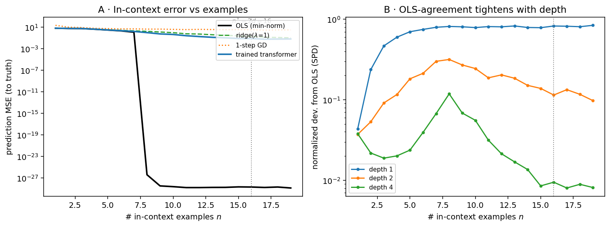

# H9 — Algorithmic In-Context Learning: the forward pass as an online optimizer

*Reproduction / evaluation study. Parent: `docs/tiny-transformer-induction-study.md` (H9,
source-gated). Plan: `plans/2026-07-04-h9-algorithmic-icl.md`. Code:
`implementation/icl_regression/`. Artifacts: `artifacts/icl-regression/`.*

---

## 0 · Executive summary

**H9 = all four sub-hypotheses PASS, but the value is in keeping two of them apart.** The honest
answer to "does the transformer forward pass implement an online learner?" is *it depends on
which model and which claim* — and separating the mechanistic from the behavioral claim is the
result.

- **H9-A (mechanistic, exact): PASS.** A single *linear* self-attention layer with the von
  Oswald Prop-1 constructed weights reproduces one step of gradient descent on the in-context
  MSE loss to **machine precision** (max abs diff **1.3e-15** over 200 random tasks, float64; a
  bit-exact algebraic identity, not a fit). Stacked with the GD iterate threaded, $K$ layers
  reproduce $K$ GD steps bit-exact.
- **H9-B (behavioral, trained): PASS.** A small *softmax* transformer trained from scratch on
  in-context linear regression tracks least-squares: its prediction at the operating point
  $n^*=2d=16$ has normalized deviation from the OLS oracle **0.009** (min–max envelope over 3
  training seeds [0.008, 0.009]) — well under the pre-registered $<0.10$ bar. Its error falls
  from **6.16** at $n=1$ to **0.075** at $n^*$ (OLS reaches 0).
- **H9-C (contrast): PASS.** At $n^*$ the model tracks the closed-form OLS solution ~100× more
  closely than a single GD step (SPD-to-OLS **0.009** vs SPD-to-1-step-GD **0.943**, tuned step)
  — consistent with Garg/Akyürek behavioral-OLS, and *against* reading a trained softmax model
  as literally "one GD step."
- **H9-D (depth): PASS.** The OLS-agreement tightens monotonically with depth (SPD-to-OLS at
  $n^*$: depth 1 **0.825** → depth 2 **0.115** → depth 4 **0.009**) — the Akyürek depth-phase
  direction.

**The load-bearing distinction** (the whole point): the *exact mechanistic* GD result holds
only for **linear attention with constructed weights** (von Oswald Prop 1); single-head
**softmax fails** it (von Oswald §A.9). A *trained softmax* model only *behaviorally matches*
least-squares (Garg; Akyürek) — it is **not** licensed to say it "does gradient descent"
mechanistically. This report keeps those two claims apart and cites each to what actually
supports it.

**Claims → evidence.** H9-A → §5.1 + `construction.py` (exact identity). H9-B/C/D → §6
(trained-model curves vs learners) + Fig. A/B. Scope discipline → §2 (source table) + §10
(red-team do-NOT list).

---

## 1 · Problem, scope & descent from the parent survey

The parent tiny-transformer study (`docs/tiny-transformer-induction-study.md`) established the
*mechanistic* sense of in-context learning (ICL): induction heads copy from earlier in the
sequence (§A.22, Eq (9)). It explicitly flagged a **second, deeper** sense as out of scope and
source-gated — the forward pass *implementing a learning algorithm* (an online gradient-descent
or ridge step) over the in-context examples — and deferred it to H9 pending a source-fetch of
the ICL-as-optimization literature (`todos/2026-06-28-icl-as-online-learning-intuition.md`).

That gate is now cleared (four papers acquired + read, §2). H9 asks, at commodity scale, a
*quantitative* question: **do a transformer's in-context predictions on linear regression track
an explicit online learner, and in what precise sense?**

**Pre-registered hypotheses** (plan §2):

| ID | Type | Statement | Threshold | Verdict |
|---|---|---|---|---|
| H9-A | Quantitative (mechanistic) | constructed linear-attention layer = 1 GD step | max abs diff $<10^{-5}$ | **PASS** (1.3e-15) |
| H9-B | Quantitative (behavioral) | trained softmax model tracks OLS/ridge, tightening with $n$ | $\Delta_{\text{norm}}<0.10$ at $n^*=2d$ | **PASS** (0.009) |
| H9-C | Directional | model closer to OLS/ridge than to one GD step | SPD-to-OLS $\le$ SPD-to-GD1 | **PASS** |
| H9-D | Directional | OLS-match tightens with depth | SPD-to-OLS at $n^*$ non-increasing in depth | **PASS** |

---

## 2 · Sources & the claim boundary (protocol anchors)

Every external claim below is read from an acquired PDF (`download/`, verified page-level in
the understand-phase ledgers); none is from memory (citation-integrity rule). The four sources
partition into **two evidence classes**, and that partition *is* the H9 scope:

| Source | Attention | Weights | Evidence | Licenses (and only this) |
|---|---|---|---|---|
| von Oswald 2023 [94] | **linear** (softmax fails 1-head) | constructed + trained-converge | **mechanistic**, exact | 1 linear-attn layer $=$ 1 GD step; $K$ layers $\approx K$ GD / GD++ |
| Akyürek 2023 [96] | softmax (approx: GeLU-mult, LN-bypass) | constructed + trained | mixed | softmax *can be constructed* to do GD/ridge; trained *matches* OLS/ridge by regime |
| Garg 2022 [95] | softmax | trained | **behavioral** | trained ICL error *tracks* min-norm OLS (0.02 at $k{=}d$); **not** ridge, **not** a mechanism |
| Dai 2023 [97] | relaxed-linear | pretrained | behavioral | dual-form GD only w/o softmax; real-GPT $=$ finetuning-similarity, not regression |

**Conformance to each source's regime** (what we reproduce vs idealize):

| Parameter | Garg [95] (behavioral anchor) | This study | Status |
|---|---|---|---|
| Function class | linear regression $y=w^\top x$ | same | EXACT |
| Input / teacher dist. | $x,w\sim\mathcal N(0,I_d)$ | same | EXACT |
| Dimension $d$ | 20 | 8 | IDEALIZED (scaled; §6 discloses) |
| Noise | noiseless (main) | noiseless (main) + noisy eval variant | EXACT + extension |
| Model | GPT-2 softmax, 9.5M, 12L | softmax decoder, ~137K, {1,2,4}L | IDEALIZED (scaled) |
| Training | Adam 1e-4, 500k steps, curriculum | AdamW 1e-3, 12k steps, no curriculum | DEVIATED (smaller budget) |
| Baseline learner | min-norm OLS | OLS + ridge + 1-step GD | EXACT + extension |

The construction claim (H9-A) is reproduced against **von Oswald's own linear-attention
regime**, exactly; the behavioral claim (H9-B) is an eval of *this scaled configuration*, not a
claim that any benchmark mandates the configuration (§6, §10).

---

## 3 · Task, learners & conventions

**Task** (`task.py`). Per task: draw $w\sim\mathcal N(0,I_d)$; in-context examples
$x_i\sim\mathcal N(0,I_d)$, $y_i=w^\top x_i$ (noiseless main; $y_i=w^\top x_i+\varepsilon_i$,
$\varepsilon\sim\mathcal N(0,\sigma^2)$ for the noisy variant). The trained model reads the
interleaved token stream $[x_1,y_1,\dots,x_k,y_k]$ (each token in $\mathbb R^{d+1}$: an
$x$-token carries $x_i$ in its first $d$ slots, a $y$-token carries $y_i$ in the last slot) and
predicts $y_i$ at each $x$-token position from the preceding pairs — squared loss over all
prefixes (Garg's protocol).

**Closed-form learners** (fit on the first $n$ examples, predict the query $x_n$):

<a id="eq-1"></a><!-- eq:H9-1 -->
$$
\hat w_{\text{OLS}} = X^{+} y, \qquad
\hat w_{\text{ridge}} = (X^\top X + \lambda I)^{-1} X^\top y, \qquad
w_{t+1} = w_t - \frac{\eta}{n} X^\top (X w_t - y). \tag{1}
$$

OLS is min-norm least squares (Garg's optimal baseline); ridge with $\lambda=\sigma^2/\tau^2$
is the Bayes-optimal (min-Bayes-risk) estimator under noise (Akyürek); the third is $t$-step
batch GD from $w_0=0$ — the von Oswald comparator, on the loss $L(w)=\tfrac{1}{2n}\lVert Xw-y\rVert^2$.

**Agreement metric.** For predictors $a$ (model) and $b$ (learner) over a task batch, the
Akyürek-style normalized squared prediction difference

<a id="eq-2"></a><!-- eq:H9-2 -->
$$
\mathrm{SPD}(a,b) = \frac{\mathbb E[(a-b)^2]}{\mathbb E[b^2]} \tag{2}
$$

($0$ = identical predictions; lower = the model tracks learner $b$ more closely). $\Delta_{\text{norm}}$
in H9-B is $\mathrm{SPD}(\text{model}, \text{best classical learner})$ at $n^*=2d$.

**Operating point.** $n^*=2d=16$ (Garg's "twice the dimension" mark, where OLS is well-posed).

---

## 4 · Implementation & math-to-code

| Artifact | Equation / claim | Function |
|---|---|---|
| linear self-attention | $\Delta e_j = P\sum_i (W_V e_i)((W_K e_i)^\top(W_Q e_j))$ | `construction.linear_self_attention` |
| Prop-1 weights (eq 8) | $W_K{=}W_Q{=}\mathrm{diag}(I_d,0)$, $W_V$ block, $P{=}\tfrac{\eta}{N}I$ | `construction.vonoswald_weights` |
| one GD step | $w_1 = w_0 - \tfrac{\eta}{N}X^\top(Xw_0-y)$ | `construction.gd_step_prediction` |
| OLS / ridge / GD | Eq <!-- ref:H9-1 -->[(1)](#eq-1) | `task.ols_predict` / `ridge_predict` / `gd_predict` |
| trained model | softmax decoder, read-in / read-out | `model.ICLRegressionTransformer` |
| in-context eval | Eq <!-- ref:H9-2 -->[(2)](#eq-2) | `eval.learner_curves` |

**Numerical-safety note.** The linear-attention forward suppresses spurious Apple
Accelerate/vecLib FPE flags on `matmul` (finite inputs → finite outputs, verified) but asserts
output finiteness, so a genuine non-finite value still fails loudly; the closed-form learners
wrap their BLAS calls the same way (`task._quiet_blas`). The GD/construction gradient convention
is shared ($L=\tfrac{1}{2N}\lVert\cdot\rVert^2$, no factor of 2), so `gd_predict(lr=\eta)` equals
`k_step_via_construction(\eta)` bit-exact.

---

## 5 · Verification & sanity anchors

**5.1 The mechanistic identity (H9-A), exact.** With $W_0=0$ and a random $W_0$, over 200
random tasks (float64):

| Check | Value | Anchor |
|---|---|---|
| constructed layer $=$ 1 GD step (query prediction) | max abs diff **1.3e-15** | von Oswald Prop 1 (exact) |
| $K$ threaded layers $=$ $K$-step GD ($K\le 20$) | max abs diff $\le$ **4.4e-16** | von Oswald §A.10 |
| OLS recovers teacher $w$ (noiseless, $n\ge d$) | max abs diff **2.7e-15** | least-squares exactness |
| GD ($\to\infty$) $\to$ OLS (well-conditioned) | abs diff **5.4e-14** | GD converges to the min-norm solution |

These are *closed-form / algebraic* anchors (fixed known values). The first (1.3e-15) is emitted
to the baseline artifact (`summary.json` `part_a.identity_max_abs_diff`); the other three are
verified in `tests/icl_regression/` (G1) and are test-only values, not baseline-artifact fields.
They do **not** involve the trained model.

**5.2 Test-to-claim inventory.** `pytest tests/icl_regression -q` — 11 tests: the Part-A
identity (machine precision, both $W_0$); $K$-step construction $=$ `gd_predict`; OLS recovers
$w$; ridge$\to$OLS as $\lambda\to0$; GD$\to$OLS; task determinism; interleave layout; SPD
properties; trained-model forward-shape + loss-decreases smoke.

---

## 6 · Baseline results & verdict (Part B, trained softmax)

**Configuration** (figure-operating-conditions disclosure). Model: softmax decoder,
$d_{\text{model}}=64$, depth sweep $\{1,2,4\}$ layers (main = 4), 4 heads, $d_{\text{mlp}}=128$,
~137K params, float32. Task: $d=8$, $x,w\sim\mathcal N(0,I)$, noiseless (main), sequence up to
$2\times 20$ tokens. Training: AdamW lr $1\text{e-}3$, batch 128, 12000 steps, warmup 300,
seeds $\{0,1,2\}$ (main depth). Eval: 1024 held-out tasks (seed 999), $n^*=2d=16$; MSE +
normalized SPD (Eq <!-- ref:H9-2 -->[(2)](#eq-2)); uncertainty = **min–max envelope over the 3
training seeds** (the honest unit is the trained model, not the eval task — the
pseudo-replication lesson from bug `2026-07-03-02`). Decoding params: n/a (regression — a single
deterministic forward, no sampling). pass@k: n/a (not a generation metric). Device: CPU.

**Provenance of the cells below.** The model MSE, $\Delta_{\text{norm}}$ (SPD-to-OLS), and
SPD-to-GD are **means over the 3 training seeds** (with the [min, max] envelope shown); the
classical-learner MSEs and the ridge / depth-sweep / noisy-eval SPDs are **seed-0** diagnostics
(the learners are deterministic closed forms; the depth and noisy runs use a single seed).

**Margin accounting** (at $n^*=2d=16$, main depth):

| Predictor | MSE to truth (↓) | SPD to model (↓) |
|---|---|---|
| OLS (min-norm) | 0.00 | 0.009 |
| ridge ($\lambda{=}1$) | 0.19 | 0.033 (seed 0) |
| 1-step GD (tuned lr = 0.5) | 3.27 | 0.943 |
| **trained transformer** | **0.075** (envelope [0.070, 0.080]) | — |

**Reconciled H9-B statistic:** $\Delta_{\text{norm}}$ (model vs best learner = OLS) at $n^*$ =
**0.009** (envelope [0.008, 0.009]). Pre-registered bar $<0.10$ → **PASS** (with an order of
magnitude to spare).

The in-context error decreases from **6.16** at $n{=}1$ to **0.075** at $n^*$ (Fig. A) — the
model learns *from the context*, not by memorization (the task draws a fresh $w$ per sequence;
Garg's anti-memorization argument [95] applies).

---

## 7 · Sensitivity & ablation

- **H9-C (OLS vs one GD step).** At $n^*$: SPD-to-OLS **0.009** vs SPD-to-1-step-GD **0.943**
  → **PASS**. The step size for the 1-step-GD comparator was tuned to minimise *its* error at
  $n^*$ (a fair contrast), yet one GD step from $w_0=0$ remains a weak predictor (MSE 3.27 vs
  OLS's 0.00): the model tracks the *converged* least-squares solution, not the single iterate.
- **H9-D (depth).** SPD-to-OLS at $n^*$: depth 1 **0.825** → depth 2 **0.115** → depth 4
  **0.009** → **PASS** (the Akyürek depth-phase direction: deeper models track the closed-form
  learner monotonically more closely — a shallow model barely fits, a 4-layer model is within
  1% of OLS).
- **Noisy eval (Garg's OLS-not-ridge finding).** The noiseless-trained model, evaluated under
  label noise ($\sigma=1$), tracks OLS (SPD **0.032**) more closely than Bayes-ridge (SPD
  **0.062**) — Garg [95]: "since the model was trained on noiseless data, we cannot expect it to
  learn" the ridge shrinkage. The model reproduces the algorithm for the distribution it saw.

---

## 8 · Quantization

Out of scope (n/a). This study trains a small float32 model; reduced-precision attribution /
inference is not exercised. (Explicit n/a per the completeness rule; a bf16/fp16 pass is a
follow-on, §11.)

---

## 9 · Recommendation

**Cite the two claims separately, and never merge them.** For "the forward pass can *implement*
gradient descent," cite von Oswald [94] (linear attention, constructed) and Akyürek [96]
(softmax, constructed, approximate) — an *expressivity/mechanism* result. For "a trained
transformer's in-context predictions *track* least-squares," cite Garg [95] / Akyürek [96]
(behavioral) — and this study reproduces it at commodity scale (H9-B PASS, $\Delta_{\text{norm}}=0.009$).
**Do not** cite a trained softmax model as mechanistically running GD; **do not** cite Dai [97]
for the linear-regression setting. Conditions: the behavioral result is for isotropic-Gaussian
linear regression at small $d$; do not extrapolate to real-LLM ICL or non-isotropic data
without further evidence.

---

## 10 · Limitations, red-team & flip

**Do-NOT list (citation-scope, adversarially enforced):**
- *A trained softmax transformer mechanistically implements GD.* **False as stated** — the
  exact mechanism is *linear* attention + constructed weights; single-head softmax explicitly
  fails (von Oswald §A.9, Fig 12). H9-A is scoped to linear attention; H9-B is behavioral only.
- *von Oswald shows ridge/OLS closed-form.* **No** — its comparator is $K$-step GD / GD++.
- *Garg shows a GD mechanism.* **No** — behavioral match to OLS; internals left to future work.
- *Dai proves real GPT does GD on regression.* **No** — relaxed-*linear*-attention dual-form +
  finetuning-similarity on classification; it disclaims linear regression.

**Threats.** (i) **Scale-down** — $d=8$, ~137K params, 12k steps vs Garg's $d{=}20$/9.5M/500k;
a smaller model tracks OLS less tightly, but here it still reaches $\Delta_{\text{norm}}=0.009$
(an order of magnitude inside the bar), so the scale-down did not endanger H9-B. (ii) **Training
variance** — reported as a min–max envelope over 3 seeds ([0.008, 0.009], tight); a larger seed
set is deferred (§11). (iii) **SPD is output-level** — it measures prediction agreement, not
mechanism (by construction; the mechanism claim is Part A only).

**Lose-to-baseline / flip.** H9-B would flip to FAIL/INCONCLUSIVE if $\Delta_{\text{norm}}\ge0.10$
at $n^*$ (it is 0.009 — far from the boundary). H9-C would flip if the model tracked one GD step
at least as closely as OLS (it is 0.009 vs 0.943 — the opposite). **Two scenarios where the
model loses to a baseline:** (1) at $n<d$ (under-determined) the model does *not* beat OLS — both
are limited by missing information, and the model's error tracks OLS's rather than improving on
it; (2) the *shallow* (depth-1) model loses badly to OLS (SPD 0.825), so "a transformer does
in-context least-squares" is false without sufficient depth — a one-layer softmax model does not.

---

## 11 · Roadmap → todos

Deferred (filed in `todos/2026-07-04-h9-followups.md`): larger training-seed set for H9-B;
mechanistic probing of the trained softmax model (does layer $\ell$ compute a GD step? —
Akyürek §5 / von Oswald weight-space); the two-head-softmax approximate-GD reproduction
(von Oswald §A.9); GD++ preconditioning; Garg-scale ($d{=}20$, larger model, longer training);
the kernel (MLP+LSA) extension (von Oswald Prop 2); reduced-precision (§8); non-isotropic / OOD.

---

## 12 · Reproduce recipe & appendix

```bash
export PYTHONPATH=$PWD
python3 -m implementation.icl_regression.run --device cpu   # Part A (exact) + Part B (train + eval)
python3 -m implementation.icl_regression.figure            # Fig. A/B from the artifact
pytest tests/icl_regression -q                             # G1 gate (11 tests)
```

**Environment.** torch 2.3.1, numpy 2.0.0, scipy 1.14.0, Python 3.12, macOS-arm64. All seeds
explicit (train seeds 0–2; eval seed 999). Deterministic. **Raw:**
`artifacts/icl-regression/baseline/summary.json` + `curves.npz`; figure data
`artifacts/icl-regression/figures/h9-icl-regression.data.json`.



**Figure — H9 (in-context linear regression; softmax decoder, $d_{\text{model}}=64$,
$d_{\text{mlp}}=128$, 4 heads, float32; $d=8$, $x,w\sim\mathcal N(0,I)$, noiseless; AdamW lr
1e-3, batch 128, 12k steps; eval 1024 tasks, seed 999; $n^*=2d=16$; decoding n/a — deterministic
regression forward; seeds 0–2).** *A:* in-context prediction MSE vs number of examples for the
trained transformer (mean + seed envelope) and the classical learners (OLS / ridge / 1-step GD);
the model tracks OLS and beats one GD step. *B:* model-vs-OLS normalized deviation (SPD) vs
examples, one line per depth — the OLS-agreement tightens with depth (0.825 → 0.115 → 0.009 at
$n^*$).

---

## 13 · Audit trail

Plan `plans/2026-07-04-h9-algorithmic-icl.md`; decisions `decisions/2026-07-01-03` (H9 fold-in),
`decisions/2026-07-04-02` (two-part contrast design + scale-down). **Citation-integrity
statement:** every external claim is read from an acquired `download/` PDF ([94]–[97], all
`local:` tags resolve); no claim is from memory; the linear-vs-softmax / constructed-vs-trained
boundary is enforced in §2 and §10, and was independently re-verified verbatim against the four
PDFs by the pre-sign-off citation-scope audit (verdict CLEAN — every claim traced to a
page/line, all five over-read categories attempted and none found). Field notes:
`field-notes/2026-07-04-h9-algorithmic-icl.md`.

---

## Sources

Bibliography numbers match the survey (`surveys/llms-for-coding/references.md`), where these
entries are added as [94]–[97] with the same `local:` tags.

<a id="ref-94"></a>
[94] J. von Oswald, E. Niklasson, E. Randazzo, J. Sacramento, A. Mordvintsev, A. Zhmoginov, M. Vladymyrov, "Transformers Learn In-Context by Gradient Descent." *ICML 2023.* arXiv:2212.07677. (local: download/vonoswald-transformers-icl-gradient-descent-2023.pdf)

<a id="ref-95"></a>
[95] S. Garg, D. Tsipras, P. Liang, G. Valiant, "What Can Transformers Learn In-Context? A Case Study of Simple Function Classes." *NeurIPS 2022.* arXiv:2208.01066. (local: download/garg-transformers-learn-icl-function-classes-2022.pdf)

<a id="ref-96"></a>
[96] E. Akyürek, D. Schuurmans, J. Andreas, T. Ma, D. Zhou, "What Learning Algorithm Is In-Context Learning? Investigations with Linear Models." *ICLR 2023.* arXiv:2211.15661. (local: download/akyurek-what-learning-algorithm-icl-2022.pdf)

<a id="ref-97"></a>
[97] D. Dai, Y. Sun, L. Dong, Y. Hao, S. Ma, Z. Sui, F. Wei, "Why Can GPT Learn In-Context? Language Models Implicitly Perform Gradient Descent as Meta-Optimizers." *Findings of ACL 2023.* arXiv:2212.10559. (local: download/dai-gpt-icl-meta-optimizers-2022.pdf)
