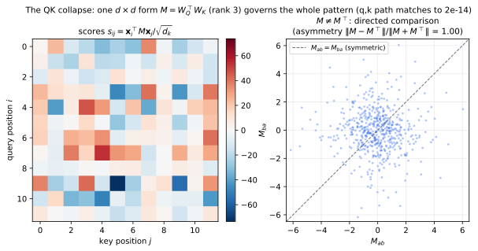
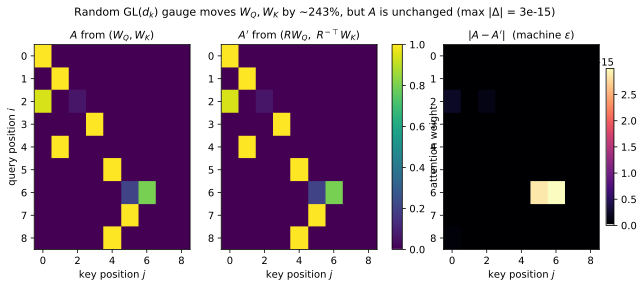
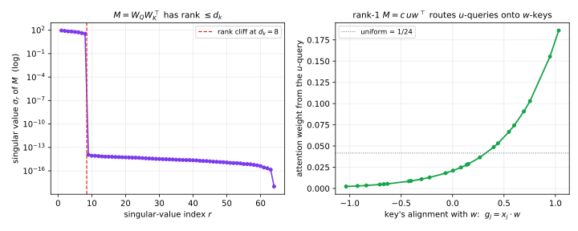
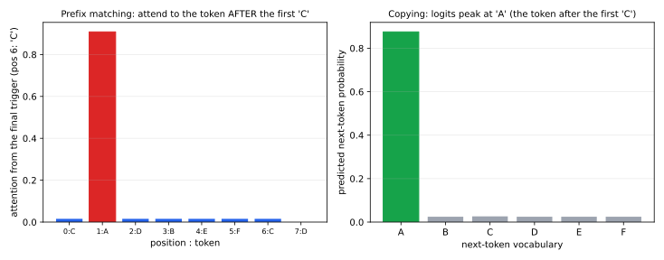

## A Query, Key, and Value from First Principles

<!-- para:a-query-key-and-value-from-first-principles-1 --> Section <!-- secxref:3.3 -->[§3.3](language-models-from-first-principles.md#sec-3.3) introduced self-attention as a content-addressed, data-dependent matched filter and gave its defining equation. This appendix asks a sharper question: once a Transformer is *trained*, what do the learned projection matrices $W_Q$, $W_K$, $W_V$ actually mean? The answer is at first deflating and ultimately clarifying — **the three matrices are not individually meaningful; the network only ever uses two gauge-invariant products.** Everything below is derived from the definition of attention with no skipped steps, and each result is paired with an intuition — several in signal-processing terms, for a reader who thinks in correlators, kernels, and noise floors <!-- cite:54 --> [[54]](references.md#ref-54).

<!-- para:a-query-key-and-value-from-first-principles-2 --> Notation follows three rules throughout: vectors are **bold lowercase columns** ($\mathbf{x}$, $\mathbf{q}$), matrices are non-bold capitals ($W_Q$, $M$), and scalars are non-bold lowercase ($s_{ij}$, $d_k$). The plan: A.1 fixes notation; A.2 and A.3 collapse the six projection matrices into two operators; A.4 proves the gauge freedom that makes the raw matrices unobservable; A.5 and A.6 give two intuitions (kernel regression, matched filter); A.7 derives the $1/\sqrt{d_k}$ scaling; A.8 shows how to *read* a trained head through the singular value decompositions of its two operators; A.9 builds an induction head by hand; A.10 extends to multiple heads; A.11 derives why the QK and OV circuits co-adapt, so neither is meaningful in isolation.

<!-- sec:A.1 -->
### A.1 Setup and Notation

<!-- para:a1-setup-and-notation-1 --> A token's residual-stream vector is a column $\mathbf{x}_i \in \mathbb{R}^{d}$, and the $T$ tokens of a context form the columns of $X \in \mathbb{R}^{d\times T}$. A single attention head owns four learned matrices: query, key, and value projections $W_Q, W_K \in \mathbb{R}^{d_k\times d}$ and $W_V \in \mathbb{R}^{d_v\times d}$, and an output projection $W_O \in \mathbb{R}^{d\times d_v}$ (the head's slice of the multi-head output map of A.10). Per position, $\mathbf{q}_i = W_Q\mathbf{x}_i$, $\mathbf{k}_j = W_K\mathbf{x}_j$, and $\mathbf{v}_j = W_V\mathbf{x}_j$. Stacking these column vectors as the rows of $Q, K, V$ recovers the compact matrix form of Section <!-- secxref:3.3 -->[§3.3](language-models-from-first-principles.md#sec-3.3):

<!-- eq:A-1 -->
$$
\mathrm{Attention}(Q,K,V) = \mathrm{softmax}\!\left(\frac{QK^{\top}}{\sqrt{d_k}}\right)V. \tag{1}
$$

<!-- para:a1-setup-and-notation-2 --> To read Equation <!-- ref:A-1 -->[(1)](#eq-1) one position at a time, unpack each matrix operation entrywise. Stacking the per-token column vectors as rows makes row $i$ of $Q$ equal to $\mathbf{q}_i^{\top}$ and row $j$ of $K$ equal to $\mathbf{k}_j^{\top}$, so the $(i,j)$ entry of $QK^{\top}$ is the dot product $\mathbf{q}_i^{\top}\mathbf{k}_j$; dividing by $\sqrt{d_k}$ gives the score $s_{ij}$. The softmax acts independently on each row, and the causal mask sends every entry with $j > i$ to $-\infty$ (so its weight is $0$), leaving row $i$ to normalize only over $j \le i$, which gives the weight $a_{ij}$. Finally, multiplying by $V$ reads, in row $i$, as the combination $\sum_{j\le i} a_{ij}\mathbf{v}_j$ of value rows. Componentwise, then, for query $i$:

<!-- eq:A-2 -->
$$
s_{ij} = \frac{\mathbf{q}_i^{\top} \mathbf{k}_j}{\sqrt{d_k}}, \qquad
a_{ij} = \frac{e^{s_{ij}}}{\sum_{j'\le i} e^{s_{ij'}}}, \qquad
\mathbf{o}_i = \sum_{j\le i} a_{ij}\, \mathbf{v}_j, \tag{2}
$$

<!-- para:a1-setup-and-notation-3 --> where $j \le i$ encodes the causal mask (a decoder position attends only to the past, the masking of Section <!-- secxref:3.3 -->[§3.3](language-models-from-first-principles.md#sec-3.3)). The head's contribution to the residual stream is the output passed through $W_O$, written additively: $\Delta\mathbf{x}_i = W_O\mathbf{o}_i$. These are the only objects in play; the rest of the appendix rewrites them.

<!-- sec:A.2 -->
### A.2 The Query–Key Collapse: Only $M = W_Q^{\top} W_K$ Governs the Pattern

<!-- para:a2-the-querykey-collapse-only-m-w_qtop-w_k-governs-the-pattern-1 --> Substitute the definitions $\mathbf{q}_i = W_Q\mathbf{x}_i$ and $\mathbf{k}_j = W_K\mathbf{x}_j$ into the score of Equation <!-- ref:A-2 -->[(2)](#eq-2) and regroup the matrix product, changing nothing:

<!-- eq:A-3 -->
$$
s_{ij}
= \frac{(W_Q\mathbf{x}_i)^{\top}(W_K\mathbf{x}_j)}{\sqrt{d_k}}
= \frac{\mathbf{x}_i^{\top}\, W_Q^{\top} W_K\, \mathbf{x}_j}{\sqrt{d_k}}
= \frac{\mathbf{x}_i^{\top}\, M\, \mathbf{x}_j}{\sqrt{d_k}},
\qquad M \equiv W_Q^{\top} W_K \in \mathbb{R}^{d\times d}. \tag{3}
$$

<!-- para:a2-the-querykey-collapse-only-m-w_qtop-w_k-governs-the-pattern-2 --> Two consequences follow immediately. First, the entire attention pattern $A = \mathrm{softmax}(X^{\top} M X/\sqrt{d_k})$ depends on $W_Q$ and $W_K$ **only through the single matrix $M$**. Second, because $M$ is a product through the $d_k$-dimensional bottleneck, its rank is at most $d_k$, which is far smaller than $d$ in practice ($d_k = 64$ against $d$ in the thousands, A.10).

<!-- para:a2-the-querykey-collapse-only-m-w_qtop-w_k-governs-the-pattern-3 --> **Intuition.** $M$ is one learned bilinear form on the residual stream — a *comparison metric* that scores how much position $i$ wants to read from position $j$. It is generally **not symmetric**: the feature a token advertises when it is a *key* need not equal the feature it requests when it is a *query*, so the comparison is directed. Splitting $M$ into $W_Q$ and $W_K$ is a *low-rank factorization* (rank $\le d_k$) plus a compute trick: forming the per-position vectors $\mathbf{q}_i$ and $\mathbf{k}_j$ and dotting them costs far less than materializing the $d\times d$ matrix $M$. The factorization is an implementation detail; $M$ is the object that carries meaning. This is exactly the matrix the circuits literature calls the **QK circuit** — the query and key vectors are "intermediate results in the computation of the low-rank matrix" $W_Q^{\top} W_K$, which in this column-vector convention *is* our $M$ <!-- cite:59 --> [[59]](references.md#ref-59). Figure A.1 shows this single form directly — the score pattern it produces and its built-in asymmetry.

<!-- para:a2-the-querykey-collapse-only-m-w_qtop-w_k-governs-the-pattern-4 --> 

<!-- sec:A.2-figure-a -->
<!-- para:a2-the-querykey-collapse-only-m-w_qtop-w_k-governs-the-pattern-5 --> **Figure A.1.** The query–key collapse: one $d\times d$ bilinear form governs the pattern. *Left:* the raw score matrix $s_{ij} = \mathbf{x}_i^{\top} M \mathbf{x}_j/\sqrt{d_k}$ — the entire $T\times T$ pattern is a function of the single matrix $M = W_Q^{\top} W_K$, and the explicit $d_k$-dimensional $\mathbf{q},\mathbf{k}$ path reproduces it to machine precision (here a maximum difference of $2\times 10^{-14}$), the collapse of Equation <!-- ref:A-3 -->[(3)](#eq-3) made literal. *Right:* $M$ is generally **not symmetric** — scattering each off-diagonal entry $M_{ab}$ against its mirror $M_{ba}$ spreads the points off the line $M_{ab} = M_{ba}$ (asymmetry $\lVert M-M^{\top}\rVert/\lVert M+M^{\top}\rVert \approx 1$), so the comparison is directed and the score matrix on the left is itself asymmetric. ($M$ is also rank $\le d_k$ — the bottleneck of Figure A.4.) Regenerate via `surveys/llms-for-coding/figures/qkv-qk-collapse.py`.

<!-- sec:A.3 -->
### A.3 The Output–Value Collapse: Only $W_{OV} = W_O W_V$ Governs the Content

<!-- para:a3-the-outputvalue-collapse-only-w_ov-w_o-w_v-governs-the-content-1 --> Apply the same regrouping to the written update. Substitute $\mathbf{v}_j = W_V\mathbf{x}_j$ into $\mathbf{o}_i$ from Equation <!-- ref:A-2 -->[(2)](#eq-2) and pull $W_O$ through the sum:

<!-- eq:A-4 -->
$$
\Delta\mathbf{x}_i = W_O\,\mathbf{o}_i
= W_O\!\left(\sum_{j\le i} a_{ij}\, W_V\mathbf{x}_j\right)
= \sum_{j\le i} a_{ij}\, W_O W_V\, \mathbf{x}_j
= \sum_{j\le i} a_{ij}\, W_{OV}\, \mathbf{x}_j,
\qquad W_{OV} \equiv W_O W_V \in \mathbb{R}^{d\times d}. \tag{4}
$$

<!-- para:a3-the-outputvalue-collapse-only-w_ov-w_o-w_v-governs-the-content-2 --> So the *content* a head moves into position $i$ depends on $W_V$ and $W_O$ **only through the product $W_{OV}$** (again rank $\le d_v$). Equations <!-- ref:A-3 -->[(3)](#eq-3) and <!-- ref:A-4 -->[(4)](#eq-4) expose the architecture of a head as two independent computations: the **query–key operator $M$** decides *where to read*, contributing nothing to content, and the **output–value operator $W_{OV}$** decides *what to write*, contributing nothing to the pattern. The literature names these the **QK circuit** and the **OV circuit** and observes that they are "two largely independent computations: a QK circuit which computes the attention pattern, and an OV circuit which computes how each token affects the output if attended to" — the OV circuit being precisely the product $W_O W_V$ <!-- cite:59 --> [[59]](references.md#ref-59).

<!-- sec:A.4 -->
### A.4 Gauge Freedom: Why the Raw Matrices Are Not Observable

<!-- para:a4-gauge-freedom-why-the-raw-matrices-are-not-observable-1 --> The collapse of A.2 has a consequence that is easy to miss and impossible to unsee. Take any element $R \in \mathrm{GL}(d_k)$ — the group of invertible $d_k\times d_k$ matrices — and reparametrize the head by $W_Q \mapsto R W_Q$ and $W_K \mapsto R^{-\top} W_K$. The query–key operator is unchanged:

<!-- eq:A-5 -->
$$
(R W_Q)^{\top}(R^{-\top} W_K)
= W_Q^{\top}\, R^{\top} R^{-\top}\, W_K
= W_Q^{\top} W_K = M. \tag{5}
$$

<!-- para:a4-gauge-freedom-why-the-raw-matrices-are-not-observable-2 --> Because $M$ is unchanged, every score, every attention weight, and the whole output of the head are bit-for-bit identical. The same holds for the value path: $W_V \mapsto S^{-1} W_V$ and $W_O \mapsto W_O S$ for any $S \in \mathrm{GL}(d_v)$ leave $W_{OV} = W_O W_V$ fixed. The raw matrices therefore carry $d_k^2 + d_v^2$ unobservable degrees of freedom; the specific $W_Q$, $W_K$, $W_V$ in a checkpoint are one arbitrary representative of an infinite equivalence class, selected by initialization and optimizer path, not by the function the head computes.

<!-- para:a4-gauge-freedom-why-the-raw-matrices-are-not-observable-3 --> **Intuition (signal processing).** Asking "what does the trained $W_Q$ mean?" is like asking for the absolute phase of a complex baseband signal: it is not an observable. Only phase *differences* are physical, and here the physical object is the *product* $M$ (and $W_{OV}$), not the factors. Any interpretation that reads structure off the columns of $W_Q$ in isolation is reading gauge, not signal. The two well-posed objects are $M$ and $W_{OV}$.

<!-- para:a4-gauge-freedom-why-the-raw-matrices-are-not-observable-4 --> Figure A.2 makes this concrete: a random $\mathrm{GL}(d_k)$ gauge transform moves the raw matrices by a large amount while leaving the attention matrix identical to machine precision.

<!-- para:a4-gauge-freedom-why-the-raw-matrices-are-not-observable-5 --> 

<!-- sec:A.4-figure-a -->
<!-- para:a4-gauge-freedom-why-the-raw-matrices-are-not-observable-6 --> **Figure A.2.** The query and key matrices are gauge, not signal. A random invertible reparametrization $W_Q \mapsto R W_Q$, $W_K \mapsto R^{-\top} W_K$ moves the raw matrices by about 240% in Frobenius norm, yet the causal attention matrix it produces (middle) is identical to the original (left) down to a maximum absolute difference of $3\times 10^{-15}$ — floating-point round-off (right). Only the product $M = W_Q^{\top} W_K$ of Equation <!-- ref:A-3 -->[(3)](#eq-3) is observable; the factorization into $W_Q$ and $W_K$ is unobservable gauge. Regenerate via `surveys/llms-for-coding/figures/qkv-gauge-invariance.py`.

<!-- sec:A.5 -->
### A.5 Intuition I: Attention Is Kernel Regression with a Learned Metric

<!-- para:a5-intuition-i-attention-is-kernel-regression-with-a-learned-metric-1 --> Write the output of Equation <!-- ref:A-2 -->[(2)](#eq-2) in its explicit normalized form, using the bilinear score of Equation <!-- ref:A-3 -->[(3)](#eq-3):

<!-- eq:A-6 -->
$$
\mathbf{o}_i = \frac{\sum_{j\le i} \kappa(i,j)\, \mathbf{v}_j}{\sum_{j\le i} \kappa(i,j)},
\qquad \kappa(i,j) = \exp\!\left(\frac{\mathbf{x}_i^{\top} M \mathbf{x}_j}{\sqrt{d_k}}\right). \tag{6}
$$

<!-- para:a5-intuition-i-attention-is-kernel-regression-with-a-learned-metric-2 --> This is exactly **Nadaraya–Watson kernel regression**: the output at the query point is a kernel-weighted average of the "responses" $\mathbf{v}_j$, with kernel $\kappa$. Attention is a kernel smoother whose kernel is the exponential of a bilinear form — and whose *metric is the learned matrix $M$*. Training does not just fit regression targets (the values); it learns the geometry $M$ that decides which points are "near." When $M$ is symmetric positive definite, $\mathbf{x}_i^{\top} M \mathbf{x}_j$ is an inner product in the $M$-metric and $\kappa$ is a similarity kernel — but note it is the exponential of an *inner product*, not of a negative squared distance, so unlike a Gaussian RBF it *grows with alignment* rather than decaying with separation, and the softmax denominator (not a fixed bandwidth) supplies the normalization. The asymmetry transformers actually learn makes the kernel *directed*, with distinct read-side and write-side geometries. A reader who has tuned a kernel smoother has the right picture, except that here the metric $M$ — the kernel's whole geometry — is learned, the normalization is the softmax rather than a fixed bandwidth, and the smoothing runs over the sequence rather than over a fixed feature space.

<!-- sec:A.6 -->
### A.6 Intuition II: The Score Is a Learned Matched Filter

<!-- para:a6-intuition-ii-the-score-is-a-learned-matched-filter-1 --> The same score supports the matched-filter reading of Section <!-- secxref:3.3 -->[§3.3](language-models-from-first-principles.md#sec-3.3), now made precise. The query $\mathbf{q}_i$ is a *template*, the keys $\{\mathbf{k}_j\}$ are *candidate signals*, the inner product $\mathbf{q}_i^{\top} \mathbf{k}_j$ is a correlator output, and the softmax is a *soft detector* — a temperature-$\tfrac{1}{\sqrt{d_k}}$ relaxation of $\arg\max$ that returns a peaked-but-smooth selection rather than a hard one. Through Equation <!-- ref:A-3 -->[(3)](#eq-3), $M = W_Q^{\top} W_K$ is the learned cross-correlation operator between query-content and key-content. Two differences from a classical matched filter are worth stating. First, the templates are *generated from the data* ($\mathbf{q}_i = W_Q\mathbf{x}_i$) rather than fixed in advance, so the head is an **adaptive filter** whose taps depend on the input — though, unlike an LMS or RLS filter, the adaptation is a closed-form function of the current input, not a recursive update. Second, the comparison is global across the sequence and content-addressed, not local and position-addressed as in a convolution.

<!-- sec:A.7 -->
### A.7 The $1/\sqrt{d_k}$ Scaling, Derived

<!-- para:a7-the-1sqrtd_k-scaling-derived-1 --> Section <!-- secxref:3.3 -->[§3.3](language-models-from-first-principles.md#sec-3.3) stated that the $1/\sqrt{d_k}$ factor is a variance normalization; here is the second-moment argument in full. Model the entries of a query and a key as independent, mean-zero, variance-$\sigma^2$ random variables (the standard heuristic of the original paper, with $\sigma^2 = 1$) <!-- cite:54 --> [[54]](references.md#ref-54). The raw score is $\mathbf{q}^{\top}\mathbf{k} = \sum_{l=1}^{d_k} q_l k_l$, a sum over the scalar components. Each term has mean $\mathbb{E}[q_l k_l] = \mathbb{E}[q_l]\,\mathbb{E}[k_l] = 0$, and its variance is $\operatorname{Var}(q_l k_l) = \mathbb{E}[(q_l k_l)^2] - (\mathbb{E}[q_l k_l])^2 = \mathbb{E}[q_l^2]\,\mathbb{E}[k_l^2] - 0 = \sigma^4$, where the squared-mean term drops because $\mathbb{E}[q_l k_l] = 0$ and the remaining expectation factors by independence. The $d_k$ terms are independent, so variances add:

<!-- eq:A-7 -->
$$
\mathbb{E}[\mathbf{q}^{\top}\mathbf{k}] = 0, \qquad
\operatorname{Var}(\mathbf{q}^{\top}\mathbf{k}) = \sum_{l=1}^{d_k} \operatorname{Var}(q_l k_l) = d_k\,\sigma^4,
\qquad \operatorname{std}(\mathbf{q}^{\top}\mathbf{k}) = \sigma^2\sqrt{d_k}. \tag{7}
$$

<!-- para:a7-the-1sqrtd_k-scaling-derived-2 --> The raw score's spread grows like $\sqrt{d_k}$; dividing by $\sqrt{d_k}$ holds it at $\sigma^2$ regardless of head width. Without the correction, the softmax logits scale up with $d_k$, the largest logit runs away, and the softmax saturates into the regime "where it has extremely small gradients," which is precisely the failure the scaling is introduced to prevent <!-- cite:54 --> [[54]](references.md#ref-54).

<!-- para:a7-the-1sqrtd_k-scaling-derived-3 --> **Intuition (signal processing).** This is the same move as normalizing a correlator's output by its noise standard deviation so that the detector operates in its sensitive regime rather than railing. The scaling fixes the softmax temperature to the *noise floor* of the scores, which is $\sqrt{d_k}$ wide, so that the temperature does not drift with head width.

<!-- para:a7-the-1sqrtd_k-scaling-derived-4 --> 

<!-- sec:A.7-figure-a -->
<!-- para:a7-the-1sqrtd_k-scaling-derived-5 --> **Figure A.3.** Why attention divides by $\sqrt{d_k}$, made numerical. *Left:* for queries and keys drawn with independent unit-variance entries, the standard deviation of the raw score $\mathbf{q}^{\top}\mathbf{k}$ tracks $\sqrt{d_k}$ exactly (about 8.0 at $d_k = 64$), confirming Equation <!-- ref:A-7 -->[(7)](#eq-7), while the $\sqrt{d_k}$-scaled score sits at 1 for every width. *Right:* the consequence for a softmax over 16 *independent* (no-signal) keys. The unscaled softmax grows spuriously confident as $d_k$ grows — its mean peak weight climbs from 0.43 toward 0.92 purely from noise, the saturated small-gradient regime — whereas the $\sqrt{d_k}$-scaled softmax is width-invariant, its mean peak weight pinned near 0.25 at every $d_k$, far above the $1/16$ uniform floor (the dotted line) yet, crucially, not growing with width. Scaling sets the temperature to the noise floor instead of letting it grow with width. Regenerate via `surveys/llms-for-coding/figures/qkv-sqrt-dk-scaling.py`.

<!-- sec:A.8 -->
### A.8 Reading a Trained Head: the SVD of the Two Circuits

<!-- para:a8-reading-a-trained-head-the-svd-of-the-two-circuits-1 --> Because $M$ and $W_{OV}$ are the observables, interpreting a trained head means decomposing *them*. Take the singular value decomposition $M = \sum_{r=1}^{d_k} \sigma_r\, \mathbf{u}_r \mathbf{w}_r^{\top}$ (at most $d_k$ nonzero singular values — the remaining terms vanish — by the rank bound of A.2). Substituting into Equation <!-- ref:A-3 -->[(3)](#eq-3) and using $\mathbf{x}_i^{\top} \mathbf{u}_r \mathbf{w}_r^{\top} \mathbf{x}_j = (\mathbf{u}_r^{\top}\mathbf{x}_i)(\mathbf{w}_r^{\top}\mathbf{x}_j)$ gives a sum of rank-one routing rules:

<!-- eq:A-8 -->
$$
s_{ij} \;=\; \frac{1}{\sqrt{d_k}}\sum_{r=1}^{d_k} \sigma_r\, (\mathbf{u}_r^{\top}\mathbf{x}_i)\,(\mathbf{w}_r^{\top}\mathbf{x}_j). \tag{8}
$$

<!-- para:a8-reading-a-trained-head-the-svd-of-the-two-circuits-2 --> Each triple $(\sigma_r, \mathbf{u}_r, \mathbf{w}_r)$ says: route attention *from* positions whose residual has a large component along the query-side direction $\mathbf{u}_r$ *to* positions with a large component along the key-side direction $\mathbf{w}_r$, with strength $\sigma_r$. The top singular directions are what the head is "for," and the asymmetry $\mathbf{u}_r \ne \mathbf{w}_r$ is the directedness of A.2. The OV circuit reads the same way through its own SVD $W_{OV} = \sum_r \tau_r\, \mathbf{p}_r \mathbf{e}_r^{\top}$: applied to a fetched token, $W_{OV}\mathbf{x}_j = \sum_r \tau_r (\mathbf{e}_r^{\top}\mathbf{x}_j)\,\mathbf{p}_r$ reads the content along the input direction $\mathbf{e}_r$ and writes it along the output direction $\mathbf{p}_r$ with gain $\tau_r$. A channel with $\mathbf{p}_r = \mathbf{e}_r$ copies a feature back verbatim; a channel with $\mathbf{p}_r \ne \mathbf{e}_r$ *remaps* one feature to another — for example "the token here" to "the token to predict next," as in A.9.

<!-- para:a8-reading-a-trained-head-the-svd-of-the-two-circuits-3 --> 

<!-- sec:A.8-figure-a -->
<!-- para:a8-reading-a-trained-head-the-svd-of-the-two-circuits-4 --> **Figure A.4.** The QK circuit is low-rank, and its SVD is the head's routing rule. *Left:* the singular value spectrum of $M = W_Q^{\top} W_K$ for $d_k = 8$ shows exactly eight significant singular values and then a cliff to machine zero — the head compares tokens inside an eight-dimensional subspace of the full residual space, never the whole thing. *Right:* a constructed rank-one routing circuit $M = c\,\mathbf{u} \mathbf{w}^{\top}$ with orthonormal $\mathbf{u}$, $\mathbf{w}$. A query aligned with $\mathbf{u}$ places attention on each key in monotone proportion to that key's alignment $g_j = \mathbf{w}^{\top}\mathbf{x}_j$ — from 0.19 on the most $\mathbf{w}$-aligned key down to 0.002 on the most anti-aligned (uniform would be $1/24 \approx 0.042$) — literally routing $\mathbf{u}$-queries onto $\mathbf{w}$-keys. Regenerate via `surveys/llms-for-coding/figures/qkv-lowrank-routing.py`.

<!-- sec:A.9 -->
### A.9 An Induction Head, Built by Hand

<!-- para:a9-an-induction-head-built-by-hand-1 --> The cleanest demonstration that the pair $(M, W_{OV})$ *is* the head is to construct a useful one with no training and watch it work. An **induction head** completes a repeated pattern — given $\ldots [A][B]\ldots[A]$ it raises the probability of $[B]$ — by two sub-behaviors found empirically in trained transformers: *prefix matching* (attend back to tokens that were preceded by the current token) and *copying* (write the attended token into the next-token logits) <!-- cite:60 --> [[60]](references.md#ref-60).

<!-- para:a9-an-induction-head-built-by-hand-2 --> Build it directly. Suppose each position $j$ carries a residual feature $\mathbf{x}_j$ that stacks two one-hot blocks: its own token $\mathbf{e}^{\text{own}}(\text{tok}_j)$ and its predecessor $\mathbf{e}^{\text{prev}}(\text{tok}_{j-1})$ — the predecessor block being what a previous-token head would have written one layer earlier. Define the two circuits as one-hot matchers:

<!-- eq:A-9 -->
$$
M = \beta \sum_{a} \mathbf{e}^{\text{own}}(a)\, \mathbf{e}^{\text{prev}}(a)^{\top},
\qquad
W_{OV} = \gamma \sum_{a} \mathbf{e}^{\text{logit}}(a)\, \mathbf{e}^{\text{own}}(a)^{\top}. \tag{9}
$$

<!-- para:a9-an-induction-head-built-by-hand-3 --> Then $\mathbf{x}_i^{\top} M \mathbf{x}_j \propto \beta\,[\,\text{tok}_i = \text{tok}_{j-1}\,]$: the score is large exactly when position $j$ follows an earlier copy of the current token — prefix matching. And $W_{OV}\mathbf{x}_j = \gamma\,\mathbf{e}^{\text{logit}}(\text{tok}_j)$ reads the attended position's own-token block and writes it to the logit space — copying. The strengths $\beta$ (match confidence) and $\gamma$ (copy confidence) are what a real head learns in its circuit norms. Nothing else is needed; the raw $W_Q, W_K, W_V$ never appear, because by A.2–A.3 only $M$ and $W_{OV}$ ever do.

<!-- para:a9-an-induction-head-built-by-hand-4 --> 

<!-- sec:A.10-figure-a -->
<!-- para:a9-an-induction-head-built-by-hand-5 --> **Figure A.5.** A hand-built induction head running on the stream `C A D B E F C ?`. *Left:* the attention from the second `C` (the trigger) concentrates with weight 0.91 on position 1 — the token `A` that followed the *first* `C` — exactly the prefix match of Equation <!-- ref:A-9 -->[(9)](#eq-9). *Right:* the OV circuit copies that attended token into the logits, so the head predicts `A` with probability 0.88 against roughly 0.025 for every other token. The whole head is the pair $(M, W_{OV})$; no optimization was run. Regenerate via `surveys/llms-for-coding/figures/qkv-induction-head.py`.

<!-- sec:A.10 -->
### A.10 Multiple Heads: a Sum of Low-Rank Circuits

<!-- para:a10-multiple-heads-a-sum-of-low-rank-circuits-1 --> A layer runs $h$ heads in parallel on different projections and sums their writes. Write the output projection as $h$ horizontally stacked $d\times d_v$ blocks, $W^O = [\,W_O^{(1)}\;\cdots\;W_O^{(h)}\,]$; then $W^O$ applied to the stacked per-head output column $[\,\mathbf{o}_i^{(1)};\cdots;\mathbf{o}_i^{(h)}\,]$ expands as $\sum_{\ell} W_O^{(\ell)}\mathbf{o}_i^{(\ell)}$ — concatenate-then-project is exactly the sum of per-head slices, not an approximation. So the layer's update is

<!-- eq:A-10 -->
$$
\Delta\mathbf{x}_i = \sum_{\ell=1}^{h} \sum_{j\le i} a_{ij}^{(\ell)}\, W_{OV}^{(\ell)}\, \mathbf{x}_j,
\qquad
a_{ij}^{(\ell)} = \mathrm{softmax}_j\!\left(\frac{\mathbf{x}_i^{\top}\, M^{(\ell)}\, \mathbf{x}_j}{\sqrt{d_k}}\right), \tag{10}
$$

<!-- para:a10-multiple-heads-a-sum-of-low-rank-circuits-2 --> with one query–key operator $M^{(\ell)} = W_Q^{(\ell)\top} W_K^{(\ell)}$ and one output–value operator $W_{OV}^{(\ell)} = W_O^{(\ell)} W_V^{(\ell)}$ per head, each of rank at most $d_k$ or $d_v$. The original Transformer uses $h = 8$ heads with $d_k = d_v = d_{\text{model}}/h = 64$, so the total compute matches a single full-width head while the layer gets eight independent low-rank comparison subspaces — "different representation subspaces at different positions" <!-- cite:54 --> [[54]](references.md#ref-54). Understanding a layer therefore means understanding the *set* of circuit pairs $\{(M^{(\ell)}, W_{OV}^{(\ell)})\}$, each read by its SVD as in A.8 — not the raw projection matrices, which by A.4 are gauge.

<!-- sec:A.11 -->
### A.11 Why the QK and OV Circuits Co-Adapt

<!-- para:a11-why-the-qk-and-ov-circuits-co-adapt-1 --> A last derivation explains why $M$ and $W_{OV}$ co-adapt rather than being meaningful in isolation. Differentiate a weight $a_{ij}$ of Equation <!-- ref:A-2 -->[(2)](#eq-2) with respect to a score $s_{im}$; the softmax Jacobian is

<!-- eq:A-11 -->
$$
\frac{\partial a_{ij}}{\partial s_{im}} = a_{ij}\,(\delta_{jm} - a_{im}), \tag{11}
$$

<!-- para:a11-why-the-qk-and-ov-circuits-co-adapt-2 --> with $\delta_{jm}$ the Kronecker delta. Let $\boldsymbol{\delta}_i = \partial L/\partial \mathbf{o}_i$ be the loss gradient arriving at the head output. Because a weight $a_{ij}$ influences the loss only through $\mathbf{o}_i = \sum_j a_{ij} \mathbf{v}_j$, the chain rule gives $\partial L/\partial a_{ij} = \boldsymbol{\delta}_i^{\top}\mathbf{v}_j$. Assembling this with Equation <!-- ref:A-11 -->[(11)](#eq-11) through $\partial L/\partial s_{im} = \sum_j (\partial L/\partial a_{ij})(\partial a_{ij}/\partial s_{im})$ gives the gradient on a score:

<!-- eq:A-12 -->
$$
\frac{\partial L}{\partial s_{im}}
= \sum_{j} (\boldsymbol{\delta}_i^{\top}\mathbf{v}_j)\, a_{ij}\,(\delta_{jm}-a_{im})
= a_{im}\,\boldsymbol{\delta}_i^{\top}\mathbf{v}_m - a_{im}\sum_{j} a_{ij}\,(\boldsymbol{\delta}_i^{\top}\mathbf{v}_j)
= a_{im}\,\boldsymbol{\delta}_i^{\top}\Big(\mathbf{v}_m - \textstyle\sum_{j} a_{ij}\mathbf{v}_j\Big)
= a_{im}\,\boldsymbol{\delta}_i^{\top}(\mathbf{v}_m - \mathbf{o}_i). \tag{12}
$$

<!-- para:a11-why-the-qk-and-ov-circuits-co-adapt-3 --> The middle steps are the Kronecker $\delta_{jm}$ selecting $j = m$ in the first term, factoring $a_{im}$ out of the second, and collapsing $\sum_j a_{ij} \mathbf{v}_j = \mathbf{o}_i$. Gradient descent therefore *raises* the score $s_{im}$ — attends more to key $m$ — exactly when $\boldsymbol{\delta}_i^{\top}(\mathbf{v}_m - \mathbf{o}_i) < 0$, i.e. when pulling the output toward $\mathbf{v}_m$ reduces the loss. The attention pattern is thus trained, key by key, to read from positions whose fetched value (delivered through the OV circuit) helps; and symmetrically $W_{OV}$ is trained to make the fetched content helpful under the current pattern. The QK circuit learns *where to look* and the OV circuit learns *what to bring*, each conditioned on the other — which is the structural reason they are meaningful only as the paired circuits $M$ and $W_{OV}$, never as the six raw matrices. This descent argument shows the two circuits *co-adapt*; it does not by itself prove training converges to the specific low-rank routing or copy circuits of A.8–A.9 — those are what such a head can *implement*, and, for induction heads, are *observed* empirically in trained models (A.9), not a structure this single gradient identity guarantees.

<!-- sec:A.12 -->
### A.12 Summary

<!-- para:a12-summary-1 --> Understanding the trained $W_Q$, $W_K$, $W_V$ does not mean inspecting them. By Equations <!-- ref:A-3 -->[(3)](#eq-3) and <!-- ref:A-4 -->[(4)](#eq-4) a head is two operators: the **QK circuit** $M = W_Q^{\top} W_K$, a learned, asymmetric, low-rank bilinear form that *routes* attention — equivalently the metric of a Nadaraya–Watson kernel smoother (A.5) and the cross-correlation operator of a learned matched filter (A.6) — and the **OV circuit** $W_{OV} = W_O W_V$, the low-rank map of *what content moves*. The raw projection matrices carry $d_k^2 + d_v^2$ degrees of unobservable gauge (A.4), so the well-posed reading of a trained head is the SVD of its two circuits (A.8), which exposes routing rules and copy/transform maps directly — as the hand-built induction head of A.9 shows in miniature. The $1/\sqrt{d_k}$ factor is the noise-floor normalization that keeps the softmax detector sensitive at any head width (A.7), and a layer is just a sum of $h$ such low-rank circuit pairs (A.10), co-adapted by the gradient of Equation <!-- ref:A-12 -->[(12)](#eq-12).
