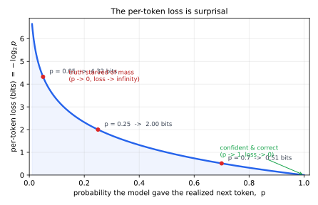
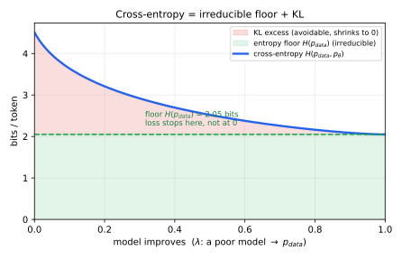
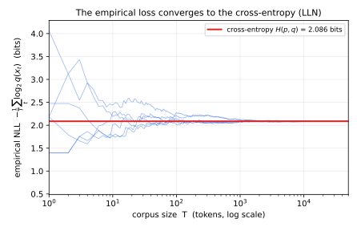
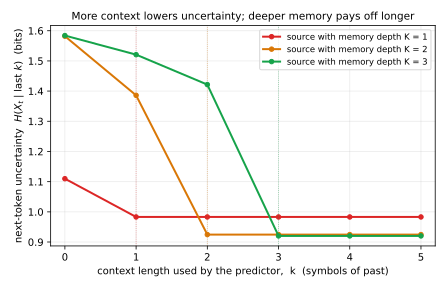
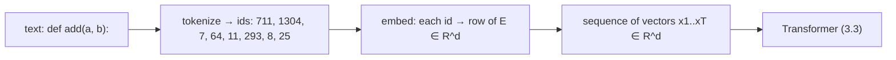
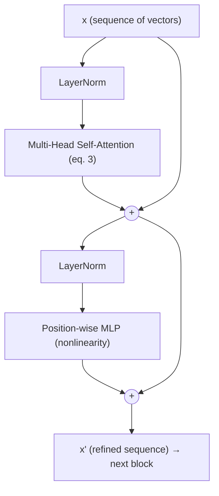
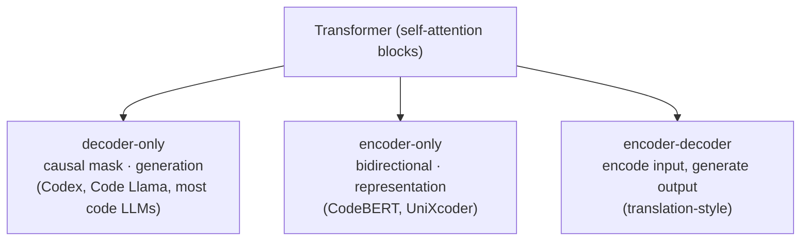
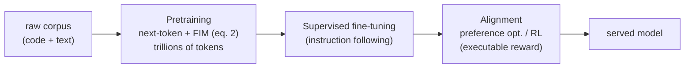
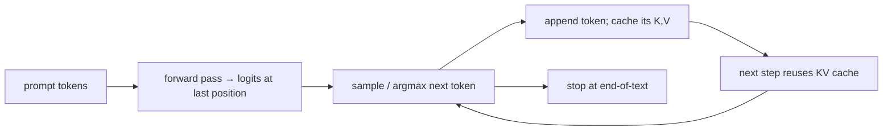

## 3 Language Models from First Principles

<a id="p-3-language-models-from-first-principles-1"></a><!-- para:3-language-models-from-first-principles-1 --> The rest of this survey assumes a working picture of what a large language model *is* and how it is built. This section supplies that picture from first principles, for a reader comfortable with mathematics (linear algebra, probability, optimization, signals) but new to deep learning. The strategy throughout is to anchor each new object to something a signal-processing reader already owns — an autoregressive model, a correlation, a matched filter, a Fourier basis — and only then add the deep-learning specifics. The section builds from the language-modeling objective up through the Transformer and scaling laws, and closes with the code-specific machinery (tokenization, fill-in-the-middle, and the pass@k metric) the later sections rely on.

<!-- sec:3.1 -->
### <a id="sec-3.1"></a>3.1 A Language Model Is an Autoregressive Predictor

<a id="p-31-a-language-model-is-an-autoregressive-predictor-1"></a><!-- para:31-a-language-model-is-an-autoregressive-predictor-1 --> Fix a finite alphabet of symbols called **tokens** (Section 3.2 makes "token" precise; for now think "the discrete units text is chopped into"). A language model places a probability distribution over token sequences by factorizing it left to right, exactly as a causal autoregressive model factorizes a discrete-time signal:

<a id="eq-1"></a><!-- eq:3-1 -->
$$
p_\theta(x_1,\dots,x_T) = \prod_{t=1}^{T} p_\theta\!\left(x_t \mid x_{<t}\right), \qquad x_{<t} \equiv (x_1,\dots,x_{t-1}). \tag{1}
$$

<a id="p-31-a-language-model-is-an-autoregressive-predictor-2"></a><!-- para:31-a-language-model-is-an-autoregressive-predictor-2 --> The model is the conditional $p_\theta(x_t \mid x_{<t})$: given the past, output a probability vector over the whole vocabulary for the next token. What should training optimize? The principled goal is to make the model distribution match the data — to minimize the **relative entropy** (KL divergence) from $p_{\text{data}}$ to $p_\theta$. Because the data's own entropy does not depend on $\theta$, that is equivalent to minimizing the **cross-entropy** between data and model, which a corpus lets us estimate by the average negative log-likelihood. Read top-down, the following *derives* the training loss $\mathcal{L}(\theta)$ rather than positing it:

<a id="eq-2"></a><!-- eq:3-2 -->
$$
\begin{aligned}
\underbrace{H\!\left(p_{\text{data}},\,p_\theta\right)}_{\text{cross-entropy}}
&= \underbrace{H\!\left(p_{\text{data}}\right)}_{\text{irreducible}}
\;+\;
\underbrace{D_{\mathrm{KL}}\!\left(p_{\text{data}}\,\big\|\,p_\theta\right)}_{\ge\,0,\;=\,0\,\Leftrightarrow\,p_\theta=p_{\text{data}}}
&&\text{(match the data}\Rightarrow\text{minimize KL)}\\
&= -\,\mathbb{E}_{p_{\text{data}}}\!\left[\log p_{\text{data}}\right]
\;+\;
\mathbb{E}_{p_{\text{data}}}\!\left[\log p_{\text{data}} - \log p_\theta\right]
&&\text{(expand }H\text{ and }D_{\mathrm{KL}})\\
&= -\,\mathbb{E}_{p_{\text{data}}}\!\left[\log p_\theta(x_{1:T})\right]
&&\text{(the }\mathbb{E}[\log p_{\text{data}}]\text{ terms cancel)}\\
&= -\,\mathbb{E}_{p_{\text{data}}}\!\left[\textstyle\sum_{t=1}^{T}\log p_\theta\!\left(x_t \mid x_{<t}\right)\right]
&&\text{(chain rule on }p_\theta)\\
\tfrac{1}{T}\,H\!\left(p_{\text{data}},\,p_\theta\right)
&\approx -\frac{1}{T}\sum_{t=1}^{T}\log p_\theta\!\left(x_t \mid x_{<t}\right)
\;\equiv\; \mathcal{L}(\theta)
&&\text{(empirical mean; LLN, i.i.d./ergodic corpus)}
\end{aligned} \tag{2}
$$

<a id="p-31-a-language-model-is-an-autoregressive-predictor-3"></a><!-- para:31-a-language-model-is-an-autoregressive-predictor-3 --> **Note — why the data's own entropy cancels.** The expansion step of Equation <!-- ref:3-2 -->[(2)](#eq-2) collapses $-\mathbb{E}_{p_{\text{data}}}[\log p_{\text{data}}] + \mathbb{E}_{p_{\text{data}}}[\log p_{\text{data}} - \log p_\theta]$ to the bare cross-entropy $-\mathbb{E}_{p_{\text{data}}}[\log p_\theta]$. Mechanically this is just linearity of expectation — the $\pm\,\mathbb{E}_{p_{\text{data}}}[\log p_{\text{data}}]$ pair annihilates — but three readings explain why it is the load-bearing step. *Source coding.* In nats, $H(p_{\text{data}}) = -\mathbb{E}_{p_{\text{data}}}[\log p_{\text{data}}]$ is the cost of encoding the data with the optimal code built from the true distribution — the unavoidable floor — while $D_{\mathrm{KL}} = \mathbb{E}_{p_{\text{data}}}[\log(p_{\text{data}}/p_\theta)]$ is the *excess* cost charged for using the model's code instead; their sum is the absolute cost of the model's code on real data, which is exactly the cross-entropy. The KL is built by adding back a $+\log p_{\text{data}}$ to score the model against the ideal, so re-adding the ideal cost $H(p_{\text{data}})$ cancels that bookkeeping and leaves the raw model cost. *The reference cancels.* The expanded form mixes the data's own self-information $\log p_{\text{data}}$ with the model's $\log p_\theta$, yet the cross-entropy depends only on how the model scores real samples — so any honest decomposition must have the $p_{\text{data}}$-only pieces cancel, the same shape as $\text{total} = \text{reference} + (\text{signal} - \text{reference})$ in which the reference is a device for measuring error that vanishes once the absolute objective is reassembled. *Optimization.* The cancelled term $H(p_{\text{data}})$ does not depend on $\theta$, so $\nabla_\theta H(p_{\text{data}}, p_\theta) = \nabla_\theta D_{\mathrm{KL}}(p_{\text{data}}\,\|\,p_\theta)$ — minimizing the cross-entropy one can actually compute and minimizing the KL one actually wants are the *same* optimization, differing only by a $\theta$-independent constant. That is why the empirical loss is a faithful proxy for the modeling goal, and why one never needs the value of $H(p_{\text{data}})$ — which would require the unknown true distribution: the gradient discards it.

<a id="p-31-a-language-model-is-an-autoregressive-predictor-4"></a><!-- para:31-a-language-model-is-an-autoregressive-predictor-4 --> 

<a id="p-31-a-language-model-is-an-autoregressive-predictor-5"></a><!-- para:31-a-language-model-is-an-autoregressive-predictor-5 --> **Figure 3.1.** The per-token loss is *surprisal*. Each token's contribution to the cross-entropy of Equation <!-- ref:3-2 -->[(2)](#eq-2) is $-\log_2 p$, the information content (in bits) of the realized next token under the model's predictive distribution — near zero when the model is confident and correct ($p \to 1$), and exploding as it starves the true token of probability ($p \to 0$). At $p = 0.7$ (roughly the `a` token in the running `def add` example) the loss is only $0.51$ bits; at $p = 0.05$ it is $4.3$ bits. This is the discrete-alphabet analogue of an AR model's innovation — the surprise of the realized symbol. Regenerate via `surveys/llms-for-coding/figures/per-token-surprisal.py`.

<a id="p-31-a-language-model-is-an-autoregressive-predictor-6"></a><!-- para:31-a-language-model-is-an-autoregressive-predictor-6 --> 

<a id="p-31-a-language-model-is-an-autoregressive-predictor-7"></a><!-- para:31-a-language-model-is-an-autoregressive-predictor-7 --> **Figure 3.2.** Cross-entropy is an irreducible floor plus a shrinkable KL, so the loss cannot reach zero. For a fixed true categorical $p_{\text{data}}$ over six symbols, a model improves from a poor guess toward the data ($\lambda: 0 \to 1$); the cross-entropy $H(p_{\text{data}}, p_\theta)$ (blue) descends from $4.5$ bits to the entropy floor $H(p_{\text{data}}) = 2.05$ bits as the KL excess (red band) shrinks to zero. The floor is the data's own entropy — its intrinsic unpredictability — the part of the loss no model can remove, exactly the irreducible term the note above isolates and the reason scaling curves bottom out rather than vanish. Regenerate via `surveys/llms-for-coding/figures/cross-entropy-floor-kl.py`.

<a id="p-31-a-language-model-is-an-autoregressive-predictor-8"></a><!-- para:31-a-language-model-is-an-autoregressive-predictor-8 --> 

<a id="p-31-a-language-model-is-an-autoregressive-predictor-9"></a><!-- para:31-a-language-model-is-an-autoregressive-predictor-9 --> **Figure 3.3.** The empirical loss converges to the cross-entropy — the law of large numbers behind Equation <!-- ref:3-2 -->[(2)](#eq-2). Tokens are drawn i.i.d. from a true categorical $p$ and scored by a fixed model $q$; the running per-token average $-\frac{1}{T}\sum_t \log_2 q(x_t)$ (six seeds, blue) converges to the population cross-entropy $H(p, q) = 2.09$ bits (red) as the corpus size $T$ grows, the Monte-Carlo scatter narrowing like $1/\sqrt{T}$. This is the empirical-mean step of the derivation — its one approximation — valid because the corpus is an i.i.d. (or stationary-ergodic) sample of the source. Regenerate via `surveys/llms-for-coding/figures/lln-empirical-nll.py`.

<a id="p-31-a-language-model-is-an-autoregressive-predictor-10"></a><!-- para:31-a-language-model-is-an-autoregressive-predictor-10 --> **Intuition (signal processing).** Equation <!-- ref:3-1 -->[(1)](#eq-1) is an AR($\infty$) model: the next symbol depends on the entire history. The differences from a classical AR($p$) model are three: the predictor is a *learned nonlinear* map (the neural network of Sections 3.3–3.4) instead of a linear filter; the output is a *categorical distribution* over a discrete alphabet (produced by a softmax) instead of a scalar plus Gaussian innovation; and the loss in Equation <!-- ref:3-2 -->[(2)](#eq-2) is *derived, not posited*: matching the data distribution means minimizing the KL divergence to it, which — because the data's own entropy is a fixed floor — reduces to minimizing the cross-entropy, of which the per-token negative log-likelihood is the empirical (Monte-Carlo) estimate. Minimizing it is therefore maximum-likelihood fitting, and that irreducible entropy floor is exactly why the loss cannot reach zero. "Generation" is then just running the AR recursion forward: sample $x_t$ from $p_\theta(\cdot \mid x_{<t})$, append it, repeat.

<a id="p-31-a-language-model-is-an-autoregressive-predictor-11"></a><!-- para:31-a-language-model-is-an-autoregressive-predictor-11 --> 

<a id="p-31-a-language-model-is-an-autoregressive-predictor-12"></a><!-- para:31-a-language-model-is-an-autoregressive-predictor-12 --> **Figure 3.4.** More context lowers next-token uncertainty, and deeper memory keeps paying off longer. For order-$K$ Markov sources ($K \in \{1, 2, 3\}$, alphabet size $3$), the next-token conditional entropy $H(X_t \mid \text{last } k)$ falls as the predictor conditions on more of the past, then plateaus once the context length $k$ reaches the source's memory depth $K$ — at $k = 1$, $k = 2$, and $k = 3$ respectively. Natural language has very deep, long-range structure, so a model that conditions on the *entire* history (the AR($\infty$) factorization of Equation <!-- ref:3-1 -->[(1)](#eq-1)) keeps extracting reductions a finite-context AR($p$) leaves on the table. Each curve is computed exactly from its source's stationary distribution. Regenerate via `surveys/llms-for-coding/figures/context-reduces-uncertainty.py`.

<a id="p-31-a-language-model-is-an-autoregressive-predictor-13"></a><!-- para:31-a-language-model-is-an-autoregressive-predictor-13 --> *Concrete example.* Prompt the model with the token sequence for `def add(a, b):\n    return ` and it returns a distribution over next tokens in which `a` carries high probability, `subtract` low, and `):` near zero — the same object an AR model produces, but over a code vocabulary.

<!-- sec:3.2 -->
### <a id="sec-3.2"></a>3.2 Tokens and Embeddings

<a id="p-32-tokens-and-embeddings-1"></a><!-- para:32-tokens-and-embeddings-1 --> Text is first **tokenized**: mapped to a sequence of integer ids drawn from a fixed vocabulary of size $V$ (typically tens of thousands). This is discretization — the symbol-mapping / quantization step that turns a stream of characters into a finite alphabet. Code tokenization has its own pressures (whitespace, identifiers), treated in Section 3.7.

<a id="p-32-tokens-and-embeddings-2"></a><!-- para:32-tokens-and-embeddings-2 --> Each id is then mapped to a vector by an **embedding** matrix $E \in \mathbb{R}^{V \times d}$: token id $i$ becomes the row $E_i \in \mathbb{R}^{d}$. The embedding is *learned* — it is part of $\theta$ — so semantically related tokens end up near each other in $\mathbb{R}^{d}$ (a learned codebook, in reverse: ids index into a table of trainable vectors). Everything downstream operates on these $d$-dimensional vectors, never on the raw ids.



<!-- sec:3.3 -->
### <a id="sec-3.3"></a>3.3 Attention and the Transformer

<a id="p-33-attention-and-the-transformer-1"></a><!-- para:33-attention-and-the-transformer-1 --> The network that computes $p_\theta(x_t \mid x_{<t})$ is a **Transformer**: a stack of identical blocks, each refining the sequence of vectors. Its defining operation is **self-attention**, which lets every position mix in information from other positions by a *data-dependent* weighting.

<a id="p-33-attention-and-the-transformer-2"></a><!-- para:33-attention-and-the-transformer-2 --> Project each input vector into three column vectors — a **query** $\mathbf{q}$, a **key** $\mathbf{k}$, and a **value** $\mathbf{v}$ — by learned linear maps (stack them into matrices $Q, K, V$). Attention compares each query to every key by a dot product, normalizes the comparisons into weights with a softmax, and returns the weighted average of the values <!-- cite:54 --> [[54]](references.md#ref-54):

<a id="eq-3"></a><!-- eq:3-3 -->
$$
\mathrm{Attention}(Q,K,V) = \mathrm{softmax}\!\left(\frac{QK^{\top}}{\sqrt{d_k}}\right)V. \tag{3}
$$

<a id="p-33-attention-and-the-transformer-3"></a><!-- para:33-attention-and-the-transformer-3 --> **Intuition (signal processing).** Read Equation <!-- ref:3-3 -->[(3)](#eq-3) right to left. The output at a position is a *convex combination of value vectors*; the combination weights are a softmax of inner products between that position's query and all keys. An inner product is an (unnormalized) correlation, so the weight on position $j$ is large exactly when key $j$ is well-matched to the current query — this is a **content-addressed, data-dependent matched filter**. Contrast a convolution, whose kernel weights are *fixed* and *local*; attention's weights are *computed from the data* and *global* across the sequence. The $1/\sqrt{d_k}$ factor keeps the dot products from growing with dimension $d_k$ and saturating the softmax (a variance normalization). A causal mask sets the weight to zero for $j > t$ so position $t$ attends only to the past, enforcing the factorization of Equation <!-- ref:3-1 -->[(1)](#eq-1).

<a id="p-33-attention-and-the-transformer-4"></a><!-- para:33-attention-and-the-transformer-4 --> *Concrete example.* With three positions and query-key scores $[2.0,\,1.0,\,0.0]$ for the current query, the softmax weights are approximately $[0.67,\,0.24,\,0.09]$; the attention output is $0.67\,\mathbf{v}_1 + 0.24\,\mathbf{v}_2 + 0.09\,\mathbf{v}_3$ — most of the "read" comes from the best-matched position, the rest is a soft blend.

<a id="p-33-attention-and-the-transformer-5"></a><!-- para:33-attention-and-the-transformer-5 --> **Multi-head attention** runs $h$ such attention operations in parallel on different learned projections (different "channels" of comparison) and concatenates them, so one block can attend to several relationships at once. A full Transformer **block** wraps attention with a position-wise MLP and two residual connections with normalization:



<a id="p-33-attention-and-the-transformer-6"></a><!-- para:33-attention-and-the-transformer-6 --> Residual connections let the block learn a *correction* to its input (an additive update, easy to optimize); normalization keeps activations well-scaled. Stacking $L$ such blocks and reading out the final vector at position $t$ through a linear map to $V$ logits, followed by a softmax, yields $p_\theta(x_t \mid x_{<t})$.

<!-- sec:3.4 -->
### <a id="sec-3.4"></a>3.4 Architectural Structures

<a id="p-34-architectural-structures-1"></a><!-- para:34-architectural-structures-1 --> The same attention machinery is wired into three structural families, distinguished by *which positions may attend to which*:

- <a id="p-34-architectural-structures-2"></a><!-- para:34-architectural-structures-2 --> **Decoder-only (causal).** Every position attends only to the past (causal mask). This is the autoregressive generator of Equation <!-- ref:3-1 -->[(1)](#eq-1) — it can both score and *generate* sequences. Code LLMs are overwhelmingly decoder-only (e.g., Codex <!-- cite:1 --> [[1]](references.md#ref-1)) because the task is to *produce* code.
- **Encoder-only (bidirectional).** Every position attends to all positions, past and future, with no causal mask. This yields rich *representations* for understanding tasks (classification, search) but cannot generate left to right; CodeBERT <!-- cite:2 --> [[2]](references.md#ref-2) is the code example, used for code search rather than synthesis.
- **Encoder-decoder.** An encoder builds a bidirectional representation of an input; a decoder generates an output while attending to it. Natural for translation-style mappings.



<a id="p-34-architectural-structures-3"></a><!-- para:34-architectural-structures-3 --> Four variations recur and matter later:

- <a id="p-34-architectural-structures-4"></a><!-- para:34-architectural-structures-4 --> **Attention-head sharing (MHA → MQA → GQA).** Storing the keys/values of all past tokens (the "KV cache") dominates generation memory. Multi-query and grouped-query attention share keys/values across heads to shrink that cache, trading a little quality for much faster, cheaper inference (StarCoder uses multi-query attention for this reason, Section 7).
- **Mixture-of-experts (MoE).** Replace the block's single MLP with many "expert" MLPs and a router that sends each token to only a few. This raises total parameters while keeping the *active* compute per token small — sparse conditional computation <!-- cite:58 --> [[58]](references.md#ref-58). DeepSeek-Coder-V2 (Sections 14–15) is an MoE with 236B total but only 21B active parameters.
- **Positional encodings.** Attention is permutation-invariant (Equation <!-- ref:3-3 -->[(3)](#eq-3) has no notion of order), so position must be injected. The original Transformer adds fixed **sinusoidal** features of varying frequency — literally a Fourier-style positional basis <!-- cite:54 --> [[54]](references.md#ref-54). **Rotary position embedding (RoPE)** instead *rotates* the query and key vectors by an angle proportional to position, so their dot product depends only on relative position — a phase encoding, in signal-processing terms, that a reader of Fourier methods will find immediately natural <!-- cite:57 --> [[57]](references.md#ref-57). RoPE underpins the long-context extensions of Section 7.

<!-- sec:3.5 -->
### <a id="sec-3.5"></a>3.5 How a Model Is Trained

<a id="p-35-how-a-model-is-trained-1"></a><!-- para:35-how-a-model-is-trained-1 --> Producing a deployed assistant is a sequence of optimization stages, each changing $\theta$ to a different objective:



- <a id="p-35-how-a-model-is-trained-2"></a><!-- para:35-how-a-model-is-trained-2 --> **Pretraining** minimizes the cross-entropy of Equation <!-- ref:3-2 -->[(2)](#eq-2) over a huge corpus by stochastic gradient descent (Adam-family optimizers). This is where almost all capability is acquired; it is also where almost all compute is spent (Section 3.6). Data curation is decisive — covered in Section 6.
- **Supervised fine-tuning (SFT)** continues training on curated (instruction, response) pairs so the model follows requests rather than merely continuing text (Section 8).
- **Alignment** then optimizes the model against a *preference* or *reward* signal — and for code that reward can be an executable oracle (does the code pass tests?), which is the lever behind Sections 8 and 9.

<a id="p-35-how-a-model-is-trained-3"></a><!-- para:35-how-a-model-is-trained-3 --> Generation at serving time is the forward AR recursion of Section 3.1, made efficient by caching the keys/values of past tokens so each new token costs one block pass rather than reprocessing the whole prefix:



<a id="p-35-how-a-model-is-trained-4"></a><!-- para:35-how-a-model-is-trained-4 --> Decoding choices (greedy, temperature sampling, top-p) and serving optimizations are detailed in Section 10.

<!-- sec:3.6 -->
### <a id="sec-3.6"></a>3.6 Scaling Laws

<a id="p-36-scaling-laws-1"></a><!-- para:36-scaling-laws-1 --> How good is a model before we train it? Remarkably, the answer is *predictable*. Across many orders of magnitude, the pretraining cross-entropy loss falls as a **power law** in each of three resources held non-bottlenecked: the number of (non-embedding) parameters $N$, the dataset size $D$ in tokens, and the training compute $C$. Kaplan et al. fit <!-- cite:55 --> [[55]](references.md#ref-55)

<a id="eq-4"></a><!-- eq:3-4 -->
$$
L(N) = \left(\frac{N_c}{N}\right)^{\alpha_N}, \quad L(D) = \left(\frac{D_c}{D}\right)^{\alpha_D}, \quad L(C) = \left(\frac{C_c}{C}\right)^{\alpha_C}, \tag{4}
$$

<a id="p-36-scaling-laws-2"></a><!-- para:36-scaling-laws-2 --> with small exponents $\alpha_N \approx 0.076$, $\alpha_D \approx 0.095$, and $\alpha_C \approx 0.050$ <!-- cite:55 --> [[55]](references.md#ref-55). **Intuition (signal processing).** On a log-log plot these are straight lines — the loss is scale-free in the resource, and the exponent is the slope. The small exponents say returns diminish slowly but steadily: each $10\times$ in a resource buys a fixed decrement in loss.

```text
log L
  |  *.
  |    '*.            slope = -alpha   (a power law L ∝ C^{-alpha})
  |       '*.
  |          '*.
  +-------------------- log C  (compute)
```

<a id="p-36-scaling-laws-3"></a><!-- para:36-scaling-laws-3 --> The sharper question is *allocation*: given a fixed compute budget $C$, split it between a bigger model and more data. Compute for a Transformer is, to good approximation,

<a id="eq-5"></a><!-- eq:3-5 -->
$$
C \approx 6\,N\,D \tag{5}
$$

<a id="p-36-scaling-laws-4"></a><!-- para:36-scaling-laws-4 --> (forward and backward passes cost about six floating-point operations per parameter per token) <!-- cite:55 --> [[55]](references.md#ref-55), <!-- cite:56 --> [[56]](references.md#ref-56). Hoffmann et al. (the "Chinchilla" study) fit a joint parametric loss <!-- cite:56 --> [[56]](references.md#ref-56)

<a id="eq-6"></a><!-- eq:3-6 -->
$$
L(N, D) = E + \frac{A}{N^{\alpha}} + \frac{B}{D^{\beta}}, \tag{6}
$$

<a id="p-36-scaling-laws-5"></a><!-- para:36-scaling-laws-5 --> with $E = 1.69$, $A = 406.4$, $B = 410.7$, $\alpha = 0.34$, $\beta = 0.28$ <!-- cite:56 --> [[56]](references.md#ref-56). The first term $E$ is the irreducible loss (the data's intrinsic entropy); the other two are the finite-$N$ and finite-$D$ penalties. Minimizing Equation <!-- ref:3-6 -->[(6)](#eq-6) subject to the budget constraint of Equation <!-- ref:3-5 -->[(5)](#eq-5) is a textbook Lagrange problem: form $L(N,D) + \lambda(6ND - C)$, set the gradients to zero, and the optimal allocation follows a power law in the budget,

<a id="eq-7"></a><!-- eq:3-7 -->
$$
N_{\mathrm{opt}} \propto C^{a}, \qquad D_{\mathrm{opt}} \propto C^{b}, \tag{7}
$$

<a id="p-36-scaling-laws-6"></a><!-- para:36-scaling-laws-6 --> with $a \approx b \approx 0.5$ (Chinchilla reports $a=b=0.50$ from two methods and $a=0.46$, $b=0.54$ from a third) <!-- cite:56 --> [[56]](references.md#ref-56). **The conclusion that reshaped practice:** model size and training tokens should grow in roughly *equal* proportion, so the compute-optimal "tokens per parameter" is a constant — about $20$ for the Chinchilla setup. Their 70B-parameter model trained on 1.4 trillion tokens (four times the data, at the same compute, as the 280B Gopher) outperformed Gopher, GPT-3 (175B), and larger models <!-- cite:56 --> [[56]](references.md#ref-56) — direct evidence that earlier large models were badly *under-trained*: too many parameters fed too little data.

<a id="p-36-scaling-laws-7"></a><!-- para:36-scaling-laws-7 --> **Intuition (signal processing).** Equation <!-- ref:3-6 -->[(6)](#eq-6) is a capacity-versus-data tradeoff with an irreducible floor — structurally the bias-variance / rate-distortion shape a signal-processing reader knows: $E$ is the floor you cannot beat, $A/N^\alpha$ is model-capacity bias, $B/D^\beta$ is finite-sample error, and the budget line $C=6ND$ is the resource you allocate between them. These laws explain two choices in later sections: why production code models deliberately *over-train* small models far past the compute-optimal point to make inference cheap (StarCoder 2, Section 7), and why the *composition* of the data — not just its size — moves the curve (the data-quality and code:text:math-mixture results of Sections 6 and 7).

<!-- sec:3.7 -->
### <a id="sec-3.7"></a>3.7 Tokenization for Code

<a id="p-37-tokenization-for-code-1"></a><!-- para:37-tokenization-for-code-1 --> Code language models are ordinary autoregressive Transformers (Section 3.1) trained on code — CodeGen and InCoder maximize the likelihood of a code corpus <!-- cite:3 --> [[3]](references.md#ref-3), <!-- cite:4 --> [[4]](references.md#ref-4), and Codex is a GPT-family model fine-tuned on code <!-- cite:1 --> [[1]](references.md#ref-1) — with everything code-specific layered on top. The first such specialization is the tokenizer, which code stresses in ways prose does not: significant indentation, runs of whitespace, and long compound identifiers. Two design responses recur. CodeGen extends the GPT-2 byte-pair vocabulary with special tokens for repeated runs of tabs and spaces, compressing Python's indentation <!-- cite:3 --> [[3]](references.md#ref-3). InCoder instead trains a byte-level BPE tokenizer that allows merges to cross whitespace (excluding newlines), so an idiom like `import numpy as np` can become a single token; this reduces the tokens needed to encode its corpus by 45% relative to GPT-2's tokenizer <!-- cite:4 --> [[4]](references.md#ref-4). Modern code models use byte-level BPE with vocabularies tuned for the code mixture — 49,152 for StarCoder, 32,000 for DeepSeek-Coder, 151,646 for Qwen2.5-Coder <!-- cite:9 --> [[9]](references.md#ref-9), <!-- cite:10 --> [[10]](references.md#ref-10), <!-- cite:11 --> [[11]](references.md#ref-11) — a point developed in Section 7. The byte-level fallback also guarantees that arbitrary identifiers and Unicode never produce out-of-vocabulary tokens.

<!-- sec:3.8 -->
### <a id="sec-3.8"></a>3.8 Fill-in-the-Middle: Teaching a Causal Model to Infill

<a id="p-38-fill-in-the-middle-teaching-a-causal-model-to-infill-1"></a><!-- para:38-fill-in-the-middle-teaching-a-causal-model-to-infill-1 --> A purely left-to-right model can only condition on context to its left, which prevents it from filling a hole that has committed code on both sides — the common case when editing. A masked (BERT-style) model sees both sides but is trained to predict only a small fraction of tokens and cannot generate freely. Fill-in-the-middle (FIM) reconciles the two with a strikingly simple idea: rewrite a fraction of training documents so the model still trains autoregressively, yet learns to infill. Split a document into three pieces and move the middle to the end <!-- cite:5 --> [[5]](references.md#ref-5):

<a id="eq-8"></a><!-- eq:3-8 -->
$$
(\text{prefix},\ \text{middle},\ \text{suffix}) \;\longrightarrow\; \langle\text{PRE}\rangle\,\text{prefix}\,\langle\text{SUF}\rangle\,\text{suffix}\,\langle\text{MID}\rangle\,\text{middle} \tag{8}
$$

<a id="p-38-fill-in-the-middle-teaching-a-causal-model-to-infill-2"></a><!-- para:38-fill-in-the-middle-teaching-a-causal-model-to-infill-2 --> The reordered form in Equation <!-- ref:3-8 -->[(8)](#eq-8) is the **prefix-suffix-middle (PSM)** layout, concatenated with sentinel tokens. At inference the model is prompted with everything up to and including $\langle\text{MID}\rangle$ and samples the middle until it emits an end token. A **suffix-prefix-middle (SPM)** ordering also exists and is preferred for key-value cache reuse, because appending tokens to the prefix does not invalidate the cached suffix <!-- cite:5 --> [[5]](references.md#ref-5). The transform is applied at the character level so completions remain sensible when a prefix ends mid-token, and the best results come from training jointly on PSM and SPM <!-- cite:5 --> [[5]](references.md#ref-5). The defining empirical result is "FIM-for-free": training with a 50% FIM rate leaves the left-to-right loss unchanged, so infilling is acquired at no measurable cost to ordinary generation <!-- cite:5 --> [[5]](references.md#ref-5). Production code models adopt FIM almost universally (Section 7).

<!-- sec:3.9 -->
### <a id="sec-3.9"></a>3.9 Measuring Correctness: The pass@k Estimator

<a id="p-39-measuring-correctness-the-passk-estimator-1"></a><!-- para:39-measuring-correctness-the-passk-estimator-1 --> Because code is executable (Section 2), it is judged by *running it*, not by string overlap with a reference. The standard metric is **pass@k**: generate $k$ samples for a problem and count it solved if any sample passes the problem's unit tests. Estimating this naively — draw exactly $k$ samples and report the solved fraction — is high-variance. Codex instead draws $n \geq k$ samples per problem (the paper uses $n = 200$, $k \leq 100$), counts the number $c \leq n$ that pass, and computes the unbiased estimator <!-- cite:1 --> [[1]](references.md#ref-1)

<a id="eq-9"></a><!-- eq:3-9 -->
$$
\text{pass@}k := \mathbb{E}_{\text{problems}}\!\left[\,1 - \frac{\binom{n-c}{k}}{\binom{n}{k}}\,\right] \tag{9}
$$

<a id="p-39-measuring-correctness-the-passk-estimator-2"></a><!-- para:39-measuring-correctness-the-passk-estimator-2 --> The bracketed term in Equation <!-- ref:3-9 -->[(9)](#eq-9) is one minus the probability that a size-$k$ subset of the $n$ samples contains *no* correct sample. It is tempting to instead estimate pass@k as $1-(1-\hat{p})^k$ from an empirical pass@1 of $\hat{p}$, but Codex shows this is biased <!-- cite:1 --> [[1]](references.md#ref-1). Evaluating Equation <!-- ref:3-9 -->[(9)](#eq-9) directly overflows for large $n$, so it is computed in the numerically stable product form

<a id="eq-10"></a><!-- eq:3-9b -->
$$
\text{pass@}k = 1 - \prod_{i=n-c+1}^{n}\left(1 - \frac{k}{i}\right) \tag{10}
$$

<a id="p-39-measuring-correctness-the-passk-estimator-3"></a><!-- para:39-measuring-correctness-the-passk-estimator-3 --> Two consequences matter for the whole survey. First, pass@k separates a model's *generation* quality (pass@1) from the leverage of *sampling many candidates and selecting* (the gap up to pass@100), which is precisely what reranking and test-time methods exploit (Section 9). Second, the metric is only as honest as the test suite behind it — a theme that drives the test-adequacy critique of Section 13. Functional correctness is "the most convincing" criterion because it is the one human developers use <!-- cite:1 --> [[1]](references.md#ref-1), but it inherits the coverage of whatever tests define it.
