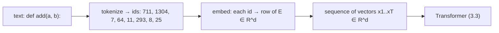
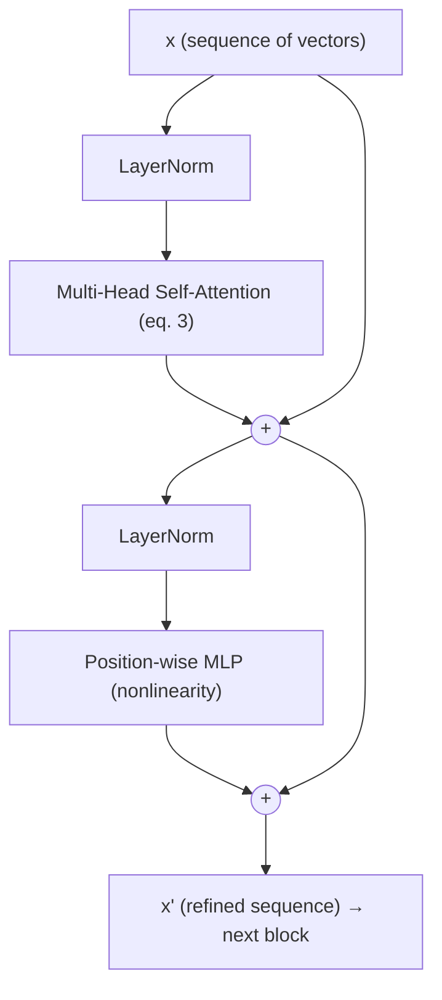
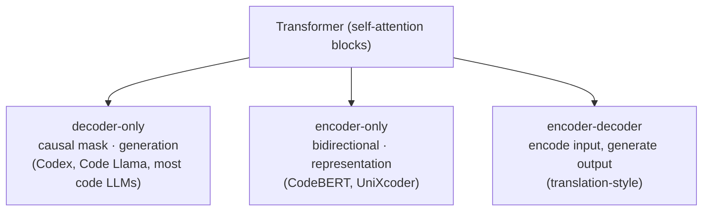
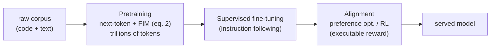
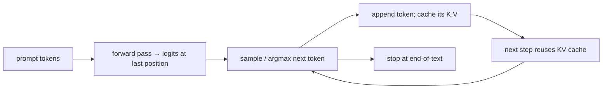

## 3 Language Models from First Principles

The rest of this survey assumes a working picture of what a large language model *is* and how it is built. This section supplies that picture from first principles, for a reader comfortable with mathematics (linear algebra, probability, optimization, signals) but new to deep learning. The strategy throughout is to anchor each new object to something a signal-processing reader already owns — an autoregressive model, a correlation, a matched filter, a Fourier basis — and only then add the deep-learning specifics. The section builds from the language-modeling objective up through the Transformer and scaling laws, and closes with the code-specific machinery (tokenization, fill-in-the-middle, and the pass@k metric) the later sections rely on.

### 3.1 A Language Model Is an Autoregressive Predictor

Fix a finite alphabet of symbols called **tokens** (Section 3.2 makes "token" precise; for now think "the discrete units text is chopped into"). A language model places a probability distribution over token sequences by factorizing it left to right, exactly as a causal autoregressive model factorizes a discrete-time signal:

<a id="eq-1"></a><!-- eq:3-1 -->
$$
p_\theta(x_1,\dots,x_T) = \prod_{t=1}^{T} p_\theta\!\left(x_t \mid x_{<t}\right), \qquad x_{<t} \equiv (x_1,\dots,x_{t-1}). \tag{1}
$$

The model is the conditional $p_\theta(x_t \mid x_{<t})$: given the past, output a probability vector over the whole vocabulary for the next token. Training fits the parameters $\theta$ by minimizing the average negative log-likelihood over a corpus — equivalently, the **cross-entropy** between the data and the model:

<a id="eq-2"></a><!-- eq:3-2 -->
$$
\mathcal{L}(\theta) = -\frac{1}{T}\sum_{t=1}^{T} \log p_\theta\!\left(x_t \mid x_{<t}\right). \tag{2}
$$

**Intuition (signal processing).** Equation <!-- ref:3-1 -->[(1)](#eq-1) is an AR($\infty$) model: the next symbol depends on the entire history. The differences from a classical AR($p$) model are three: the predictor is a *learned nonlinear* map (the neural network of Sections 3.3–3.4) instead of a linear filter; the output is a *categorical distribution* over a discrete alphabet (produced by a softmax) instead of a scalar plus Gaussian innovation; and the loss in Equation <!-- ref:3-2 -->[(2)](#eq-2) is cross-entropy, which is the negative log-likelihood and equals the KL divergence from the data distribution up to the data's own entropy. Minimizing it is maximum-likelihood fitting. "Generation" is then just running the AR recursion forward: sample $x_t$ from $p_\theta(\cdot \mid x_{<t})$, append it, repeat.

*Concrete example.* Prompt the model with the token sequence for `def add(a, b):\n    return ` and it returns a distribution over next tokens in which `a` carries high probability, `subtract` low, and `):` near zero — the same object an AR model produces, but over a code vocabulary.

### 3.2 Tokens and Embeddings

Text is first **tokenized**: mapped to a sequence of integer ids drawn from a fixed vocabulary of size $V$ (typically tens of thousands). This is discretization — the symbol-mapping / quantization step that turns a stream of characters into a finite alphabet. Code tokenization has its own pressures (whitespace, identifiers), treated in Section 3.7.

Each id is then mapped to a vector by an **embedding** matrix $E \in \mathbb{R}^{V \times d}$: token id $i$ becomes the row $E_i \in \mathbb{R}^{d}$. The embedding is *learned* — it is part of $\theta$ — so semantically related tokens end up near each other in $\mathbb{R}^{d}$ (a learned codebook, in reverse: ids index into a table of trainable vectors). Everything downstream operates on these $d$-dimensional vectors, never on the raw ids.



### 3.3 Attention and the Transformer

The network that computes $p_\theta(x_t \mid x_{<t})$ is a **Transformer**: a stack of identical blocks, each refining the sequence of vectors. Its defining operation is **self-attention**, which lets every position mix in information from other positions by a *data-dependent* weighting.

Project each input vector into three vectors — a **query** $q$, a **key** $k$, and a **value** $v$ — by learned linear maps (stack them into matrices $Q, K, V$). Attention compares each query to every key by a dot product, normalizes the comparisons into weights with a softmax, and returns the weighted average of the values [54]:

<a id="eq-3"></a><!-- eq:3-3 -->
$$
\mathrm{Attention}(Q,K,V) = \mathrm{softmax}\!\left(\frac{QK^{\top}}{\sqrt{d_k}}\right)V. \tag{3}
$$

**Intuition (signal processing).** Read Equation <!-- ref:3-3 -->[(3)](#eq-3) right to left. The output at a position is a *convex combination of value vectors*; the combination weights are a softmax of inner products between that position's query and all keys. An inner product is an (unnormalized) correlation, so the weight on position $j$ is large exactly when key $j$ is well-matched to the current query — this is a **content-addressed, data-dependent matched filter**. Contrast a convolution, whose kernel weights are *fixed* and *local*; attention's weights are *computed from the data* and *global* across the sequence. The $1/\sqrt{d_k}$ factor keeps the dot products from growing with dimension $d_k$ and saturating the softmax (a variance normalization). A causal mask sets the weight to zero for $j > t$ so position $t$ attends only to the past, enforcing the factorization of Equation <!-- ref:3-1 -->[(1)](#eq-1).

*Concrete example.* With three positions and query-key scores $[2.0,\,1.0,\,0.0]$ for the current query, the softmax weights are approximately $[0.67,\,0.24,\,0.09]$; the attention output is $0.67\,v_1 + 0.24\,v_2 + 0.09\,v_3$ — most of the "read" comes from the best-matched position, the rest is a soft blend.

**Multi-head attention** runs $h$ such attention operations in parallel on different learned projections (different "channels" of comparison) and concatenates them, so one block can attend to several relationships at once. A full Transformer **block** wraps attention with a position-wise MLP and two residual connections with normalization:



Residual connections let the block learn a *correction* to its input (an additive update, easy to optimize); normalization keeps activations well-scaled. Stacking $L$ such blocks and reading out the final vector at position $t$ through a linear map to $V$ logits, followed by a softmax, yields $p_\theta(x_t \mid x_{<t})$.

### 3.4 Architectural Structures

The same attention machinery is wired into three structural families, distinguished by *which positions may attend to which*:

- **Decoder-only (causal).** Every position attends only to the past (causal mask). This is the autoregressive generator of Equation <!-- ref:3-1 -->[(1)](#eq-1) — it can both score and *generate* sequences. Code LLMs are overwhelmingly decoder-only (e.g., Codex [1]) because the task is to *produce* code.
- **Encoder-only (bidirectional).** Every position attends to all positions, past and future, with no causal mask. This yields rich *representations* for understanding tasks (classification, search) but cannot generate left to right; CodeBERT [2] is the code example, used for code search rather than synthesis.
- **Encoder-decoder.** An encoder builds a bidirectional representation of an input; a decoder generates an output while attending to it. Natural for translation-style mappings.



Four variations recur and matter later:

- **Attention-head sharing (MHA → MQA → GQA).** Storing the keys/values of all past tokens (the "KV cache") dominates generation memory. Multi-query and grouped-query attention share keys/values across heads to shrink that cache, trading a little quality for much faster, cheaper inference (StarCoder uses multi-query attention for this reason, Section 7).
- **Mixture-of-experts (MoE).** Replace the block's single MLP with many "expert" MLPs and a router that sends each token to only a few. This raises total parameters while keeping the *active* compute per token small — sparse conditional computation [58]. DeepSeek-Coder-V2 (Sections 14–15) is an MoE with 236B total but only 21B active parameters.
- **Positional encodings.** Attention is permutation-invariant (Equation <!-- ref:3-3 -->[(3)](#eq-3) has no notion of order), so position must be injected. The original Transformer adds fixed **sinusoidal** features of varying frequency — literally a Fourier-style positional basis [54]. **Rotary position embedding (RoPE)** instead *rotates* the query and key vectors by an angle proportional to position, so their dot product depends only on relative position — a phase encoding, in signal-processing terms, that a reader of Fourier methods will find immediately natural [57]. RoPE underpins the long-context extensions of Section 7.

### 3.5 How a Model Is Trained

Producing a deployed assistant is a sequence of optimization stages, each changing $\theta$ to a different objective:



- **Pretraining** minimizes the cross-entropy of Equation <!-- ref:3-2 -->[(2)](#eq-2) over a huge corpus by stochastic gradient descent (Adam-family optimizers). This is where almost all capability is acquired; it is also where almost all compute is spent (Section 3.6). Data curation is decisive — covered in Section 6.
- **Supervised fine-tuning (SFT)** continues training on curated (instruction, response) pairs so the model follows requests rather than merely continuing text (Section 8).
- **Alignment** then optimizes the model against a *preference* or *reward* signal — and for code that reward can be an executable oracle (does the code pass tests?), which is the lever behind Sections 8 and 9.

Generation at serving time is the forward AR recursion of Section 3.1, made efficient by caching the keys/values of past tokens so each new token costs one block pass rather than reprocessing the whole prefix:



Decoding choices (greedy, temperature sampling, top-p) and serving optimizations are detailed in Section 10.

### 3.6 Scaling Laws

How good is a model before we train it? Remarkably, the answer is *predictable*. Across many orders of magnitude, the pretraining cross-entropy loss falls as a **power law** in each of three resources held non-bottlenecked: the number of (non-embedding) parameters $N$, the dataset size $D$ in tokens, and the training compute $C$. Kaplan et al. fit [55]

<a id="eq-4"></a><!-- eq:3-4 -->
$$
L(N) = \left(\frac{N_c}{N}\right)^{\alpha_N}, \quad L(D) = \left(\frac{D_c}{D}\right)^{\alpha_D}, \quad L(C) = \left(\frac{C_c}{C}\right)^{\alpha_C}, \tag{4}
$$

with small exponents $\alpha_N \approx 0.076$, $\alpha_D \approx 0.095$, and $\alpha_C \approx 0.050$ [55]. **Intuition (signal processing).** On a log-log plot these are straight lines — the loss is scale-free in the resource, and the exponent is the slope. The small exponents say returns diminish slowly but steadily: each $10\times$ in a resource buys a fixed decrement in loss.

```text
log L
  |  *.
  |    '*.            slope = -alpha   (a power law L ∝ C^{-alpha})
  |       '*.
  |          '*.
  +-------------------- log C  (compute)
```

The sharper question is *allocation*: given a fixed compute budget $C$, split it between a bigger model and more data. Compute for a Transformer is, to good approximation,

<a id="eq-5"></a><!-- eq:3-5 -->
$$
C \approx 6\,N\,D \tag{5}
$$

(forward and backward passes cost about six floating-point operations per parameter per token) [55], [56]. Hoffmann et al. (the "Chinchilla" study) fit a joint parametric loss [56]

<a id="eq-6"></a><!-- eq:3-6 -->
$$
L(N, D) = E + \frac{A}{N^{\alpha}} + \frac{B}{D^{\beta}}, \tag{6}
$$

with $E = 1.69$, $A = 406.4$, $B = 410.7$, $\alpha = 0.34$, $\beta = 0.28$ [56]. The first term $E$ is the irreducible loss (the data's intrinsic entropy); the other two are the finite-$N$ and finite-$D$ penalties. Minimizing Equation <!-- ref:3-6 -->[(6)](#eq-6) subject to the budget constraint of Equation <!-- ref:3-5 -->[(5)](#eq-5) is a textbook Lagrange problem: form $L(N,D) + \lambda(6ND - C)$, set the gradients to zero, and the optimal allocation follows a power law in the budget,

<a id="eq-7"></a><!-- eq:3-7 -->
$$
N_{\mathrm{opt}} \propto C^{a}, \qquad D_{\mathrm{opt}} \propto C^{b}, \tag{7}
$$

with $a \approx b \approx 0.5$ (Chinchilla reports $a=b=0.50$ from two methods and $a=0.46$, $b=0.54$ from a third) [56]. **The conclusion that reshaped practice:** model size and training tokens should grow in roughly *equal* proportion, so the compute-optimal "tokens per parameter" is a constant — about $20$ for the Chinchilla setup. Their 70B-parameter model trained on 1.4 trillion tokens (four times the data, at the same compute, as the 280B Gopher) outperformed Gopher, GPT-3 (175B), and larger models [56] — direct evidence that earlier large models were badly *under-trained*: too many parameters fed too little data.

**Intuition (signal processing).** Equation <!-- ref:3-6 -->[(6)](#eq-6) is a capacity-versus-data tradeoff with an irreducible floor — structurally the bias-variance / rate-distortion shape a signal-processing reader knows: $E$ is the floor you cannot beat, $A/N^\alpha$ is model-capacity bias, $B/D^\beta$ is finite-sample error, and the budget line $C=6ND$ is the resource you allocate between them. These laws explain two choices in later sections: why production code models deliberately *over-train* small models far past the compute-optimal point to make inference cheap (StarCoder 2, Section 7), and why the *composition* of the data — not just its size — moves the curve (the data-quality and code:text:math-mixture results of Sections 6 and 7).
