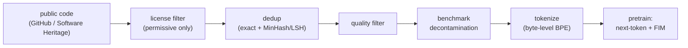

## 6 Pretraining Data

<!-- para:6-pretraining-data-1 --> If one fact organizes this survey, it is that *data is the moat* for code models. Architectures are largely shared with general LLMs; the recipe (Section 5) is stable; what most separates a strong code model from a weak one is the corpus. This section walks the data pipeline — sourcing, licensing, deduplication, quality filtering, decontamination — using the openly documented corpora (The Stack and its successors) as the worked example, because frontier closed datasets are not published.

<!-- para:6-pretraining-data-2 --> **Intuition.** The pipeline is a cascade of filters on a firehose of public code, each removing tokens that would otherwise hurt or cheat the next-token objective of Section 3 — much like conditioning a signal before it enters an estimator. Deduplicate so copies do not dominate the average; license-filter for legality; quality-filter to raise signal-to-noise; decontaminate so the benchmarks do not leak into training. The scaling laws of Section 3 promise that loss falls predictably with *more* tokens — but only clean, non-redundant, in-distribution tokens count, which is why curation rather than raw volume is the moat.

<!-- sec:6.1 -->
### 6.1 Building a Code Corpus: The Stack

<!-- para:61-building-a-code-corpus-the-stack-1 --> The Stack (2022) was assembled by collecting active GitHub repository names from the public GHArchive event timeline and pulling their source files <!-- cite:7 --> [[7]](references.md#ref-7). The all-license collection exceeds 29 TB; restricting to permissively licensed files reduces it to 3.1 TB across 30 programming languages — only about 10% of the raw data survives the license filter <!-- cite:7 --> [[7]](references.md#ref-7). A handful of languages dominate by volume: HTML, JavaScript, Java, and C together account for more than half the permissive dataset <!-- cite:7 --> [[7]](references.md#ref-7). Its successor, The Stack v2 (2024), was built in partnership with Software Heritage rather than by direct crawl, spans 619 languages plus pull requests, Kaggle notebooks, documentation, and compiler intermediate representations, and is roughly ten times larger — a 67.5 TB raw dataset yielding over 900B unique training tokens, four times the first StarCoder corpus <!-- cite:9 --> [[9]](references.md#ref-9). StarCoder 2's largest 15B model trains on over 913B unique tokens drawn from it <!-- cite:9 --> [[9]](references.md#ref-9).

<!-- sec:6.2 -->
### 6.2 Licensing and Governance

<!-- para:62-licensing-and-governance-1 --> Code carries licenses, and training on it raises questions prose rarely does (Section 16). The Stack's response is permissive-only selection plus a data-governance plan: license detection runs over repositories (via GHArchive metadata where available, and the `go-license-detector`/ScanCode toolkit for the ~97% of repositories lacking repo-level metadata), and developers can request removal of their code through a documented opt-out process <!-- cite:7 --> [[7]](references.md#ref-7), <!-- cite:9 --> [[9]](references.md#ref-9). This "license-clean by construction" stance is the open ecosystem's counter-pattern to the copyright disputes that surround code trained indiscriminately (Section 16). It is also a constraint: the permissive filter discards ~90% of available code, trading scale for legal defensibility.

<!-- sec:6.3 -->
### 6.3 Deduplication

<!-- para:63-deduplication-1 --> Web-scale code is massively redundant — forks, vendored copies, generated files — and deduplication consistently improves models. The standard pipeline computes MinHash signatures (The Stack uses 256 permutations) and applies locality-sensitive hashing to cluster documents whose Jaccard similarity exceeds a threshold (0.85 for The Stack; StarCoder 2 uses 5-grams at 0.7, breaking ties toward higher-starred repositories to preserve context) <!-- cite:7 --> [[7]](references.md#ref-7), <!-- cite:9 --> [[9]](references.md#ref-9). The effect is large: in the permissive Stack, 38.6% of files are near-duplicates that get removed, and the authors report that "near-deduplicating the data significantly boosts performance across all experiments" <!-- cite:7 --> [[7]](references.md#ref-7). DeepSeek-Coder adds **repository-level** deduplication — dedup at the granularity of whole projects rather than individual files — to preserve cross-file structure <!-- cite:10 --> [[10]](references.md#ref-10). These corpora use exact and near-duplicate (MinHash/LSH) deduplication; *semantic* deduplication by embedding similarity, as in SemDeDup <!-- cite:13 --> [[13]](references.md#ref-13), is a complementary technique from the general-data literature not yet standard in published code corpora — a gap worth noting rather than a settled practice.

<!-- sec:6.4 -->
### 6.4 Quality Filtering and the "Textbooks" Thesis

<!-- para:64-quality-filtering-and-the-textbooks-thesis-1 --> Beyond removing duplicates, filtering for *quality* can change the economics of training. The sharpest demonstration is phi-1 (2023): a 1.3B-parameter model trained for four days on eight A100s using about 6B tokens of "textbook-quality" code selected from The Stack and Stack Overflow by a learned classifier, plus under 1B tokens of synthetic GPT-3.5-generated textbooks and exercises <!-- cite:12 --> [[12]](references.md#ref-12). Despite seeing only ~50B tokens total, phi-1 attains 50.6% pass@1 on HumanEval and 55.5% on MBPP — "several orders of magnitude" smaller than competing models at comparable scores <!-- cite:12 --> [[12]](references.md#ref-12). A 350M-parameter sibling trained the same way still reaches 45% on HumanEval <!-- cite:12 --> [[12]](references.md#ref-12). The paper's thesis, stated plainly, is that "improving data quality can dramatically change the shape of the scaling laws" <!-- cite:12 --> [[12]](references.md#ref-12) — the strongest published argument that *what* you train on can dominate *how much*.

<!-- sec:6.5 -->
### 6.5 Decontamination

<!-- para:65-decontamination-1 --> Because evaluation is benchmark-driven and benchmarks are public, a corpus must be scrubbed of test data or its scores are meaningless. The published corpora are explicit about this. StarCoder removes files containing docstrings or solutions from HumanEval and MBPP, docstrings from APPS, questions from GSM8K, or prompts from DS-1000 <!-- cite:8 --> [[8]](references.md#ref-8), <!-- cite:9 --> [[9]](references.md#ref-9). DeepSeek-Coder applies an n-gram filter: any code containing a 10-gram identical to test data is excluded, with exact matching for 3-to-10-gram overlaps, covering HumanEval, MBPP, GSM8K, and MATH <!-- cite:10 --> [[10]](references.md#ref-10). Qwen2.5-Coder runs a dedicated decontamination pass over both pretraining and post-training data for the same key benchmarks <!-- cite:11 --> [[11]](references.md#ref-11). Decontamination is necessary but not sufficient: it removes verbatim leakage, but paraphrased or structurally similar problems survive, which is exactly why contamination-resistant evaluation (LiveCodeBench, Section 13) became necessary.
