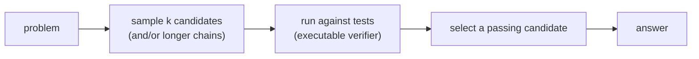

## 9 Reasoning and Test-Time Compute

<!-- para:9-reasoning-and-test-time-compute-1 --> The pass@k metric (Section 3) exposes a gap that defines this section: a model's single-sample quality (pass@1) is often far below what it can achieve when allowed to *generate many candidates and select* (pass@100). That gap is latent capability recoverable at inference time — and code's executable reward makes recovering it unusually easy, because the model can *check* candidates by running them. This section moves from cheap inference-time tricks to full RL-trained reasoning models, the current frontier.

**Intuition.** Test-time compute buys accuracy with inference instead of training: spend more forward passes per problem — sample many candidates, reason in longer chains, run-and-repair — and the success rate climbs. The pass@1-to-pass@k gap of Section 3 is exactly the headroom this exploits, and code makes the *selection* step nearly free because candidates can be filtered by running the tests (an executable verifier), rather than guessed at. The tradeoff is explicit and quantified in Section 14: solve rate rises, but cost and latency rise with the number of samples and the length of reasoning.

<!-- sec:9.1 -->
### 9.1 Chain-of-Thought and Sampling-and-Selection

<!-- para:91-chain-of-thought-and-sampling-and-selection-1 --> The simplest test-time lever is to let the model think in natural language before emitting code. Chain-of-thought prompting elicits intermediate reasoning steps that improve performance on tasks requiring multi-step logic <!-- cite:21 --> [[21]](references.md#ref-21). Self-consistency strengthens this by sampling many chains and taking the majority answer rather than a single greedy decode <!-- cite:22 --> [[22]](references.md#ref-22). For code specifically, the selection step can be *execution-based* rather than majority vote: generate k candidates, run them against available tests, and return one that passes. This is the mechanism behind the pass@1-to-pass@k gap — AlphaCode generates orders of magnitude more samples and then *filters* on example tests before submitting (Section 13) <!-- cite:40 --> [[40]](references.md#ref-40), and CodeRL shows the same model rising from ~2% pass@1 to roughly 20% at pass@1000 on APPS purely by sampling more <!-- cite:19 --> [[19]](references.md#ref-19). The trade is explicit: correctness bought with inference compute.

<!-- sec:9.2 -->
### 9.2 Self-Repair: Using Execution Feedback at Inference

<!-- para:92-self-repair-using-execution-feedback-at-inference-1 --> A model that can read its own failures can fix them. Self-Debugging teaches a model to debug its predicted code via few-shot prompting alone — no fine-tuning, no human feedback — by having it investigate execution results and explain its code in natural language ("rubber-duck debugging") to localize mistakes, then revise <!-- cite:23 --> [[23]](references.md#ref-23). The gains are consistent: on the Spider text-to-SQL task (which has no unit tests) code explanation improves the baseline by 2–3% overall and up to 9% on the hardest problems, and where unit tests are available (TransCoder, MBPP) self-debugging improves accuracy by up to 12% while also improving sample efficiency by reusing failed attempts <!-- cite:23 --> [[23]](references.md#ref-23). Reflexion generalizes this into "verbal reinforcement learning": rather than updating weights, an Actor generates attempts, an Evaluator scores them, and a Self-Reflection module converts the feedback into linguistic notes stored in an episodic memory that guides the next attempt <!-- cite:24 --> [[24]](references.md#ref-24). Reflexion reports 91.0% HumanEval pass@1, exceeding the contemporaneous GPT-4 figure of 80.1% <!-- cite:24 --> [[24]](references.md#ref-24). Both methods are the inference-time face of the execution-feedback idea that RLEF (Section 8) bakes into training.

<!-- sec:9.3 -->
### 9.3 Reasoning Models: RL-Trained Long Chain-of-Thought

<!-- para:93-reasoning-models-rl-trained-long-chain-of-thought-1 --> The current frontier collapses the distinction between training and test-time reasoning: models are *trained by reinforcement learning to produce long chains of thought*, then spend that learned reasoning at inference. DeepSeek-R1 is the clearest open account <!-- cite:25 --> [[25]](references.md#ref-25). Its R1-Zero variant applies RL directly to a base model with **no supervised fine-tuning**, using Group Relative Policy Optimization and a purely **rule-based reward** with two parts — an accuracy reward (is the final answer correct, checked by tests for code or by ground truth for math) and a format reward (keep reasoning inside delimiters) — deliberately avoiding a neural reward model to prevent reward hacking <!-- cite:25 --> [[25]](references.md#ref-25). Over RL training, R1-Zero spontaneously develops longer reasoning, self-verification, and reflection (the much-noted "aha moment"), and its AIME 2024 score rises from 15.6% to 77.9% pass@1, reaching 86.7% with self-consistency <!-- cite:25 --> [[25]](references.md#ref-25). The production R1 adds a small cold-start of human-aligned reasoning traces for readability and reports Codeforces at the 96.3rd percentile (rating 2029), 65.9% on LiveCodeBench, and 49.2% on SWE-bench Verified <!-- cite:25 --> [[25]](references.md#ref-25). This is the strongest evidence for the RLVR thesis of Section 8: competition-level coding emerges from reinforcement learning on a verifiable reward, with minimal human labeling.

<!-- para:93-reasoning-models-rl-trained-long-chain-of-thought-2 --> Proprietary reasoning models report the same trajectory. OpenAI's competitive-programming study traces a clean progression on Codeforces — gpt-4o at rating 808 (11th percentile), o1 at 1673 (89th), and o3 at 2724 (99.8th) — and reports that o3 wins a gold medal at the 2024 International Olympiad in Informatics *without* the hand-crafted, domain-specific inference strategies that an earlier specialized system (o1-ioi, rating 1807) required <!-- cite:26 --> [[26]](references.md#ref-26). The headline conclusion is the one that matters for the field's direction: scaling *general-purpose* reinforcement learning overtakes domain-specific scaffolding <!-- cite:26 --> [[26]](references.md#ref-26). Reasoning models are where the executable-reward property of code (Section 2) pays its largest dividend, and they set up the agentic systems of Section 12, which apply this reasoning across many tool-using turns in a real repository.
