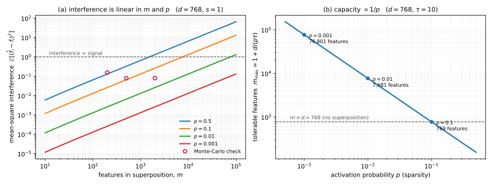

<!-- sec:B -->
## B Superposition and the grokking circuit

<!-- para:b-superposition-and-the-grokking-circuit-1 --> **Depth tier:** headline

<!-- para:b-superposition-and-the-grokking-circuit-2 --> Derivations for § <!-- secxref:2.4 -->[§2.4](fundamentals.md#sec-2.4) (superposition) and § <!-- secxref:9.3 -->[§9.3](circuits-across-models.md#sec-9.3) (the reverse-engineered modular-addition algorithm).

<!-- sec:B.1 -->
### B.1 The ReLU-output toy model

<!-- para:b1-the-relu-output-toy-model-1 --> The minimal model of superposition <!-- cite:3 --> [[3]](references.md#ref-3) takes $n$ synthetic features $\mathbf{x}\in\mathbb{R}^{n}$, each active independently with probability $1-S_i$ ($S_i$ the sparsity) and carrying importance $I_i$, projects them through $W\in\mathbb{R}^{m\times n}$ with $m<n$, and reconstructs with the tied transpose plus a ReLU:

<!-- eq:B-1 -->
$$
\mathbf{x}' = \mathrm{ReLU}\big(W^{\top} W\mathbf{x} + \mathbf{b}\big), \qquad \mathcal{L} = \mathbb{E}_{\mathbf{x}}\sum_{i} I_i\,(x_i - x'_i)^2. \tag{1}
$$

<!-- para:b1-the-relu-output-toy-model-2 --> The hidden activation $W\mathbf{x}\in\mathbb{R}^{m}$ is the bottleneck; $W^{\top}$ reconstructs; the ReLU filters interference. When features are **dense** (low $S_i$) the optimum represents the $m$ most important features orthogonally and drops the rest (PCA-like); when features are **sparse** (high $S_i$) it packs $>m$ features as non-orthogonal directions, tolerating rare collisions — **superposition**.

<!-- sec:B.2 -->
### B.2 Feature dimensionality, capacity, and the phase diagram

<!-- para:b2-feature-dimensionality-capacity-and-the-phase-diagram-1 --> For learned columns $W_i$ with unit versions $\hat W_i = W_i/\lVert W_i\rVert$, define the **feature dimensionality**

<!-- eq:B-2 -->
$$
D_i = \frac{\lVert W_i\rVert_2^{2}}{\sum_{j}\big(\hat W_j\cdot W_i\big)^{2}}, \qquad \sum_i D_i \approx m. \tag{2}
$$

<!-- para:b2-feature-dimensionality-capacity-and-the-phase-diagram-2 --> $D_i = 1$ means feature $i$ owns a whole dimension (orthogonal to all others); $D_i = 0$ means it is not represented; $D_i = \tfrac12$ is an antipodal pair sharing a dimension. The capacity identity $\sum_i D_i \approx m$ says the model uses ~all of its bottleneck. Sweeping (importance, sparsity) reveals a sharp **phase transition** from no-superposition (orthogonal or dropped) to superposition, where the optimal geometry moves through antipodal pairs to vertices of regular polytopes (line, triangle, pentagon, octahedron, …) that spread directions as uniformly as possible to minimize pairwise interference $\sum_{i\ne j}(\hat W_i\cdot\hat W_j)^2$ — the same *flavour* of problem as the physics **Thomson problem** of charges repelling on a sphere. The analogy is worth naming and worth bounding: the Thomson energy is a Coulomb $1/r$ potential, while the interference energy here is a squared-inner-product (and, once the ReLU is restored, a one-sided squared-inner-product — see <!-- secref:B.7 -->[§B.7](#sec-B.7)). Both are minimized by spreading points on a sphere and both produce regular polytopes at small counts, but they are different functionals and the identification is an analogy, not a reduction. This is why polysemantic neurons are the *expected* outcome, not a defect, and why the interpretable unit is a learned direction (§ <!-- secxref:6 -->[§6](method-inventory-dictionary.md#sec-6)).

> <!-- para:b2-feature-dimensionality-capacity-and-the-phase-diagram-3 --> **SP note.** Equation <!-- ref:B-1 -->[(1)](#eq-1) is compressed sensing run by training: a sparse high-dimensional signal is projected to a low-dimensional measurement $W\mathbf{x}$, and recovery is possible under incoherence + sparsity — with the ReLU standing in for the nonlinear recovery step. Dictionary learning (the SAE) is the decoder that inverts it.

<!-- sec:B.3 -->
### B.3 The grokking modular-addition algorithm

<!-- para:b3-the-grokking-modular-addition-algorithm-1 --> The one-layer transformer trained on $a+b \bmod p$ ($p=113$) embeds each input, projected onto a sparse set of key frequencies $w_k = 2\pi k/p$, as a point on a circle $(\cos w_k x, \sin w_k x)$ — a discrete Fourier feature <!-- cite:55 --> [[55]](references.md#ref-55). The attention+MLP block combines the embeddings of $a$ and $b$ via the angle-addition identities

<!-- eq:B-3 -->
$$
\cos(w_k a)\cos(w_k b) - \sin(w_k a)\sin(w_k b) = \cos\!\big(w_k(a+b)\big), \tag{3}
$$

<!-- para:b3-the-grokking-modular-addition-algorithm-2 --> producing a representation at angle $w_k(a+b)$ for each key frequency. The unembedding forms, for each candidate answer $c$, a logit that (via a further identity) is proportional to a sum over key frequencies:

<!-- eq:B-4 -->
$$
\text{logit}(c) \;\propto\; \sum_{k\in\text{key}}\cos\!\big(w_k(a + b - c)\big), \tag{4}
$$

<!-- para:b3-the-grokking-modular-addition-algorithm-3 --> which is a **matched filter**: it is maximized by constructive interference across the frequencies exactly when $c \equiv a+b\ (\mathrm{mod}\ p)$, and near-uniformly small otherwise. The **progress measures** that expose the gradual formation of this circuit under a flat test-loss curve are the *restricted loss* (keep only key frequencies) and *excluded loss* (ablate key frequencies); tracking them reveals the memorization → circuit-formation → cleanup phases <!-- cite:55 --> [[55]](references.md#ref-55). This is the field's cleanest existence proof that gradient descent finds a crisp, human-legible algorithm — and it is entirely a statement in the frequency domain.

<!-- sec:B.4 -->
### B.4 Figure — the capacity argument, plotted

<!-- para:b4-figure-the-capacity-argument-plotted-1 --> 

<!-- para:b4-figure-the-capacity-argument-plotted-2 --> **F-B1 · Interference is linear in feature count and sparsity; capacity is inversely proportional to sparsity.**

<!-- para:b4-figure-the-capacity-argument-plotted-3 --> **1 · Purpose and operating conditions.** Both panels are **closed forms**, not measurements: no model was trained or run. Parameters: residual width $d = 768$ (GPT-2-small's, used only to keep the numbers recognizable); typical squared magnitude of an active feature $s = 1$; required signal-to-interference ratio $\tau = 10$ in panel (b); sparsities $p \in \{0.5, 0.1, 0.01, 0.001\}$. The Monte-Carlo markers in (a) use `numpy.random.default_rng(0)`, 4,000 trials per point, at $(d,m,p) \in \{(64,200,0.05), (128,500,0.02), (256,2000,0.01)\}$.

<!-- para:b4-figure-the-capacity-argument-plotted-4 --> **2 · What it shows.** (a) The mean-square interference from reading one feature off a superposed stream, against the closed form $(m-1)ps/d$; markers are the seeded simulation. (b) The number of features tolerable at a given signal-to-interference ratio, $m_{\max} = 1 + d/(p\tau)$.

<!-- para:b4-figure-the-capacity-argument-plotted-5 --> **3 · How to read it.** The interference curve crosses the signal level at the point where a probe recovers noise rather than a feature — that crossing, not any capacity bound, is what limits superposition. In (b), note that $s$ cancels: **tolerable feature count does not depend on how large activations are**, only on how often they fire.

<!-- para:b4-figure-the-capacity-argument-plotted-6 --> **4 · Caveats.** The closed form assumes *random* directions; a trained model's directions are not random, and organized geometry can do better. Empirical ratios of simulation to closed form are 0.992, 1.007, 1.017 — agreement is the claim, the third digit is not. The panel-(b) bound is a *probe-legibility* criterion, not a recovery criterion; <!-- secref:B.6 -->[§B.6](#sec-B.6) derives the stricter recovery bound and says which of the two binds. Generator and persisted data: `figures/appendix-b-superposition-capacity.py` / `.json`.

<!-- sec:B.5 -->
### B.5 How many almost-orthogonal directions actually fit

<!-- para:b5-how-many-almost-orthogonal-directions-actually-fit-1 --> The superposition hypothesis rests on a counting claim, and the claim is usually made by gesture. The primary source states it in full as: "it's possible to have exp(n) many 'almost orthogonal' ($<\epsilon$ cosine similarity) vectors in high-dimensional spaces. See the Johnson–Lindenstrauss lemma" <!-- cite:3 --> [[3]](references.md#ref-3). No proof, and — more consequentially — **no $\epsilon$ in the answer**, when $\epsilon$ is precisely the quantity the rest of the appendix trades against. The argument is six lines, so here it is.

<!-- para:b5-how-many-almost-orthogonal-directions-actually-fit-2 --> **A caution before the derivation, because the citation is doing work it should not.** The Johnson–Lindenstrauss lemma is a statement about *distortion of pairwise distances under a random projection*. What is needed here is a *packing* statement: how many unit vectors can be pairwise near-orthogonal in a fixed space. The two are cousins — both follow from the same concentration phenomenon — but they are not the same theorem, and this appendix derives the one it uses rather than inheriting a name for it.

<!-- sec:B.5-step-1 -->
<!-- para:b5-how-many-almost-orthogonal-directions-actually-fit-3 --> **Step 1 — two random directions are nearly orthogonal.** Let $\mathbf{u}, \mathbf{v}$ be independent and uniform on the unit sphere $S^{d-1}$. By rotational invariance, fix $\mathbf{v} = \mathbf{e}_1$; then $\langle \mathbf{u},\mathbf{v}\rangle$ is just the first coordinate of a uniform point on the sphere, which concentrates near zero as the dimension grows, with a sub-Gaussian tail of variance proxy $1/d$:

<!-- eq:B-5-1 -->
$$
\Pr\big(\lvert\langle \mathbf{u},\mathbf{v}\rangle\rvert > \epsilon\big) \;\le\; 2\exp\!\left(-\frac{d\,\epsilon^{2}}{2}\right). \tag{5}
$$

<!-- sec:B.5-step-2 -->
<!-- para:b5-how-many-almost-orthogonal-directions-actually-fit-4 --> **Step 2 — union bound over pairs.** Draw $N$ directions independently and uniformly. There are $\binom{N}{2} < N^2/2$ pairs, so the probability that *any* pair violates the $\epsilon$ tolerance is at most $N^{2}\exp(-d\epsilon^{2}/2)$. That is below one — so a valid configuration **exists** — as soon as

<!-- eq:B-5-2 -->
$$
N \;<\; \exp\!\left(\frac{d\,\epsilon^{2}}{4}\right). \tag{6}
$$

<!-- para:b5-how-many-almost-orthogonal-directions-actually-fit-5 --> **Read the guarantee precisely at the boundary.** At $N$ exactly equal to the right-hand side the failure bound is exactly $1$, which guarantees nothing; taking $N = \delta\,e^{d\epsilon^2/4}$ for $\delta < 1$ gives failure probability at most $\delta^2$, so "a random draw works with high probability" needs that margin and is not free at the threshold itself. Note also that this counts vectors with $\lvert\langle \mathbf{u},\mathbf{v}\rangle\rvert \le \epsilon$ — **two-sided**. <!-- secref:B.7 -->[§B.7](#sec-B.7) shows the toy model charges only *positive* interference, so the two-sided criterion is stricter than the mechanism requires and this count is correspondingly conservative.

<!-- para:b5-how-many-almost-orthogonal-directions-actually-fit-6 --> **What Equation <!-- ref:B-5-2 -->[(6)](#eq-6) says that "exp(n) many" does not.** Capacity is exponential in the dimension *at a fixed tolerance*, and the tolerance enters the exponent **quadratically**. Halving the interference you are willing to tolerate costs a factor of four in the exponent — so the headline claim is not a free lunch, it is a statement about a specific point on a trade-off. At $d = 768$ the guarantee gives about $7\times10^{20}$ directions at $\epsilon = 0.5$ and about $3\times10^{7}$ at $\epsilon = 0.3$; the *same* formula guarantees only about $7$ directions at $\epsilon = 0.1$.

<!-- para:b5-how-many-almost-orthogonal-directions-actually-fit-7 --> **Read that last number correctly.** It does not mean a 768-dimensional space holds only seven directions of pairwise cosine below 0.1 — it means the *union bound is loose* in that regime, because it insists every pair be simultaneously good under a purely random construction. The result to carry forward is the **scaling**, $N = \exp(\Omega(d\epsilon^{2}))$ — a lower bound, since this construction proves existence and says nothing about a matching ceiling — not the constant in the exponent. That scaling is exactly the form later capacity theorems build on: the multi-dimensional refinement states that $\tfrac{1}{d_{\max}}e^{C_1 (d/d'^2)\delta^2}$ pairwise $\delta$-orthogonal $d'$-dimensional subspaces can be packed into $d$ dimensions <!-- cite:5 --> [[5]](references.md#ref-5). **Note the exponent carefully — it is $d/d'^2$, so capacity is exponential in $d$ and not in $d^2$**; the difference is easy to lose in transcription and it is the difference between a strong claim and an absurd one. That theorem also carries an unstated hypothesis, $\delta \cdot d_{\max} < 1$, without which its own supporting lemma's bound $\sqrt{n/(1-\delta n)}$ is undefined.

<!-- para:b5-how-many-almost-orthogonal-directions-actually-fit-8 --> **What none of these bounds establish.** They are *existence* results about geometry. They do not say a trained network finds such a configuration, they do not say a decoder can recover the coefficients, and — the point of the next section — the second of those is a strictly stronger requirement than the first.

<!-- sec:B.6 -->
### B.6 The ceiling that counting directions does not give

<!-- para:b6-the-ceiling-that-counting-directions-does-not-give-1 --> Section <!-- secref:B.5 -->[§B.5](#sec-B.5) counted directions that can *coexist*. Superposition needs something stronger: directions that can be *told apart* by a decoder downstream. That is a recovery question, and recovery has its own bound, which the primary source states and which is the only quantitative upper limit on superposition in it.

<!-- para:b6-the-ceiling-that-counting-directions-does-not-give-2 --> **Notation, because two conventions collide here.** This section writes $d$ for the embedding dimension and $m$ for the number of features, matching Figure `F-B1`. The toy model of <!-- secref:B.1 -->[§B.1](#sec-B.1) uses the source's own opposite convention ($m$ the bottleneck, $n$ the feature count); the compressed-sensing literature uses a third. Ratios below are stated in $(d, m)$ throughout, and the direction of the comparison depends on that, so the declaration is load-bearing rather than tidy-minded.

<!-- para:b6-the-ceiling-that-counting-directions-does-not-give-3 --> The compressed-sensing result is that an $m$-dimensional $k$-sparse vector is recoverable from a $d$-dimensional projection when $d = \Omega(k\log(m/k))$; the source's own observation is that this "can be interpreted as giving an upper bound on the amount of superposition" <!-- cite:3 --> [[3]](references.md#ref-3). Substituting the toy model's own sparsity, where each feature is active with probability $p = 1-S$ and so $k = O(pm)$, and using $\log(m/k) = \log(1/p)$ (natural log throughout — the base is absorbed into the hidden constant, and switching to $\log_2$ changes the multipliers below by a factor $\ln 2$):

<!-- eq:B-6-1 -->
$$
d \;=\; \Omega\!\big(m\,p\log(1/p)\big) \qquad\Longrightarrow\qquad m \;=\; O\!\left(\frac{d}{p\log(1/p)}\right). \tag{7}
$$

<!-- para:b6-the-ceiling-that-counting-directions-does-not-give-4 --> **This is the reconciliation the two claims need.** Read forward, Equation <!-- ref:B-6-1 -->[(7)](#eq-7) says the feature count is **linear in the embedding dimension**, not exponential — the exponential packing of <!-- secref:B.5 -->[§B.5](#sec-B.5) buys nothing beyond a linear number of *recoverable* features, because a decoder must separate them and not merely coexist with them. The modulation is the sparsity: the multiplier $1/(p\log(1/p))$ is about $4.3$ at $p = 0.1$, about $21.7$ at $p = 0.01$, and about $145$ at $p = 0.001$. Superposition is real and it is worth a lot, and it is not exponential.

<!-- para:b6-the-ceiling-that-counting-directions-does-not-give-5 --> **Two hypotheses this import carries, neither of them the toy model's.** The recovery result presumes a measurement matrix with a restricted-isometry-style property and a decoder solving an $\ell_1$ program; the toy model *learns* its matrix and decodes with one linear probe and a ReLU. Both differences push the same way — a weaker decoder needs *more* dimensions, not fewer — so the bound survives as an upper bound on capacity, which is the only way it is usable here. It is also an $\Omega(\cdot)$ statement, so the implication runs one way only, and the multipliers above quote it as though its hidden constant were $1$.

<!-- para:b6-the-ceiling-that-counting-directions-does-not-give-6 --> **Which of this appendix's two bounds binds.** Figure `F-B1` gives a capacity $m_{\max} = 1 + d/(p\tau)$ from requiring a signal-to-interference ratio $\tau$; Equation <!-- ref:B-6-1 -->[(7)](#eq-7) gives $d/(p\log(1/p))$ in the same variables. Their ratio is $\log(1/p)/\tau$, so **the interference criterion binds whenever $\tau > \log(1/p)$ and the recovery criterion binds otherwise**. At the figure's operating point ($\tau = 10$) and any $p \ge 10^{-3}$, $\log(1/p) \le 6.9 < 10$, so the interference bound is the tighter of the two and the figure is the conservative statement. Lower the demanded SNR below $\log(1/p)$ and recovery becomes the binding constraint instead.

<!-- para:b6-the-ceiling-that-counting-directions-does-not-give-7 --> **How much margin that verdict has, since it compares an explicit constant against an $\Omega(\cdot)$.** The worst in-range point is $\tau = 10$, $p = 10^{-3}$, where the two differ by only $1.45\times$ — so a recovery constant of $1.45$ or larger flips the ordering, and the constant is exactly what the asymptotic notation declines to supply. The verdict is therefore *conditional on treating the hidden constant as unity*, and it is stated that way rather than as a fact about the model. The two are not rivals; they answer different questions, and stating which one is active is part of quoting either.

<!-- sec:B.7 -->
### B.7 Why the nonlinearity is what permits superposition

<!-- para:b7-why-the-nonlinearity-is-what-permits-superposition-1 --> Section <!-- secref:B.1 -->[§B.1](#sec-B.1) gives the toy model and its loss but not the mechanism. The mechanism is visible as soon as the loss is decomposed by how many features are active at once, and the decomposition is a short calculation that the source states the result of without performing.

<!-- para:b7-why-the-nonlinearity-is-what-permits-superposition-2 --> **Condition on exactly one active feature.** With importance-weighted loss $\mathcal{L} = \sum_{\mathbf{x}}\sum_i I_i (x_i - x'_i)^2$ <!-- cite:3 --> [[3]](references.md#ref-3) and a single active coordinate $i$, the input is $\mathbf{x} = x_i \mathbf{e}_i$. Then $W\mathbf{x} = x_i W_i$ (the $i$-th column), so $W^{\top}W\mathbf{x} = x_i\,W^{\top}W_i$, whose $j$-th component is $x_i(W_j\cdot W_i)$. Passing through the output nonlinearity gives $x'_i = \mathrm{ReLU}(\lVert W_i\rVert^2 x_i + b_i)$ on the active coordinate and $x'_j = \mathrm{ReLU}\big((W_j\cdot W_i)x_i + b_j\big)$ on every other. The targets are $x_i$ and $0$ respectively, so with $x_i \sim U[0,1]$ the one-active-feature term is (up to the factor $\Pr[\text{only } i \text{ active}] = p(1-p)^{n-1}$ that weights it inside the expectation of Equation <!-- ref:B-1 -->[(1)](#eq-1), omitted here because it multiplies every term below identically and cancels from all the comparisons drawn from them)

<!-- eq:B-7-1 -->
$$
\mathcal{L}_1 = \underbrace{\sum_i \int_0^1 I_i\big(x_i - \mathrm{ReLU}(\lVert W_i\rVert^2 x_i + b_i)\big)^2 dx_i}_{\text{feature benefit}} \;+\; \underbrace{\sum_{i\neq j}\int_0^1 I_j\,\mathrm{ReLU}\big((W_j\cdot W_i)x_i + b_j\big)^2 dx_i}_{\text{interference}} . \tag{8}
$$

<!-- para:b7-why-the-nonlinearity-is-what-permits-superposition-3 --> **Two facts the source asserts fall straight out of the interference term, and both are about the ReLU.**

1. <!-- para:b7-why-the-nonlinearity-is-what-permits-superposition-4 --> **Negative interference is free — in this term.** $\mathrm{ReLU}(\cdot)^2$ is identically zero whenever $(W_j\cdot W_i)x_i + b_j \le 0$. A feature direction that projects *negatively* onto another therefore costs nothing at all — not "little", exactly nothing. Two scopes travel with that: it is a statement about the **one-active-feature** term, and the "half the geometry is not charged for" reading additionally assumes the interference signs are symmetrically distributed, which is precisely what training has an incentive to destroy.
2. **A negative bias buys a tolerance band on the other half.** With $b_j < 0$ the penalty stays at zero for small *positive* interference too, up to $(W_j\cdot W_i)x_i \le -b_j$. The learned bias is not decoration; it is the width of the free region.

<!-- para:b7-why-the-nonlinearity-is-what-permits-superposition-5 --> **The contrast that makes this the mechanism rather than a detail.** Remove the nonlinearity and the same conditioning gives, writing $c_{ji} = W_j\cdot W_i$, an interference term $\sum_{i\ne j} I_j \int_0^1 (c_{ji}x_i + b_j)^2 dx_i = \sum_{i\ne j} I_j\big(\tfrac{1}{3}c_{ji}^2 + c_{ji}b_j + b_j^2\big)$. **Both the $\tfrac13$ and the bias matter and are easy to drop**: integrating over the activation's range is not the same as evaluating at $x_i = 1$, and the cross term $c_{ji}b_j$ is what carries the sign information.

<!-- para:b7-why-the-nonlinearity-is-what-permits-superposition-6 --> **The durable distinction is a free region, not a symmetry.** At $b_j = 0$ the linear cost $\tfrac13 c_{ji}^2$ is symmetric, so the linear model charges both signs alike while the ReLU model charges only one — that is the clean version of the claim. But with $b_j < 0$ the linear cost is minimized at $c_{ji} = -\tfrac32 b_j > 0$, so a *biased* linear model also prefers a particular positive interference, and the symmetry argument alone does not separate the two models. What does separate them survives at every bias: the linear cost bottoms out at $b_j^2/4 > 0$ and is **never zero**, whereas the ReLU cost is *exactly* zero on a whole half-line ($c_{ji} \le -b_j$ for $b_j \le 0$). A free region, not an asymmetry, is what makes superposition profitable. **Superposition is not something a network does in spite of its nonlinearity; the nonlinearity is what makes it free.**

<!-- para:b7-why-the-nonlinearity-is-what-permits-superposition-7 --> *(A tempting one-line summary — "a model with $W^{\top}W$ invertible exhibits no superposition" — is **vacuous** and this appendix does not use it. Under the shapes of <!-- secref:B.1 -->[§B.1](#sec-B.1), $W \in \mathbb{R}^{m\times n}$ with $m < n$ makes $W^{\top}W$ an $n\times n$ matrix of rank at most $m$, hence singular whenever there is any superposition at all; the condition reduces to $n \le m$, which is the definition of the no-superposition case and holds equally for the ReLU model.)*

<!-- para:b7-why-the-nonlinearity-is-what-permits-superposition-8 --> **What is not derived here.** The source writes out the decomposition's $k \ge 2$ terms nowhere, stating explicitly that it leaves them to the reader; this appendix does not supply them either, and marks the gap rather than implying the decomposition is complete. Its companion claim — that the low-$k$ terms dominate as sparsity rises — is likewise asserted rather than argued, and the controlling quantity is the expected number of simultaneously active features $np$, not $p$ alone. At the source's own experimental scale ($n = 400$ with $p$ as large as $0.3$) that expectation is well above one, so the one-active-feature term is the illustrative case, not the operative one.

<!-- sec:B.8 -->
### B.8 Which of these results are metric-dependent, and which are not

<!-- para:b8-which-of-these-results-are-metric-dependent-and-which-are-not-1 --> Every quantity in this appendix is defined through an inner product, and <!-- secref:A.4 --><!-- secxref:A.4 -->[§A.4](appendix-a-transformer-circuits-math.md#sec-A.4) has already shown the residual stream has no privileged basis — so it is natural to ask whether the capacity results are artifacts of measuring angles the Euclidean way. Work on the geometry of linear representations argues the semantically meaningful pairing is a *causal* inner product $\langle \mathbf{u},\mathbf{v}\rangle_M = \mathbf{u}^{\top}M\mathbf{v}$ rather than the Euclidean one <!-- cite:4 --> [[4]](references.md#ref-4). The answer splits cleanly, and it is not the one a first pass suggests.

<!-- para:b8-which-of-these-results-are-metric-dependent-and-which-are-not-2 --> **The counting results are metric-*invariant*, and this appendix does not claim otherwise.** For any positive-definite $M$, factor $M = R^{\top}R$; then $\langle \mathbf{u},\mathbf{v}\rangle_M = \langle R\mathbf{u}, R\mathbf{v}\rangle$ exactly, and $\lVert\mathbf{u}\rVert_M = \lVert R\mathbf{u}\rVert$. So $\mathbf{u} \mapsto R\mathbf{u}$ is a bijection of $\mathbb{R}^d$ carrying $M$-cosines to Euclidean cosines **with no distortion at all**. A set of $N$ vectors is pairwise $\epsilon$-almost-orthogonal in the $M$ metric if and only if its image is in the Euclidean one, so the packing bound of Equation <!-- ref:B-5-2 -->[(6)](#eq-6) and the recovery bound of Equation <!-- ref:B-6-1 -->[(7)](#eq-7) transfer unchanged. A change of inner product cannot alter how many features fit.

<!-- para:b8-which-of-these-results-are-metric-dependent-and-which-are-not-3 --> **What the metric does change is every *measured* quantity, and those are the ones to scope.** The feature dimensionality $D_i$ of Equation <!-- ref:B-2 -->[(2)](#eq-2) and the interference sum of <!-- secref:B.4 -->[§B.4](#sec-B.4) are computed on the *specific learned directions of a trained model*, in whatever basis the activations arrive in. There, the metric is not a free choice absorbed by a change of coordinates — it decides which particular pairs count as interfering, which features are reported as sharing a dimension, and what a phase-diagram boundary sits at. Two analyses of the same model under two inner products will agree on the capacity theorems and can disagree about which features collide.

<!-- para:b8-which-of-these-results-are-metric-dependent-and-which-are-not-4 --> **So the honest scoping is per-result rather than blanket.** The existence and recovery bounds are basis-free and are stated here as such. Any *empirical* geometry claim — a measured $D_i$, an interference estimate, a reported polytope — is conditional on the metric it was computed in, and this survey's sources compute in the Euclidean one without saying so.
