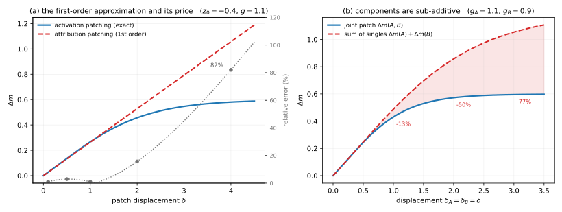

<!-- sec:C -->
## C Causal interventions

<!-- para:c-causal-interventions-1 --> **Depth tier:** headline

<!-- para:c-causal-interventions-2 --> Formalism for § <!-- secxref:5 -->[§5](method-inventory-causal.md#sec-5): mediation, the attribution-patching error term, and the attribution-graph replacement model.

<!-- sec:C.1 -->
### C.1 Activation patching as causal mediation

<!-- para:c1-activation-patching-as-causal-mediation-1 --> Treat the corruption as a *treatment*, the internal activation at site $s$ as a *mediator* $a_s$, and the metric $\mathcal{M}$ as the *outcome* <!-- cite:32 --> [[32]](references.md#ref-32). Let $a_s^{\text{clean}}$ and $a_s^{\text{corrupt}}$ be the mediator's values under the two inputs. The total effect is $\mathrm{TE} = \mathcal{M}(x_{\text{clean}}) - \mathcal{M}(x_{\text{corrupt}})$; the **indirect effect** of routing through $s$ (denoising direction) is the metric change from restoring $a_s$ to its clean value inside the corrupt run:

<!-- eq:C-1 -->
$$
\mathrm{IE}(s) = \mathcal{M}\!\big(x_{\text{corrupt}};\, a_s\!\leftarrow\! a_s^{\text{clean}}\big) - \mathcal{M}(x_{\text{corrupt}}). \tag{1}
$$

<!-- para:c1-activation-patching-as-causal-mediation-2 --> **Denoising** ($a_s^{\text{corrupt}}\!\to\! a_s^{\text{clean}}$) measures *sufficiency*; **noising** ($a_s^{\text{clean}}\!\to\! a_s^{\text{corrupt}}$) measures *necessity*; the two need not agree because the network is nonlinear and other paths compensate (§ <!-- secxref:10.2 -->[§10.2](evaluation-and-metrics.md#sec-10.2)). **Path patching** (§ <!-- secxref:5.2 -->[§5.2](method-inventory-causal.md#sec-5.2)) restricts the mediator to a single edge by additionally freezing every off-path component at its clean value — the third forward pass.

<!-- sec:C.2 -->
### C.2 Attribution patching: first-order expansion and error

<!-- para:c2-attribution-patching-first-order-expansion-and-error-1 --> Exact patching (Equation <!-- ref:C-1 -->[(1)](#eq-1)) needs one forward pass per site. Attribution patching linearizes. Write the metric as a function of the activation, $\mathcal{M}(a_s)$, and Taylor-expand the patched value $\mathcal{M}(a_s^{\text{corrupt}})$ around the clean point:

<!-- eq:C-2 -->
$$
\mathcal{M}(a_s^{\text{corrupt}}) = \mathcal{M}(a_s^{\text{clean}}) + \big(a_s^{\text{corrupt}} - a_s^{\text{clean}}\big)^{\!\top}\nabla_{a_s}\mathcal{M}\big|_{a_s^{\text{clean}}} + \tfrac12\,\Delta a_s^{\top} \mathbf{H}_s\, \Delta a_s + \cdots, \tag{2}
$$

<!-- para:c2-attribution-patching-first-order-expansion-and-error-2 --> with $\Delta a_s = a_s^{\text{corrupt}} - a_s^{\text{clean}}$ and $\mathbf{H}_s$ the Hessian. Dropping the second-order term gives the attribution-patching estimate of Equation [(2)](method-inventory-causal.md#eq-2) <!-- xref:5-2 -->: the linear term, computable for *all* sites from one backward pass. The **error is the discarded curvature** $\tfrac12\Delta a_s^{\top}\mathbf{H}_s\Delta a_s + O(\lVert\Delta a_s\rVert^3)$, which is large exactly where the metric is highly nonlinear in $a_s$: at a **saturated softmax** the local gradient $\nabla_{a}\mathcal{M}\approx 0$ even though the true patched effect (a discrete attention jump) is large — a false negative — and where direct and indirect effects **cancel** to first order. AtP\* <!-- cite:39 --> [[39]](references.md#ref-39) fixes the softmax case by recomputing the QK attention change exactly; EAP-IG <!-- cite:41 --> [[41]](references.md#ref-41) fixes it by integrating the gradient along the path from corrupt to clean,

<!-- eq:C-3 -->
$$
\widehat{\Delta\mathcal{M}}_{\text{IG}}(s) = \Delta a_s^{\top}\int_{0}^{1}\nabla_{a_s}\mathcal{M}\big|_{a_s^{\text{clean}} + \alpha\,\Delta a_s}\,\mathrm{d}\alpha \;\approx\; \Delta a_s^{\top}\,\frac{1}{M}\sum_{m=1}^{M}\nabla_{a_s}\mathcal{M}\big|_{a_s^{\text{clean}} + \frac{m}{M}\Delta a_s}, \tag{3}
$$

<!-- para:c2-attribution-patching-first-order-expansion-and-error-3 --> the standard Integrated Gradients construction <!-- cite:79 --> [[79]](references.md#ref-79) applied per site, which recovers the true effect even when the endpoint gradient is near zero because it samples the steep transition region in between.

<!-- sec:C.3 -->
### C.3 Cross-layer transcoders and the local replacement model

<!-- para:c3-cross-layer-transcoders-and-the-local-replacement-model-1 --> Attribution graphs (§ <!-- secxref:8.3 -->[§8.3](method-inventory-automation.md#sec-8.3)) linearize the *whole* forward pass for one input. A **cross-layer transcoder** replaces the MLPs: sparse features whose activation at layer $\ell$ contributes to the MLP output at $\ell$ and every later layer. For a fixed prompt, build the **local replacement model** by substituting each true MLP output $\mathbf{y}_\ell$ with the CLT reconstruction plus an **error node** that makes the substitution exact:

<!-- eq:C-4 -->
$$
\mathbf{y}_\ell = \underbrace{\textstyle\sum_{\ell'\le\ell} W_{\text{dec}}^{(\ell'\to\ell)}\,\mathbf{f}_{\ell'}}_{\text{CLT reconstruction}} + \underbrace{\mathbf{e}_\ell}_{\text{error node}}, \qquad \mathbf{e}_\ell \equiv \mathbf{y}_\ell - \text{CLT}_\ell, \tag{4}
$$

<!-- para:c3-cross-layer-transcoders-and-the-local-replacement-model-2 --> with attention patterns **frozen** at their real input-computed values. On this input the replacement reproduces the model's output exactly (the error nodes absorb the residual), and — crucially — the computation is now *linear* in the active features. The **attribution graph** is then the linear (Jacobian) map from each active feature/error/token to each downstream feature and to the logits, chained by the chain rule and pruned by influence. The two honest approximations are visible in the object itself: attention is frozen (not explained), and the error nodes are an explicit "unexplained residual" term — which is why the method is *faithful for this input* rather than a global circuit <!-- cite:20 --> [[20]](references.md#ref-20), <!-- cite:21 --> [[21]](references.md#ref-21).

<!-- sec:C.4 -->
### C.4 Figure — the two approximations patching relies on

<!-- para:c4-figure-the-two-approximations-patching-relies-on-1 --> 

<!-- para:c4-figure-the-two-approximations-patching-relies-on-2 --> **F-C1 · Attribution patching is a near-operating-point instrument, and component effects do not add.**

<!-- para:c4-figure-the-two-approximations-patching-relies-on-3 --> **1 · Purpose and operating conditions.** **Closed forms**, no model run. The metric is modelled as a saturating readout $m = \sigma(z_0 + g\delta)$, which is what a logit difference through a softmax is. Parameters: clean operating point $z_0 = -0.4$; single-component sensitivity $g = 1.1$; two-component sensitivities $g_A = 1.1$, $g_B = 0.9$. Fully deterministic — no random number generator is used.

<!-- para:c4-figure-the-two-approximations-patching-relies-on-4 --> **2 · What it shows.** (a) Exact patching against its first-order (attribution) approximation, with relative error on the right axis: 1.0% at $\delta = 0.1$, 15.7% at $\delta = 2$, **82% at $\delta = 4$**. (b) The joint effect of patching two components against the sum of their singleton effects; the shaded gap is the interaction.

<!-- para:c4-figure-the-two-approximations-patching-relies-on-5 --> **3 · How to read it.** The interaction in (b) is **negative throughout** — components are sub-additive — so summing singleton ablation effects *overstates* what a pair does together: $-1.2\%$ of the joint effect at small displacement, $-13.3\%$ at moderate, $-77.2\%$ at large. Any greedy search that scores components singly and sums inherits that bias, and it grows precisely where the components matter most.

<!-- para:c4-figure-the-two-approximations-patching-relies-on-6 --> **4 · Caveats.** The relative error in (a) is **not monotone**: $\sigma$ is convex below its inflection and concave above, so the signed error changes sign near $\delta \approx 0.36$ at this $z_0$. What is monotone is the failure once the readout saturates. Crucially, this sub-additivity requires **no interaction in the network's computation** — it is a property of the nonlinear metric alone, which is exactly the distinction a circuit claim must make. The *sign* of the departure from additivity is a property of the scale, not a universal: on the proportional scale of <!-- secref:C.5 -->[§C.5](#sec-C.5) the same independence assumption produces **super**-additivity, and <!-- secref:C.7 -->[§C.7](#sec-C.7) works that case through. Generator and persisted data: `figures/appendix-c-patching-approximation.py` / `.json`.

<!-- sec:C.5 -->
### C.5 Three scales, declared once

<!-- para:c5-three-scales-declared-once-1 --> Effect sizes in this literature are reported on at least three different scales, and no source maps between them. Because this appendix later compares numbers across sources, it declares the scales first, per the repo's two-bases rule.

<!-- para:c5-three-scales-declared-once-2 --> **The proportional (ratio) scale.** The causal-mediation treatment of bias defines every effect as a *proportional difference* <!-- cite:32 --> [[32]](references.md#ref-32). With $y(u) = p_\theta(\text{anti-stereotypical}\mid u)/p_\theta(\text{stereotypical}\mid u)$ the response, the total effect on unit $u$ is $y_{\text{set-gender}}(u)/y_{\text{null}}(u) - 1$, and the natural direct and indirect effects are the same construction with the mediator held at, or set to, its post-intervention value. The stated reason for the proportional form is variance control: "We make the difference proportional to control for the high variance of $y$ across examples." **Note that $y$ is itself already a ratio**, so a reported effect is a ratio of ratios, minus one — which is why its worked example lands at $13.1/0.14 - 1 \approx 92.6$ and why a value like $130.9$ is routine rather than impossible.

<!-- para:c5-three-scales-declared-once-3 --> **The difference scale.** The causal-abstraction formalism and the self-repair literature define total, direct and indirect effects as plain differences of the metric, typically in logit units, where a large effect is a number of order one.

<!-- para:c5-three-scales-declared-once-4 --> **The log scale**, which nobody uses explicitly but which is what connects them:

<!-- eq:C-5-1 -->
$$
\underbrace{\frac{y_1}{y_0} - 1}_{\text{proportional}}, \qquad \underbrace{y_1 - y_0}_{\text{difference}}, \qquad \underbrace{\log y_1 - \log y_0}_{\text{log}} = \log\!\Big(1 + \tfrac{y_1}{y_0} - 1\Big). \tag{5}
$$

<!-- para:c5-three-scales-declared-once-5 --> **The consequence is not cosmetic.** Additivity on the log scale is *multiplicativity* on the raw scale and is neither of the first two. So "the effects decompose additively" is three different claims depending on the scale it is asserted on, and a proportional effect of $130.9$ and a logit-space effect of $0.3$ are not merely different in magnitude — they are different quantities, and no rescaling puts them in one table. **This appendix therefore states the scale at every effect it quotes, and refuses cross-source effect tables that do not.**

<!-- sec:C.6 -->
### C.6 What the decomposition condition actually says

<!-- para:c6-what-the-decomposition-condition-actually-says-1 --> $\mathrm{TE} = \mathrm{NDE} + \mathrm{NIE}$ is often quoted as though it were an identity. It is not; it is a hypothesis, and it is worth seeing exactly which one, because the usual gloss ("no mediator–outcome confounding", the standard condition in observational mediation analysis) is the **wrong** condition here. A language model is deterministic and every mediator is directly settable, so there is no confounding to assume away. What is needed instead is a *no-interaction* condition, and three lines produce it.

<!-- para:c6-what-the-decomposition-condition-actually-says-2 --> Work on the difference scale and write $y_{\text{null}}$, $y_{\text{set}}$ for the response under the two treatments, and $y_{\text{set},z_{\text{null}}}$, $y_{\text{null},z_{\text{set}}}$ for the two cross-world quantities. Then the three effects are $D_{\mathrm{TE}} = y_{\text{set}} - y_{\text{null}}$, $D_{\mathrm{NDE}} = y_{\text{set},z_{\text{null}}} - y_{\text{null}}$ and $D_{\mathrm{NIE}} = y_{\text{null},z_{\text{set}}} - y_{\text{null}}$. Subtracting,

<!-- eq:C-6-1 -->
$$
D_{\mathrm{TE}} - D_{\mathrm{NDE}} - D_{\mathrm{NIE}} \;=\; \big(y_{\text{set}} - y_{\text{set},z_{\text{null}}}\big) \;-\; \big(y_{\text{null},z_{\text{set}}} - y_{\text{null}}\big). \tag{6}
$$

<!-- para:c6-what-the-decomposition-condition-actually-says-3 --> **So the decomposition holds exactly when the two bracketed quantities are equal** — that is, when *moving the mediator has the same effect whether or not the treatment has been applied*. That is a no-interaction condition and nothing else, and it is precisely the equality stated by Vig et al. 2020, Eq. (11), from which that paper proves the decomposition in an appendix. Its own footnote is explicit that this was needed: the decomposition "is not guaranteed without further assumptions (e.g., under linear models). In our case, an additional no-interaction condition was needed" <!-- cite:32 --> [[32]](references.md#ref-32).

<!-- para:c6-what-the-decomposition-condition-actually-says-4 --> **Two things follow that the headline claim obscures.** First, the condition is stated on the **difference** scale while every reported effect is on the **proportional** scale of <!-- secref:C.5 -->[§C.5](#sec-C.5) — the reconciliation is to divide through by $y_{\text{null}}(u)$ *per unit* before taking the expectation over units, which is what the source's proof does and what a reader transporting the condition to another setting must remember to do. Second, for the neuron interventions the decomposition is **trivial**: the source's own footnote records that "in the neuron intervention case, by definition $\mathrm{TE} = \mathrm{NIE}$-all and $\mathrm{NDE}$-all $= 0$, so the decomposition trivially holds." The non-trivial case is attention heads, where it is an *approximate empirical* finding on one dataset, not a theorem. The defensible statement is therefore "bias approximately decomposes, on attention heads, on this dataset" — not "bias is decomposable".

<!-- sec:C.7 -->
### C.7 What "synergy" would have to mean

<!-- para:c7-what-synergy-would-have-to-mean-1 --> The same source reports that summed single-mediator effects fall far short of a concurrent intervention on all of them, and concludes that "neurons combine synergistically to compound independent effects" <!-- cite:32 --> [[32]](references.md#ref-32). The numbers are real and are worth quoting exactly, because they are stronger than the prose suggests — and because the inference from them does not go through.

| GPT-2 variant | distil | small | medium | large | xl |
|---|---|---|---|---|---|
| NIE-sum (neurons) | 6.8 | 4.0 | 3.5 | 2.1 | 2.9 |
| NIE-all (neurons) | 130.9 | 112.3 | 116.0 | 96.9 | 225.2 |
| ratio | 19.2× | 28.1× | 33.1× | 46.1× | 77.7× |

<!-- para:c7-what-synergy-would-have-to-mean-2 --> **The comparison as reported has no stated null, and that is the problem — but supplying one makes the claim *stronger*, not weaker.** "Sub-additive" and "super-additive" are only meaningful against a prediction for what *independent* mediators would produce, and on a proportional scale that prediction is not the sum. If $n$ mediators act independently and multiplicatively on the response, then $y_{\text{all}}/y_{\text{null}} = \prod_i (1 + e_i)$, so the concurrent proportional effect is

<!-- eq:C-7-1 -->
$$
\mathrm{NIE}\text{-all} \;=\; \prod_{i}\,(1 + e_i) - 1 \;\le\; \exp\Big(\textstyle\sum_i e_i\Big) - 1 \;=\; \exp\big(\mathrm{NIE}\text{-sum}\big) - 1 . \tag{7}
$$

<!-- para:c7-what-synergy-would-have-to-mean-3 --> **The inequality in Equation <!-- ref:C-7-1 -->[(7)](#eq-7) is the load-bearing part, and it is exact.** Since $1 + e \le e^{e}$ for every $e \ge 0$, the product is bounded by the exponential of the sum for *any* number of mediators and *any* distribution of individual effects. So $\exp(\mathrm{NIE}\text{-sum}) - 1$ is not a point prediction — it is the **supremum** of what multiplicative independence can produce, approached only in the limit of many infinitesimal effects. (Given $\mathrm{NIE}\text{-sum} = 6.8$ alone, an independent model can produce anything in $[6.8,\ 896.8)$: $6.8$ at $n = 1$, $178.1$ at $n = 10$, $718.7$ at $n = 100$. The bound is what survives not knowing $n$.) Treating it as an equality would need $\sum_i e_i^2 \ll 1$ — a condition on the *sum of squares*, so the per-effect tolerance tightens as $1/\sqrt{n}$; the thousands-of-tiny-effects regime here satisfies it comfortably, but "small individual effects" is not the right way to state it.

<!-- para:c7-what-synergy-would-have-to-mean-4 --> **Now evaluate, and the result is a one-sided test that four of five models pass:**

| Model | $\mathrm{NIE}$-sum (additive null) | $\exp(\mathrm{NIE}\text{-sum}) - 1$ (independence bound) | measured $\mathrm{NIE}$-all | verdict |
|---|---|---|---|---|
| distil | 6.8 | 896.8 | 130.9 | consistent with independence |
| small | 4.0 | 53.6 | 112.3 | **exceeds the bound** |
| medium | 3.5 | 32.1 | 116.0 | **exceeds the bound** |
| large | 2.1 | 7.2 | 96.9 | **exceeds the bound** |
| xl | 2.9 | 17.2 | 225.2 | **exceeds the bound** |

<!-- para:c7-what-synergy-would-have-to-mean-5 --> **A measurement above the bound cannot be produced by *any* independent multiplicative model**, whatever $n$ is and however the individual effects are distributed. For small, medium, large and xl the measured concurrent effect exceeds that ceiling — by $2.1\times$ at small and by $13.5\times$ at large — so independence is refuted and genuine super-multiplicative interaction is established. The source's synergy claim is therefore **better supported than the comparison it rests on**: the paper tests against the additive null, which is the weaker test, while the sharp test is the multiplicative ceiling.

<!-- para:c7-what-synergy-would-have-to-mean-6 --> **The exception is the model the raw ratios make look most dramatic.** Distil has the largest $\mathrm{NIE}$-sum and so the loosest ceiling; its measured $130.9$ sits comfortably below $896.8$, and for distil alone the data are consistent with independent mediators and demonstrate no synergy at all. The $19.2\times$ ratio in the table above is not evidence of interaction — it is what independence looks like on a proportional scale when the effects are numerous.

<!-- para:c7-what-synergy-would-have-to-mean-7 --> **Three caveats on all of this.** The bound is only a bound: the individual $e_i$ are measured (there are thousands of them), so the *exact* independence prediction is computable rather than merely bounded, and nobody has computed it — doing so would sharpen "exceeds the ceiling" into a quantified interaction term. The multiplicative model is itself a choice; a different independence model gives a different ceiling, and the argument is conditional on it. And the source states that for neurons $\mathrm{TE} = \mathrm{NIE}$-all *by definition*, so the right-hand column is not an independent measurement — it is the total effect, which is why the honest framing of the whole comparison is a statement about how small the sum of singleton effects is relative to the total.

<!-- para:c7-what-synergy-would-have-to-mean-8 --> **The same source's attention-head numbers point the other way, and are the stronger result.** For heads it reports a maximum relative distance from NIE-all "between 0.7% and 11.3%" — near-additivity, measured, across model scales. That is a substantive finding about heads. Figure 8 of that paper, sometimes cited for the synergy claim, is a **heads** figure by its own caption ("Effects of intervening on all heads concurrently (all) vs. independently and summing (sum)"), and so is evidence for the additive result, not the synergistic one.

<!-- sec:C.8 -->
### C.8 Four normalizations, and the measured faithfulness of the linear approximation

<!-- para:c8-four-normalizations-and-the-measured-faithfulness-of-the-linear-approximation-1 --> Even within the difference scale, "how much of the effect did we recover?" is normalized four incompatible ways across the sources this survey uses. Each is defensible; none converts to another without the raw quantities.

| Convention | Definition | Range and reading |
|---|---|---|
| Patching-effect normalization <!-- cite:33 --> [[33]](references.md#ref-33) | patching effect divided by $\mathrm{LD}_{\text{clean}} - \mathrm{LD}_{*}$ | typically $[0,1]$; $1$ is fully restored performance, $0$ is the corrupted run |
| Proportion explained <!-- cite:36 --> [[36]](references.md#ref-36) | $(1 - \mathrm{AUE}(H)/\mathrm{ATE}(H))\times 100\%$ | **can be below 0%**, since $\mathrm{AUE} > \mathrm{ATE}$ is possible; all-paths is 100% by definition |
| Raw logit units <!-- cite:59 --> [[59]](references.md#ref-59) | unnormalized metric difference | order-one numbers; not comparable across metrics |
| Proportional effect <!-- cite:32 --> [[32]](references.md#ref-32) | $y_1/y_0 - 1$ on a probability *ratio* | unbounded above; values above 100 are routine |

<!-- para:c8-four-normalizations-and-the-measured-faithfulness-of-the-linear-approximation-2 --> **A number quoted without its convention is not a result.** The second row is the one most often misread: a negative "proportion explained" is not a bug but a statement that the hypothesized paths leave *more* unexplained than the null hypothesis of no important paths — and it is reachable, which a percentage presented as a share of something is not normally assumed to be.

<!-- para:c8-four-normalizations-and-the-measured-faithfulness-of-the-linear-approximation-3 --> **Every patching claim must also name its corruption.** The best-practices study's central finding is that Gaussian-noising and symmetric-token-replacement corruptions identify *different components*, and that Gaussian noising pushes the model off distribution <!-- cite:33 --> [[33]](references.md#ref-33). A localization result that does not state which corruption produced it is therefore not falsifiable, because the alternative corruption is not expected to reproduce it.

<!-- para:c8-four-normalizations-and-the-measured-faithfulness-of-the-linear-approximation-4 --> **And the linear approximation has a measured faithfulness, which should be quoted whenever it is used.** Against exact activation patching, attribution patching shows a correlation of $R^2 = 0.27$ with a line of best fit of gradient $0.531$ <!-- cite:38 --> [[38]](references.md#ref-38) — so it explains roughly a quarter of the variance and systematically *understates* effects by about half. The paper is candid about this and an appendix that cites the method without the number is less honest than its source. Both facts are what the closed form of <!-- secref:C.2 -->[§C.2](#sec-C.2) predicts and Figure `F-C1` plots: a first-order estimator is accurate near the operating point and degrades with displacement, so it is a **screening instrument** whose shortlist is verified by exact patching, and never a calibrated effect size.
