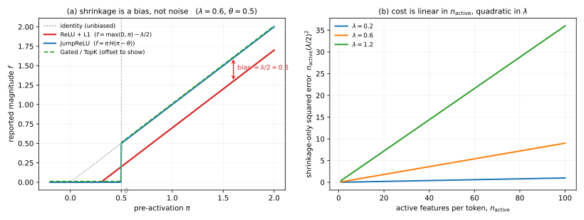

<!-- sec:D -->
## D Sparse-autoencoder derivations

<!-- para:d-sparse-autoencoder-derivations-1 --> **Depth tier:** headline

<!-- para:d-sparse-autoencoder-derivations-2 --> Every sparse-autoencoder variant in the literature — ReLU, Gated, JumpReLU, TopK, BatchTopK — is usually presented as a separate architecture with its own motivation and its own citation. They are not. **All of them are points on one calculation**, and this appendix derives that calculation first so the variants can be read off it rather than listed.

<!-- para:d-sparse-autoencoder-derivations-3 --> The calculation is elementary and, as far as the sources acquired for this survey go, is not performed in any of them: each paper states its own objective and asserts what the previous one got wrong. Supplying the shared derivation is this appendix's own contribution, and it is what makes the phrase *first principles* honest here.

<!-- sec:D.1 -->
### D.1 The objective, and the exact minimizer that generates every variant

<!-- para:d1-the-objective-and-the-exact-minimizer-that-generates-every-variant-1 --> **The ansatz.** A sparse autoencoder assumes an activation $\mathbf{x} \in \mathbb{R}^{n}$ is a sparse non-negative combination of $M \gg n$ dictionary directions,

<!-- eq:D-1-1 -->
$$
\mathbf{x} \;\approx\; \mathbf{D}\mathbf{f}, \qquad \mathbf{f} \in \mathbb{R}^{M}_{\ge 0}, \tag{1}
$$

<!-- para:d1-the-objective-and-the-exact-minimizer-that-generates-every-variant-2 --> with $\mathbf{D}$'s columns the feature directions and $\mathbf{f}$ the feature activations. Everything else follows from asking what the best such $\mathbf{f}$ is.

<!-- para:d1-the-objective-and-the-exact-minimizer-that-generates-every-variant-3 --> **Start with the inference problem, not the architecture.** Given $\mathbf{x}$ and a fixed dictionary, the sparse code we *want* is the solution of

<!-- eq:D-1-2 -->
$$
\mathbf{f}^{\star} \;=\; \arg\min_{\mathbf{f}\,\ge\,0}\ \big\lVert \mathbf{x} - \mathbf{D}\mathbf{f} \big\rVert_2^2 \;+\; \lambda \lVert \mathbf{f} \rVert_1 . \tag{2}
$$

<!-- para:d1-the-objective-and-the-exact-minimizer-that-generates-every-variant-4 --> An encoder network does not solve this per input; it *amortizes* it, learning one function that outputs an approximate solution in a single pass. So the question "what activation function should the encoder use?" has a principled answer: **whatever shape the exact solution has.**

<!-- para:d1-the-objective-and-the-exact-minimizer-that-generates-every-variant-5 --> **Solve it.** Take the dictionary columns mutually orthonormal, $\mathbf{D}^{\top}\mathbf{D} = \mathbf{I}$. Then $\lVert \mathbf{x} - \mathbf{D}\mathbf{f}\rVert_2^2 = \lVert\mathbf{x}\rVert_2^2 - 2\mathbf{f}^{\top}\mathbf{D}^{\top}\mathbf{x} + \lVert \mathbf{f}\rVert_2^2$, and because $\mathbf{f} \ge 0$ we have $\lVert\mathbf{f}\rVert_1 = \sum_i f_i$. Writing $a_i = (\mathbf{D}^{\top}\mathbf{x})_i$ for the projection of the input onto feature $i$, the objective **separates coordinate-wise** into $M$ independent scalar problems:

<!-- eq:D-1-3 -->
$$
\min_{f_i \ge 0}\ \big(f_i - a_i\big)^2 + \lambda f_i \;+\; \text{const}, \qquad \text{const} = \lVert\mathbf{x}\rVert_2^2 - \lVert\mathbf{a}\rVert_2^2 . \tag{3}
$$

<!-- para:d1-the-objective-and-the-exact-minimizer-that-generates-every-variant-6 --> Differentiate: $2(f_i - a_i) + \lambda = 0$ gives the interior stationary point $f_i = a_i - \lambda/2$. The objective is a convex parabola in $f_i$, so when that point is negative the constrained minimum sits on the boundary at $f_i = 0$. Combining the two cases,

<!-- eq:D-1-4 -->
$$
\boxed{\;f_i^{\star} \;=\; \mathrm{ReLU}\!\left( (\mathbf{D}^{\top}\mathbf{x})_i - \tfrac{\lambda}{2} \right)\;} \tag{4}
$$

<!-- para:d1-the-objective-and-the-exact-minimizer-that-generates-every-variant-7 --> **Four things fall out of this one line, and they are the whole appendix.**

1. <!-- para:d1-the-objective-and-the-exact-minimizer-that-generates-every-variant-8 --> **The ReLU encoder has a principled origin, under one identification.** Equation <!-- ref:D-1-4 -->[(4)](#eq-4) is the exact solution of the constrained problem, and it becomes an *encoder* only by reading off $\mathbf{f} = \mathrm{ReLU}(W_{\text{enc}}\mathbf{x} + \mathbf{b}_{\text{enc}})$ with $W_{\text{enc}} = \mathbf{D}^{\top}$ and $\mathbf{b}_{\text{enc}} = -\tfrac{\lambda}{2}\mathbf{1}$. **That identification is worth stating explicitly, because it says what the encoder bias *is*: the sparsity coefficient.** A learned negative bias in a ReLU SAE is not a fitting nuisance, it is $-\lambda/2$ made per-feature and trainable. But the identification is also a real hypothesis — modern SAEs untie the encoder from the decoder and learn a free per-feature bias, so ReLU is the optimum of *this* problem, not a form the objective forces on any encoder. The decisive check is internal: if it were forced, the Gated, JumpReLU and TopK encoders of <!-- secref:D.2 -->[§D.2](#sec-D.2) could not exist, and they do.
2. **Shrinkage is the $\lambda/2$ term, and it is a bias.** Every active feature is reported $\lambda/2$ too small *regardless of its true magnitude*. It does not average away across features or across data. A plain ReLU SAE therefore systematically under-reconstructs, and the effect is visible in <!-- secref:D.3 -->[§D.3](#sec-D.3) as a position on the frontier that no amount of training removes.
3. **Detection and magnitude are entangled by construction.** The single scalar $\lambda$ sets *both* the threshold at which a feature turns on *and* how much is subtracted once it is on. Any architecture that wants to keep the first job and drop the second must break them apart — which is exactly what Gated and JumpReLU do.
4. **Hard versus soft thresholding is the axis the variants live on.** Equation <!-- ref:D-1-4 -->[(4)](#eq-4) is a *soft* threshold: it shifts. A *hard* threshold keeps the value intact above a cut and zeroes it below. That is JumpReLU, and TopK is the same idea with the cut placed by rank rather than by value.

<!-- para:d1-the-objective-and-the-exact-minimizer-that-generates-every-variant-9 --> **The honest caveat, stated here rather than buried.** Orthonormal columns are impossible as soon as $M > n$ — not merely when $M \gg n$; $n$ mutually orthogonal directions is the hard ceiling in $\mathbb{R}^{n}$, and overcompleteness means crossing it deliberately. That is the whole point of an overcomplete dictionary, and it is what <!-- secxref:B.2 -->[§B.2](appendix-b-superposition.md#sec-B.2) is about. Equation <!-- ref:D-1-4 -->[(4)](#eq-4) is therefore the *tractable limit*, not the general case; with correlated columns the coordinate problems couple and the exact solution has no closed form. What survives the relaxation is the structure — a threshold plus a shift — and that is what the architectures below are competing to get right.

<!-- sec:D.2 -->
### D.2 Reading the variants off the spine

<!-- para:d2-reading-the-variants-off-the-spine-1 --> Each architecture is now a modification of one term in Equation <!-- ref:D-1-4 -->[(4)](#eq-4).

<!-- para:d2-reading-the-variants-off-the-spine-2 --> **Gated.** Split the encoder into a *detection* path that decides which features fire and a *magnitude* path that says how much, and apply the L1 penalty only to the first. The shrinkage term then acts on a gate, where a uniform shift is harmless because only its sign is read, and the magnitude path is left unbiased. The equivalence between the Gated form and the JumpReLU form below is claimed generally in the source but proved only for a single feature with no decoder bias, and it additionally needs the threshold to be non-negative: for a negative threshold the Gated encoder collapses to a plain ReLU while a literal JumpReLU emits negative activations, so the two function classes genuinely differ there. The survey states the equivalence with that hypothesis attached.

<!-- para:d2-reading-the-variants-off-the-spine-3 --> **JumpReLU.** Replace the soft threshold with a hard one,

<!-- eq:D-2-1 -->
$$
f_i \;=\; \pi_i \cdot H\!\left( \pi_i - \theta_i \right), \tag{5}
$$

<!-- para:d2-reading-the-variants-off-the-spine-4 --> where $\pi_i$ is the encoder pre-activation, $\theta_i$ a learned per-feature threshold, and $H$ the Heaviside step. Above threshold the magnitude passes through *exactly*: no shrinkage. The price is that $H$ has zero derivative almost everywhere and is undefined at the jump, so the threshold cannot be trained by ordinary backpropagation. The fix is a straight-through estimator — a pseudo-derivative substituted for the true one, which the source shows is equivalent to a kernel-density estimate of the loss gradient in a bandwidth $\varepsilon$ around the threshold, with the convention $H(0) := 1/2$ and a normalization $\mathbb{E}[x^2] = 1$ on the kernel.

<!-- para:d2-reading-the-variants-off-the-spine-5 --> **TopK.** Drop the penalty term entirely and impose sparsity by *selection*: keep the $k$ largest pre-activations, zero the rest. **Under the same orthonormality hypothesis as Equation <!-- ref:D-1-4 -->[(4)](#eq-4)** — and the hypothesis is doing more work here, so it is repeated rather than inherited — this is the exact minimizer of the reconstruction objective under a hard $L_0 \le k$ constraint rather than an $L_1$ relaxation. With $\mathbf{D}^{\top}\mathbf{D} = \mathbf{I}$ the objective again separates, an unselected coordinate costs $a_i^2$ and a selected one can be driven to zero cost by $f_i = a_i$ whenever $a_i > 0$, so keeping the $k$ largest pre-activations is optimal by inspection. **Drop orthonormality and the claim fails badly, not marginally**: choosing the support becomes best-subset selection, which is NP-hard, and even with the support *given* the optimal coefficients solve a non-negative least-squares problem rather than being read off as $a_i$. There is no shrinkage because there is no penalty to shrink by, and $k$ is a directly interpretable sparsity *budget* rather than an opaque trade parameter — a bound on $L_0$, not an identity, since the non-negativity constraint zeroes any selected coordinate whose pre-activation is negative. BatchTopK relaxes the per-token budget to a per-batch one and then needs an inference-time threshold, estimated as the mean of the smallest surviving activation.

<!-- para:d2-reading-the-variants-off-the-spine-6 --> **What each variant costs.** Gated adds a second encoder path; JumpReLU adds a non-differentiable operation and the estimator needed to train through it; TopK adds a sort and a hyperparameter that must be set rather than learned. None of them removes the underlying difficulty, which is that the dictionary is overcomplete and the coordinate problems are coupled.

<!-- para:d2-reading-the-variants-off-the-spine-7 --> Figure `F-D1` plots the shrinkage bias and the variants' responses to it directly.

<!-- sec:D.3 -->
### D.3 The fidelity–sparsity frontier, and what a position on it does not tell you

<!-- para:d3-the-fidelitysparsity-frontier-and-what-a-position-on-it-does-not-tell-you-1 --> Every SAE lives on a Pareto frontier between reconstruction fidelity and sparsity, and the variants above **shift** the frontier rather than escaping it. Fidelity is reported as cross-entropy *loss recovered* rather than raw mean-squared error, because MSE is not comparable across layers whose activation norms differ.

<!-- para:d3-the-fidelitysparsity-frontier-and-what-a-position-on-it-does-not-tell-you-2 --> There is a published joint scaling law relating loss to dictionary size and sparsity $k$, fitted empirically as a sum of two exponentials in the logs of the two. *(Its source writes the dictionary size $n$; this appendix writes $M$ throughout and reserves $n$ for the activation dimension, so the symbol is renamed here rather than allowed to collide with Equation <!-- ref:D-1-1 -->[(1)](#eq-1).)* It is a **fit, not a derivation** — it is reported here as an empirical regularity and this appendix does not dress it up as a consequence of anything. *(A notation warning: the fitted law's interaction coefficient is written $\gamma$ in its source, and the relative-reconstruction-bias quantity in the Gated literature is also written $\gamma$. They are unrelated; this survey uses $\gamma$ only for the bias and names the scaling coefficient explicitly wherever it appears.)*

<!-- para:d3-the-fidelitysparsity-frontier-and-what-a-position-on-it-does-not-tell-you-3 --> **The decisive point, and it is a negative one.** A favourable position on this frontier does **not** imply downstream usefulness. That is the lesson of <!-- secxref:10 -->[§10](evaluation-and-metrics.md#sec-10) and <!-- secxref:12.2 -->[§12.2](state-of-the-art-and-practice.md#sec-12.2), and it is why disentanglement benchmarks and direct task comparisons against difference-in-means baselines — not the frontier — are the current evaluation standard. The frontier measures how well a dictionary reconstructs; the question the field actually asks is whether its features *mean* anything and whether acting on them *does* anything, and those are different quantities measured on different instruments.

<!-- sec:D.4 -->
### D.4 Why the decoder columns must be norm-constrained

<!-- para:d4-why-the-decoder-columns-must-be-norm-constrained-1 --> Both the base and gated formulations impose unit-norm decoder columns and neither derives why. The reason is a degeneracy that would otherwise make the sparsity penalty meaningless.

<!-- para:d4-why-the-decoder-columns-must-be-norm-constrained-2 --> Scale the $i$-th decoder column up by $c > 1$ and the corresponding activation down by $1/c$:

<!-- eq:D-4-1 -->
$$
\mathbf{d}_i \mapsto c\,\mathbf{d}_i, \qquad f_i \mapsto f_i/c . \tag{6}
$$

<!-- para:d4-why-the-decoder-columns-must-be-norm-constrained-3 --> The reconstruction $\mathbf{D}\mathbf{f}$ is unchanged, since $(c\,\mathbf{d}_i)(f_i/c) = \mathbf{d}_i f_i$ term by term. But the penalty is not: $\lVert\mathbf{f}\rVert_1$ **falls** by exactly $f_i(1 - 1/c)$ for $c > 1$. So the objective can be driven down without changing a single reconstruction, purely by inflating dictionary columns — a free lunch that has nothing to do with sparsity. **Name the pathology precisely**: the objective is not unbounded below along this orbit, since the penalty contribution decreases monotonically toward $0$ as $c \to \infty$ without ever reaching it. The infimum is simply **not attained**, so there is no minimizer to converge to and training drifts along the orbit indefinitely — a subtler failure than divergence, and one that shows up as growing decoder norms rather than as a diverging loss. Constraining $\lVert \mathbf{d}_i \rVert_2 = 1$ removes the orbit and makes the penalty mean what it is supposed to mean.

<!-- para:d4-why-the-decoder-columns-must-be-norm-constrained-4 --> The alternative is to make the penalty itself invariant on that orbit by weighting each activation by its column norm, which is what the reparametrization-invariant form of the JumpReLU objective does; then the constraint can be dropped. Both papers assert this; neither proves it, and the two-line argument above is what the assertion rests on.

<!-- sec:D.5 -->
### D.5 Dead latents, and why they are an optimization artifact rather than a finding

<!-- para:d5-dead-latents-and-why-they-are-an-optimization-artifact-rather-than-a-finding-1 --> A dictionary element that never activates contributes nothing and cannot be interpreted, and at scale a substantial fraction of latents can die. The mechanism is straightforward from Equation <!-- ref:D-1-4 -->[(4)](#eq-4): a feature whose projection $a_i$ sits below $\lambda/2$ on every input receives $f_i = 0$ always, hence **zero gradient**, hence no way to recover through its own parameters. The argument survives untying the encoder from the dictionary, which is worth checking rather than assuming: for a general learned row $\mathbf{w}_i$ and bias $b_i$, the gradient of the loss with respect to either passes through $\mathrm{ReLU}'(\mathbf{w}_i^{\top}\mathbf{x} + b_i)$, which is identically zero on exactly the inputs where the latent is dead. So the pathway closes regardless of tying.

<!-- para:d5-dead-latents-and-why-they-are-an-optimization-artifact-rather-than-a-finding-2 --> **Death is absorbing for a latent's *private* parameters — which is not quite the same as unconditionally.** One genuine revival path remains: the *shared* decoder bias $\mathbf{b}_{\text{dec}}$ keeps receiving gradient from the live latents, and moving it shifts every pre-activation, so a dead latent can in principle be carried back across its threshold by its neighbours' training with its own weights untouched. This is a narrow channel and it is not what practitioners rely on, but "no way to recover" overstates it; the accurate statement is that a dead latent cannot rescue itself.

<!-- para:d5-dead-latents-and-why-they-are-an-optimization-artifact-rather-than-a-finding-3 --> The standard remedy is an auxiliary reconstruction loss computed on the top dead latents against the residual the live dictionary failed to explain, added at a small weight. It is an engineering fix and this appendix labels it as one — it does not follow from the objective, it repairs a pathology of the optimizer acting on it.

<!-- para:d5-dead-latents-and-why-they-are-an-optimization-artifact-rather-than-a-finding-4 --> The reason to state this precisely rather than in passing: a dead-latent rate is sometimes read as evidence about the *model's* feature content, when it is evidence about the *training run*. Two dictionaries with identical downstream behaviour can differ substantially in dead-latent count.

<!-- sec:D.6 -->
### D.6 Feature absorption

<!-- para:d6-feature-absorption-1 --> A sparser code is not always a better decomposition. If feature $A$ is active whenever feature $B$ is, the objective can lower its penalty by folding $B$'s direction into $A$'s and firing only $A$ — one active latent instead of two, identical reconstruction, lower $L_1$. The resulting latent is a *conjunction* wearing the label of one of its parts, and it will read as interpretable while being systematically wrong about the cases where the parts come apart.

<!-- para:d6-feature-absorption-2 --> This is the L1 penalty behaving exactly as specified, which is what makes it a design consequence rather than a bug: the objective rewards fewer active latents and is indifferent to whether the surviving latent corresponds to anything. It is also the cleanest example of the appendix's general theme — the frontier of <!-- secref:D.3 -->[§D.3](#sec-D.3) improves while the decomposition gets worse.

<!-- sec:D.7 -->
### D.7 What identifiability would require, and why its absence matters

<!-- para:d7-what-identifiability-would-require-and-why-its-absence-matters-1 --> Everything above assumes that *some* dictionary is the right one. Nothing so far guarantees one exists or that training finds it. Two dictionaries can achieve identical loss on identical data and disagree about what the features are — and the sparse-coding literature's classical identifiability results require conditions (incoherence, sufficient sparsity, enough samples) that no one has verified hold for language-model activations.

<!-- para:d7-what-identifiability-would-require-and-why-its-absence-matters-2 --> The practical symptom is run-to-run variability: retrain with a different seed or width and the feature set changes. The 2026 work discussed in <!-- secxref:6 -->[§6](method-inventory-dictionary.md#sec-6) argues this instability is **structural** rather than a tuning problem, which if right means the field is asking for a canonical decomposition that the objective does not determine. This appendix flags it as the deepest open question in the family: every result about "the features" of a model presupposes an identifiability that has not been established.

<!-- sec:D.8 -->
### D.8 Figure — shrinkage, and what each variant does about it

<!-- para:d8-figure-shrinkage-and-what-each-variant-does-about-it-1 --> 

<!-- para:d8-figure-shrinkage-and-what-each-variant-does-about-it-2 --> **F-D1 · The L1 penalty biases every active feature low by $\lambda/2$, and the cost is quadratic in $\lambda$.**

<!-- para:d8-figure-shrinkage-and-what-each-variant-does-about-it-3 --> **1 · Purpose and operating conditions.** **Closed forms**, no SAE trained or run. Parameters: L1 coefficient $\lambda = 0.6$ in panel (a), giving a shrinkage of $\lambda/2 = 0.3$; threshold $\theta = 0.5$; panel (b) sweeps $\lambda \in \{0.2, 0.6, 1.2\}$. Fully deterministic — no random number generator is used.

<!-- para:d8-figure-shrinkage-and-what-each-variant-does-about-it-4 --> **2 · What it shows.** (a) Reported magnitude against pre-activation for the four activation rules. The ReLU + L1 line runs parallel to the identity, displaced by $\lambda/2$; JumpReLU, TopK and Gated lie *on* the identity above their thresholds. (b) The reconstruction error contributed by shrinkage alone, $n_{\mathrm{active}}(\lambda/2)^2$.

<!-- para:d8-figure-shrinkage-and-what-each-variant-does-about-it-5 --> **3 · How to read it.** The gap in (a) is a **bias, not noise** — it does not shrink with more data or more training, which is why it needed an architectural fix rather than a tuning fix. In (b), raising $\lambda$ costs reconstruction *quadratically* **at a fixed number of active features**. That last clause is load-bearing and is not a hedge: raising $\lambda$ buys sparsity precisely *by* reducing $n_{\mathrm{active}}$, so the two factors of the plotted product move in opposite directions and the net movement along the real frontier is not the quadratic shown. Panel (b) isolates one factor; it does not trace the frontier.

<!-- para:d8-figure-shrinkage-and-what-each-variant-does-about-it-6 --> **4 · Caveats.** The clean separation in (a) holds exactly only for an orthonormal dictionary, which is impossible once $M > n$ — see the caveat in <!-- secref:D.1 -->[§D.1](#sec-D.1). With correlated columns the coordinate problems couple and the displacement is no longer uniform; the *structure* (threshold plus shift) survives, the exact constant does not. **Panel (b) needs its own version of that hypothesis, and a stronger one than unit norm supplies**: summing $n_{\mathrm{active}}$ per-feature errors in quadrature assumes the *active* decoder columns are mutually orthogonal, so that the individual shrinkage errors do not interfere. Under merely-incoherent columns the cross terms contribute a correction that grows with the number of active *pairs*, i.e. quadratically in $n_{\mathrm{active}}$, while the plotted term grows linearly — so the straight lines are a lower bound on the true shrinkage cost, and the gap widens to the right. Generator and persisted data: `figures/appendix-d-sae-shrinkage.py` / `.json`.
